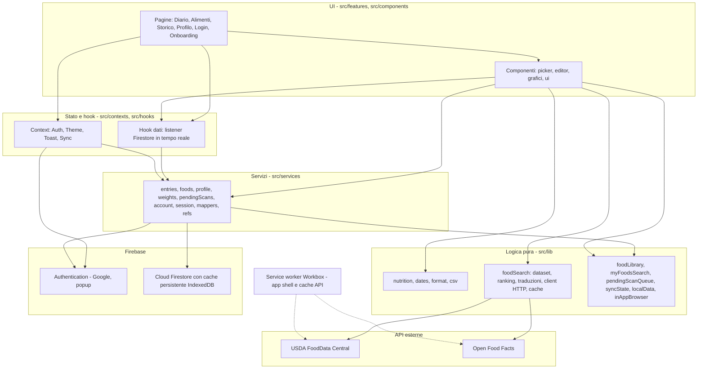
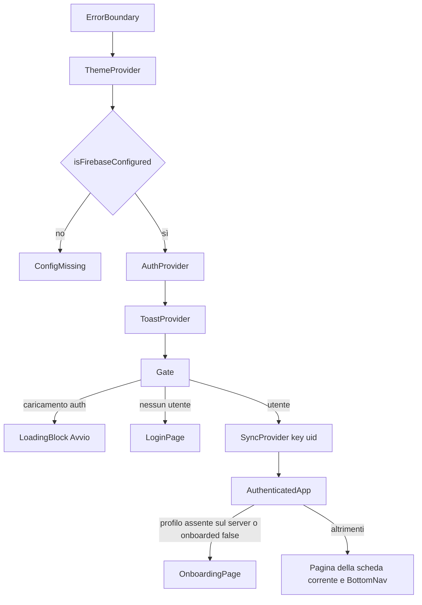

# Architettura

ContaCalorie è una **single page application** React + TypeScript, compilata con Vite e distribuita come **PWA** statica su GitHub Pages. Non c'è un backend proprio: i dati dell'utente stanno in **Firebase** (Authentication + Cloud Firestore); i dati nutrizionali arrivano da **USDA FoodData Central** e **Open Food Facts**, chiamati direttamente dal browser.

## Livelli



Regole di dipendenza osservate nel codice:

- `src/lib/**` contiene logica **pura o quasi pura**, testata con Vitest. Fanno eccezione `src/lib/firebase.ts` (inizializza Firebase), `src/lib/csv.ts` (crea il download nel DOM), `src/lib/localData.ts` (`browserDataEnv` legge le API del browser) e `src/lib/inAppBrowser.ts` (`currentInAppBrowser` legge `navigator`). `src/lib/foodSearch/usdaMap.ts` non usa `import.meta.env` e `usdaToItalian.ts` lo legge solo in modo protetto (per il log in sviluppo), così entrambi funzionano anche nello script Node `scripts/build-generic-foods.ts`.
- `src/services/**` è l'**unico** livello che scrive su Firestore (`setDoc`, `updateDoc`, `deleteDoc`, `writeBatch`) e che chiama `signOut`/`deleteUser`.
- `src/hooks/**` incapsula i listener `onSnapshot` (`useQueryData`, `useDocData` in `src/hooks/useFirestore.ts`).
- I componenti in `src/features/**` chiamano i servizi senza attendere la Promise (vedi "Offline").

## Mappa delle cartelle

```
.github/workflows/   ci.yml (lint, test, build + test regole su emulatore) · deploy.yml (GitHub Pages)
                     generic-foods.yml (genera il dataset dei generici da USDA)
scripts/             build-generic-foods.ts, genericFoods.defs.ts (≈384 alimenti), usdaPicker.ts,
                     genericFoods.test.ts, docs/ (strumenti della documentazione)
tests/rules/         test delle regole Firestore (emulatore)
public/              icone PWA e favicon
src/
  main.tsx           monta <App/> in StrictMode
  App.tsx            provider, autenticazione, onboarding, navigazione a schede
  types.ts           tipi del modello dati
  index.css          Tailwind v4, variante dark, colori dei macro e dei grafici
  lib/               logica pura (nutrizione, date, formati, CSV, ricerca, chiavi alimenti…)
  lib/foodSearch/    pipeline di ricerca alimenti (vedi docs/SEARCH_PIPELINE.md)
  data/              genericFoods.it.json (dataset generato da USDA)
  services/          scritture e letture Firestore, sessione, account
  hooks/             listener in tempo reale, scheda corrente, stato online, installazione PWA
  contexts/          Auth, Theme, Toast, Sync
  components/ui/     Button, Card, Sheet, campi, icone, anello e barre, spinner, PendingMark
  components/layout/ BottomNav, ErrorBoundary, SyncIndicator
  features/          auth, account, diary, picker, foods, history, profile
firestore.rules · firestore.indexes.json · firebase.json · vite.config.ts · vitest.rules.config.ts
```

## Avvio e composizione

`src/main.tsx` → `App` (`src/App.tsx`):



- `isFirebaseConfigured` (`src/lib/firebase.ts`) è falso se manca una tra `VITE_FIREBASE_API_KEY`, `VITE_FIREBASE_AUTH_DOMAIN`, `VITE_FIREBASE_PROJECT_ID`, `VITE_FIREBASE_APP_ID`. In quel caso l'app mostra `ConfigMissing` e non inizializza Firebase.
- `SyncProvider` e `AuthenticatedApp` sono montati con `key={user.uid}`: al cambio di utente tutto lo stato React viene ricreato.
- `AuthenticatedApp` crea il profilo base al primo accesso e avvia `usePendingScanCompletion` (completamento dei codici salvati offline).

## Routing

Non c'è un router. La scheda corrente è nell'**hash dell'URL** (`#/diario`, `#/alimenti`, `#/storico`, `#/profilo`), letta con `useSyncExternalStore` in `useHashTab` (`src/hooks/useHashTab.ts`). Un hash sconosciuto equivale a `diario`. Funziona su GitHub Pages senza riscritture lato server e con il tasto Indietro.

- `BottomNav` (`src/components/layout/BottomNav.tsx`) cambia scheda.
- `HistoryPage` è caricata in modo lazy (`React.lazy`), perché recharts è pesante.
- Il giorno mostrato nel diario è stato locale di `AuthenticatedApp` (`useState(todayKey)`), non è nell'URL.
- I pannelli (aggiunta alimento, modifica voce, editor) sono `Sheet` modali (`src/components/ui/Sheet.tsx`), non rotte.

## Gestione dello stato

Non c'è uno store globale (niente Redux o Zustand). Lo stato vive in tre posti:

| Tipo | Dove | Esempi |
|---|---|---|
| Dati dell'utente | listener Firestore negli hook di `src/hooks/data.ts` (cache persistente come fonte di verità locale) | `useProfile`, `useDayEntries`, `useFoods`, `useWeights`, `usePendingScans` |
| Stato trasversale | Context in `src/contexts/` | utente e login (`AuthContext`), tema (`ThemeContext`), notifiche (`ToastContext`), sincronizzazione (`SyncContext`) |
| Stato dell'interfaccia | `useState` nei componenti | query di ricerca, pannelli aperti, campi dei form |

Le query Firestore sono memoizzate con `useMemo` e le funzioni `map` sono di modulo, come richiesto da `useQueryData` (`src/hooks/useFirestore.ts`).

## Tema

- `ThemeProvider` (`src/contexts/ThemeContext.tsx`): preferenza `system` / `light` / `dark` salvata in `localStorage` (chiave `theme`). Aggiunge o toglie la classe `dark` su `<html>` e aggiorna `meta[name=theme-color]`; ascolta `prefers-color-scheme`.
- `index.html` applica il tema con uno script inline **prima** del render, per evitare lampeggi.
- `src/index.css`: Tailwind v4 con `@custom-variant dark (&:where(.dark, .dark *))` e variabili CSS per i colori dei macro (`--color-protein`, `--color-carbs`, `--color-fat`) e dei grafici (`--chart-*`, ridefinite nel tema scuro).

## PWA, service worker e offline

Configurazione in `vite.config.ts` (`VitePWA`):

- `registerType: 'autoUpdate'`. La registrazione è iniettata da vite-plugin-pwa nella build (`dist/registerSW.js`); nel codice sorgente non c'è un import esplicito.
- **Precache dell'app shell**: `globPatterns: ['**/*.{js,css,html,svg,png,ico,webmanifest}']`, `navigateFallback: 'index.html'`, quindi l'app si apre senza rete.
- **Cache a runtime** `food-data`: risposte di `*.openfoodfacts.org` e `api.nal.usda.gov` con strategia **StaleWhileRevalidate** (massimo 200 voci, 30 giorni).
- Manifest: nome, colori, icone in `public/`, `display: standalone`, `orientation: portrait`, `lang: it`.

Altri livelli dell'offline:

| Livello | Dove | Cosa fa |
|---|---|---|
| Firestore | `src/lib/firebase.ts` | cache persistente IndexedDB, gestione multi-scheda |
| Scritture ottimistiche | `src/services/*`, chiamanti in `src/features/*` | Promise mai attese per aggiornare l'interfaccia |
| Stato rete | `useOnlineStatus` (`src/hooks/useOnlineStatus.ts`) | `navigator.onLine` più eventi `online`/`offline` |
| Indicatore | `SyncProvider` + `SyncIndicator` | Online / Offline / Sincronizzazione in corso (N) / Tutto sincronizzato |
| Cache delle ricerche | `createSearchCache` (`src/lib/foodSearch/cache.ts`) | memoria + `sessionStorage`, 24 ore, prefisso `contacalorie:food-search:v2:` |
| Dataset generico | `src/data/genericFoods.it.json` | ricerca dei generici sempre disponibile |
| Coda codici | `pendingScans` + `usePendingScanCompletion` | completa i codici scansionati offline al ritorno della rete |

Dettagli e diagrammi: `docs/FLOWS.md` (sincronizzazione) e `docs/DATA_MODEL.md` (conflitti).

## Autenticazione

- `src/lib/firebase.ts` usa `initializeAuth` con persistenza `[browserLocalPersistence, indexedDBLocalPersistence, browserSessionPersistence]` e `browserPopupRedirectResolver`. In sviluppo, con `VITE_USE_EMULATORS=true`, si collega agli emulatori Auth (9099) e Firestore (8080).
- Accesso **solo con popup** di Google (`signInWithPopup` in `AuthProvider`, `src/contexts/AuthContext.tsx`), senza `signInWithRedirect`. Il motivo è in `docs/DECISIONS.md`.
- Browser in-app (WhatsApp, Instagram…): `detectInAppBrowser` (`src/lib/inAppBrowser.ts`) disattiva il login e propone di aprire il link in Safari o Chrome.
- Logout sicuro e pulizia dei dati locali: `src/services/session.ts` e `src/lib/localData.ts`.

## Build

- Vite 8 (rolldown) con `base: '/contacalorie/'` (GitHub Pages). `npm run build:firebase` usa `--base=/` per Firebase Hosting.
- Chunk separati per Firebase e React (`codeSplitting.groups`); recharts è in un chunk lazy con `HistoryPage`.
- `@zxing/browser` (scanner) è importato dinamicamente in `BarcodeScanner` solo quando serve.
- TypeScript strict (`tsconfig.app.json`: `strict`, `noUnusedLocals`, `noUnusedParameters`, `verbatimModuleSyntax`).
