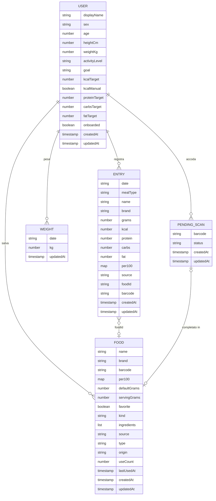

# Modello dati

Tutti i dati dell'utente stanno in **Cloud Firestore**, sotto il documento `users/{uid}` (dove `uid` è l'id di Firebase Authentication). Non esistono collezioni condivise tra utenti.

- Tipi TypeScript: `src/types.ts`
- Riferimenti alle collezioni: `src/services/refs.ts`
- Conversione documento → oggetto: `src/services/mappers.ts`
- Scritture: `src/services/*.ts`
- Regole di sicurezza: `firestore.rules` (test in `tests/rules/firestore.rules.emu.ts`)

## Panoramica

| Percorso | Contenuto | Id del documento | Scritto da |
|---|---|---|---|
| `users/{uid}` | profilo e obiettivi | uid dell'utente | `src/services/profile.ts`, `src/services/weights.ts` |
| `users/{uid}/entries/{entryId}` | voci del diario | generato sul dispositivo (`doc()` senza id) | `src/services/entries.ts` |
| `users/{uid}/foods/{foodId}` | "i miei alimenti" e ricette | chiave dell'alimento (codice a barre, chiave del dataset, `n-nome--marca`) oppure id generato | `src/services/foods.ts` |
| `users/{uid}/weights/{YYYY-MM-DD}` | peso del giorno | la data | `src/services/weights.ts` |
| `users/{uid}/pendingScans/{barcode}` | codici scansionati offline da completare | il codice a barre | `src/services/pendingScans.ts` |

## `users/{uid}` — profilo

Tipo: `Profile` in `src/types.ts`. Lettura: `toProfile` (`src/services/mappers.ts`). Valori predefiniti: `DEFAULT_PROFILE` (stesso file).

| Campo | Tipo | Obbligatorio | Descrizione | Esempio |
|---|---|---|---|---|
| `displayName` | string o null | no | nome Google al momento della creazione (max 100) | `"Alice Rossi"` |
| `sex` | `"male"` / `"female"` | no* | sesso, per la formula del metabolismo | `"female"` |
| `age` | number 10–120 | no* | età in anni | `30` |
| `heightCm` | number 50–260 | no* | altezza in cm | `165` |
| `weightKg` | number 20–400 | no* | peso in kg (aggiornato registrando il peso di oggi) | `60` |
| `activityLevel` | `sedentary` / `light` / `moderate` / `active` / `very_active` | no* | livello di attività | `"moderate"` |
| `goal` | `lose` / `maintain` / `gain` | no* | obiettivo | `"maintain"` |
| `kcalTarget` | number 500–10000 | no* | obiettivo calorico giornaliero | `1900` |
| `kcalManual` | boolean | no* | `true` se l'obiettivo è impostato a mano | `false` |
| `proteinTarget` | number 0–1000 | no* | grammi di proteine | `100` |
| `carbsTarget` | number 0–2000 | no* | grammi di carboidrati | `220` |
| `fatTarget` | number 0–1000 | no* | grammi di grassi | `60` |
| `onboarded` | boolean | no | `false` finché il nuovo utente non completa l'onboarding; se manca vale `true` (profili creati prima dell'onboarding) | `true` |
| `createdAt` | timestamp | no | orario del server alla creazione (`createUserDoc`) | |
| `updatedAt` | timestamp | sì in scrittura | deve essere l'orario del server (`serverTimestamp()`) | |

\* Le regole non li richiedono (usano valori predefiniti con `d.get(...)`), ma l'app li scrive sempre tutti (`saveProfile`, `createUserDoc` in `src/services/profile.ts`).

## `users/{uid}/entries/{entryId}` — voci del diario

Tipo: `Entry` in `src/types.ts`. I valori `kcal`/`protein`/`carbs`/`fat` sono **per i grammi indicati**; `per100` conserva i valori per 100 g per ricalcolare se cambiano i grammi (`updateEntry`).

| Campo | Tipo | Obbligatorio | Descrizione | Esempio |
|---|---|---|---|---|
| `date` | string `YYYY-MM-DD` | sì | giorno locale (mai UTC, vedi `src/lib/dates.ts`) | `"2026-10-08"` |
| `mealType` | `breakfast` / `lunch` / `dinner` / `snack` | sì | pasto | `"lunch"` |
| `name` | string 1–200 | sì | nome mostrato (per i generici: formato "Categoria - Alimento (dettaglio)") | `"Frutta - Mela"` |
| `brand` | string o null (max 200) | no | marca | `"Barilla"` |
| `grams` | number 0–10000 | sì | quantità | `80` |
| `kcal`, `protein`, `carbs`, `fat` | number | sì | valori per la quantità (kcal 0–100000, macro 0–10000) | `287` |
| `per100` | map `{kcal, protein, carbs, fat}` | sì | valori per 100 g: kcal 0–1000, macro 0–100 | `{kcal: 359, protein: 12.5, carbs: 71, fat: 1.5}` |
| `source` | `off` / `usda` / `manual` / `custom` / `recipe` | sì | origine dell'alimento | `"off"` |
| `foodId` | string o null (max 100) | no | id del documento in `foods` (impostato a ogni aggiunta dal diario) | `"8076800195057"` |
| `barcode` | string o null (max 50) | no | codice a barre | `"8076800195057"` |
| `createdAt` | timestamp | sì | orario del server alla creazione | |
| `updatedAt` | timestamp | no | orario del server alla modifica | |

## `users/{uid}/foods/{foodId}` — i miei alimenti e le ricette

Tipo: `Food` in `src/types.ts`. Ogni alimento usato (scansionato, aggiunto al diario, messo tra i preferiti) o creato a mano finisce qui.

**Id del documento** (`foodKey` in `src/lib/foodLibrary.ts`), nell'ordine:
1. `foodId` già noto (alimento già salvato);
2. codice a barre valido (6–14 cifre);
3. chiave del risultato di ricerca: `gen-<id del dataset>` per il dataset generico, `usda-<fdcId>` per USDA live, `off-<…>` per i prodotti senza codice;
4. `n-<nome>--<marca>` normalizzati (senza accenti, minuscolo), massimo 100 caratteri.

Gli alimenti e le ricette creati da `FoodEditor`/`RecipeEditor` senza codice a barre usano un id generato da Firestore (`saveFood` in `src/services/foods.ts`).

| Campo | Tipo | Obbligatorio | Descrizione | Esempio |
|---|---|---|---|---|
| `name` | string 1–200 | sì | nome | `"Spaghetti n.5"` |
| `brand` | string o null (max 200) | no | marca | `"Barilla"` |
| `barcode` | string di 6–14 cifre o null | no | codice a barre | `"8076800195057"` |
| `per100` | map `{kcal, protein, carbs, fat}` | sì | per 100 g: kcal 0–1000, macro 0–100 | |
| `defaultGrams` | number 0–10000 | sì | porzione proposta | `80` |
| `servingGrams` | number 0–5000 o null | no | porzione indicata dal produttore | `80` |
| `favorite` | boolean | sì | preferito (stella) | `false` |
| `kind` | `food` / `recipe` | sì | alimento o ricetta | `"food"` |
| `ingredients` | list (max 60) | no | ingredienti della ricetta: `{name, grams, per100}` | `[]` |
| `source` | `off` / `usda` / `manual` / `custom` / `recipe` | no | origine dei dati | `"off"` |
| `type` | `packaged` / `generic` / `custom` / `recipe` | no | tipo: confezionato, generico, personale, ricetta | `"packaged"` |
| `origin` | `scan` / `search` / `manual` / `recipe` | no | come è entrato: scansione, ricerca, a mano, ricetta | `"scan"` |
| `useCount` | int 0–1.000.000 | no | utilizzi (scansioni + aggiunte al diario non precedute da scansione) | `2` |
| `lastUsedAt` | timestamp | no | ultimo utilizzo | |
| `createdAt` | timestamp | sì | creazione | |
| `updatedAt` | timestamp | no | ultima modifica | |

I documenti creati prima di `type`/`origin`/`useCount` vengono letti con valori dedotti da `toFood` (`src/services/mappers.ts`): `type` da `kind` e `barcode`, `origin` = `manual`, `lastUsedAt` = `createdAt`, `useCount` = 0.

## `users/{uid}/weights/{YYYY-MM-DD}` — peso

Tipo: `WeightEntry` in `src/types.ts`. Un solo valore al giorno (l'id è la data). Se la data è oggi, `logWeight` aggiorna anche `weightKg` del profilo e, se l'obiettivo non è manuale, ricalcola `kcalTarget`.

| Campo | Tipo | Obbligatorio | Descrizione | Esempio |
|---|---|---|---|---|
| `date` | string `YYYY-MM-DD` | sì | deve coincidere con l'id del documento | `"2026-10-08"` |
| `kg` | number 20–400 | sì | peso (l'app arrotonda a 0,1) | `60.4` |
| `updatedAt` | timestamp | sì | orario del server | |

## `users/{uid}/pendingScans/{barcode}` — codici da completare

Tipo: `PendingScan` in `src/types.ts`. Creati da "Salva per dopo" quando si scansiona offline un codice sconosciuto.

| Campo | Tipo | Obbligatorio | Descrizione | Esempio |
|---|---|---|---|---|
| `barcode` | string di 6–14 cifre | sì | uguale all'id | `"8000500310427"` |
| `status` | `pending` / `not_found` | sì | in attesa, oppure non trovato su Open Food Facts | `"pending"` |
| `createdAt` | timestamp | sì | creazione | |
| `updatedAt` | timestamp | no | ultimo cambio di stato | |

## Query e indici

`firestore.indexes.json` **non definisce indici compositi**: tutte le query usano gli indici a campo singolo creati automaticamente. Esclude invece dall'indicizzazione `per100` (in `entries` e `foods`) e `ingredients` (in `foods`), che non vengono mai interrogati.

| Query | Dove |
|---|---|
| `entries` con `date == giorno` | `useDayEntries` (`src/hooks/data.ts`) |
| `entries` con `date >= da`, `date <= a`, `orderBy(date)` | `useEntriesRange` (`src/hooks/data.ts`), `fetchEntries` (`src/services/entries.ts`) |
| `entries` `orderBy(createdAt desc)` con `limit(400)` | `useRecentFoods` (`src/hooks/data.ts`) |
| `entries` con `date >= oggi-90`; e, separatamente, `orderBy(createdAt desc)` con `limit(50)` | `SyncProvider` (`src/contexts/SyncContext.tsx`), solo per contare le modifiche in attesa |
| `foods` `orderBy(name)` | `useFoods` (`src/hooks/data.ts`) |
| `weights` `orderBy(date)` | `useWeights`, `fetchWeights` |
| `pendingScans` (tutti) | `usePendingScans`, `SyncProvider` |

## Regole di sicurezza (`firestore.rules`)

In sintesi:

1. **Isolamento**: `isOwner(uid)` = `request.auth != null && request.auth.uid == uid`. Ogni lettura, scrittura e cancellazione sotto `users/{uid}` lo richiede, quindi un utente non può mai leggere né scrivere i dati di un altro.
2. **Tutto il resto è vietato**: `match /{document=**} { allow read, write: if false; }`. Non si possono nemmeno elencare i documenti di `users`.
3. **Validazione in scrittura** (`create`, `update`), una funzione per collezione:
   - `isValidProfile`: solo i campi previsti (`hasOnly`), tipi e intervalli, `updatedAt == request.time`.
   - `isValidEntry`: campi obbligatori, data `YYYY-MM-DD`, pasto valido, nome 1–200, `per100` plausibile (`isPer100`: kcal 0–1000, macro 0–100), `source` tra i valori ammessi.
   - `isValidFood(d, foodId)`: campi ammessi, id al massimo 100 caratteri, codice a barre di 6–14 cifre, `per100` plausibile, tipo/origine/fonte ammessi, `useCount` intero ≥ 0. **Un prodotto con `origin == "scan"` deve avere come id il proprio codice a barre.**
   - `isValidWeight(d, date)`: `date` uguale all'id, `kg` 20–400.
   - `isValidPendingScan(d, code)`: id di 6–14 cifre uguale a `barcode`, `status` ammesso.
4. **`createdAtOk()`**: `createdAt` deve essere l'orario del server (`request.time`) oppure restare uguale a quello già salvato. Così una scrittura completa fatta offline su un documento esistente ("vince l'ultima scrittura") non viene rifiutata.

Collegamento con il codice: ogni servizio in `src/services/` scrive esattamente i campi che le regole ammettono (per esempio `recordFoodUse` in `src/services/foods.ts` crea il documento con i campi di `NewFoodData` più `lastUsedAt` e `createdAt` come `serverTimestamp()`). Se si aggiunge un campo in un servizio **bisogna aggiungerlo anche alla lista `hasOnly` della regola**, altrimenti la scrittura viene rifiutata ("Permesso negato", messaggio in `errorMessage` di `src/lib/format.ts`).

Le regole vanno **pubblicate a mano** (vedi `docs/DEPLOY_AND_CONFIG.md`) e si provano con l'emulatore: `npm run test:rules` (27 test in `tests/rules/firestore.rules.emu.ts`, eseguiti anche in CI nel job `rules` di `.github/workflows/ci.yml`).

## Offline e sincronizzazione

- **Cache persistente**: `initializeFirestore(app, { localCache: persistentLocalCache({ tabManager: persistentMultipleTabManager() }) })` in `src/lib/firebase.ts`. I dati letti restano in IndexedDB; le query funzionano anche offline sulla copia locale.
- **Scritture offline**: l'app non attende mai le Promise di scrittura per aggiornare l'interfaccia. Le scrive, intercetta solo gli errori (`.catch(reportError)`) e lascia che i listener `onSnapshot` mostrino subito il dato locale. Firestore mette le scritture in coda e le invia da solo al ritorno della rete.
- **Id generati sul dispositivo**: le voci del diario usano `doc(entriesRef(uid))`, quindi una voce creata offline non si duplica alla sincronizzazione. Alimenti, pesi e codici in coda hanno id deterministici (codice a barre, data, chiave).
- **Lettura dello stato**: i listener usano `includeMetadataChanges: true` (`src/hooks/useFirestore.ts`); `toEntry`, `toFood`, `toWeight` e `toPendingScan` espongono `pending = metadata.hasPendingWrites`. `SyncProvider` (`src/contexts/SyncContext.tsx`) conta le scritture in attesa per l'indicatore nell'header.
- **Controllo "esiste già?" sulla copia locale**: `recordFoodUse` usa `getDocFromCache` per decidere se creare o aggiornare un alimento, così funziona anche offline.

### Conflitti

Strategia: **vince l'ultima scrittura** (last write wins) per documento, il comportamento predefinito di Firestore. Non c'è unione campo per campo.

- Due dispositivi che modificano offline lo stesso documento: al ritorno della rete resta l'ultima scrittura arrivata al server.
- Caso limite noto: un alimento salvato su un altro dispositivo e non ancora arrivato in cache viene ricreato con `setDoc` se usato offline. Al ritorno della rete sovrascrive quello esistente: `favorite` e `useCount` ripartono. La regola `createdAtOk` lo permette apposta.
- `increment(1)` su `useCount` è atomico lato server: due utilizzi offline da dispositivi diversi si sommano.
