# Flussi principali

Ogni flusso indica i file coinvolti. I nomi tra parentesi sono funzioni o componenti reali; il dettaglio è in `docs/FUNCTIONS.md`.

- [Login Google](#login-google)
- [Logout sicuro e pulizia delle cache](#logout-sicuro-e-pulizia-delle-cache)
- [Primo accesso e onboarding](#primo-accesso-e-onboarding)
- [Aggiunta di un alimento al diario](#aggiunta-di-un-alimento-al-diario)
- [Ricerca alimenti](#ricerca-alimenti)
- [Scansione del codice a barre](#scansione-del-codice-a-barre)
- [Sincronizzazione offline](#sincronizzazione-offline)
- [Calcolo del fabbisogno calorico](#calcolo-del-fabbisogno-calorico)
- [Dashboard e storico](#dashboard-e-storico)
- [Registrazione del peso](#registrazione-del-peso)
- [Esportazione CSV e JSON](#esportazione-csv-e-json)
- [Eliminazione dell'account](#eliminazione-dellaccount)

## Login Google

File: `src/features/auth/LoginPage.tsx`, `src/contexts/AuthContext.tsx`, `src/lib/inAppBrowser.ts`, `src/lib/firebase.ts`.

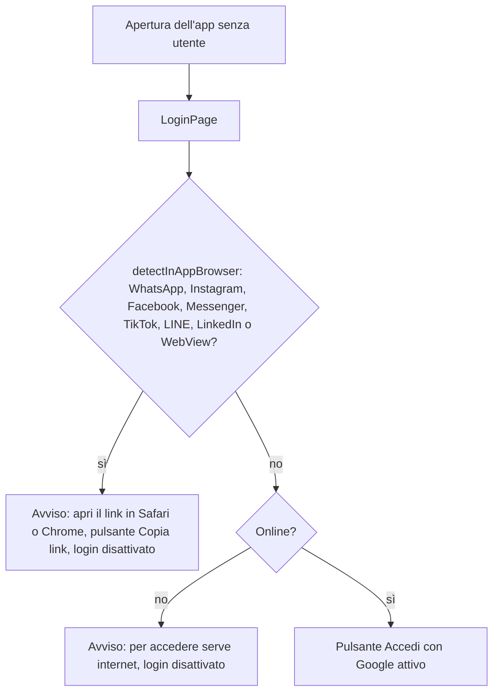

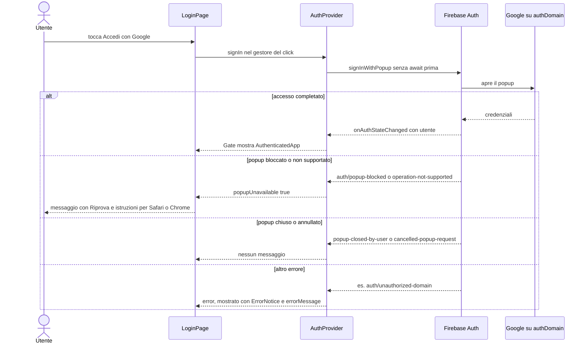

Note:
- Non esiste un ripiego su `signInWithRedirect` (rimosso apposta, vedi `docs/DECISIONS.md`).
- La sessione resta salvata grazie a `initializeAuth` con `browserLocalPersistence`, poi IndexedDB e poi sessionStorage come riserva (`src/lib/firebase.ts`).
- `classifySignInError` (`src/lib/inAppBrowser.ts`) decide tra `ignore`, `popup-unavailable` ed `error`.

## Logout sicuro e pulizia delle cache

File: `src/features/account/AccountSection.tsx`, `src/services/session.ts`, `src/lib/localData.ts`, `src/contexts/AuthContext.tsx`, `src/contexts/SyncContext.tsx`.

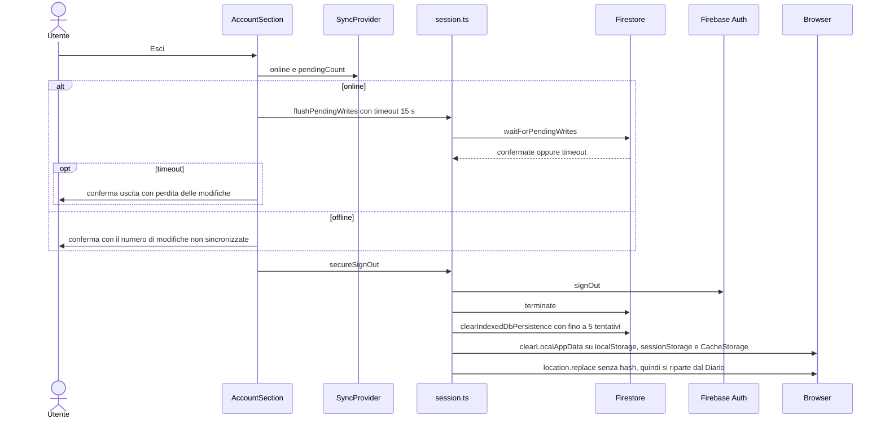

- `clearLocalAppData` rimuove solo le chiavi con prefisso `contacalorie:`, `firestore_` e `firebase:`, più la cache `food-data` del service worker. Tiene `theme` e la precache dell'app shell.
- **Altre schede**: `AuthProvider` ricorda l'ultimo uid. Se `onAuthStateChanged` arriva con un utente diverso o nullo, e la scheda non sta già uscendo (`isLeaving`), chiama `wipeLocalDataAndReload`.
- Se un'altra scheda tiene aperta la copia locale, `clearIndexedDbPersistence` fallisce: dopo 5 tentativi scrive un avviso in console e la pagina viene ricaricata comunque.

## Primo accesso e onboarding

File: `src/App.tsx`, `src/hooks/data.ts` (`useProfile`), `src/hooks/useFirestore.ts` (`useDocData`), `src/services/profile.ts`, `src/features/account/OnboardingPage.tsx`, `src/features/profile/ProfileForm.tsx`.

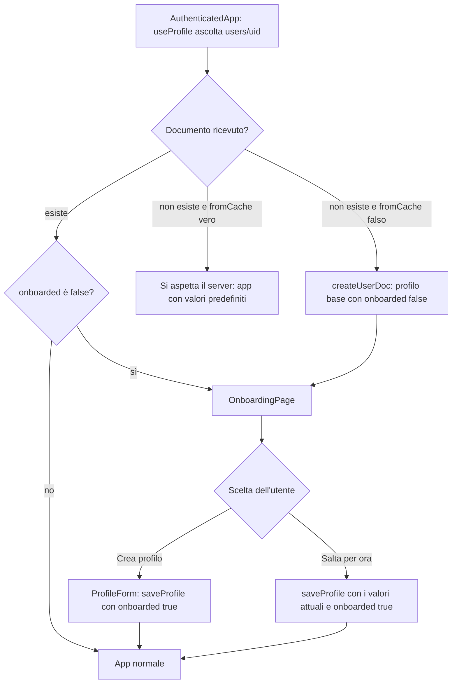

- `createUserDoc` parte **solo** se il server conferma che il documento non esiste (`fromCache === false`), per non sovrascrivere un profilo esistente ma non ancora in cache.
- I profili creati prima dell'onboarding non hanno il campo `onboarded`: `toProfile` lo considera `true`.

## Aggiunta di un alimento al diario

File: `src/features/diary/DiaryPage.tsx`, `src/features/diary/MealSection.tsx`, `src/features/diary/AddFoodSheet.tsx`, `src/features/picker/*`, `src/services/foods.ts`, `src/services/entries.ts`, `src/lib/foodLibrary.ts`.

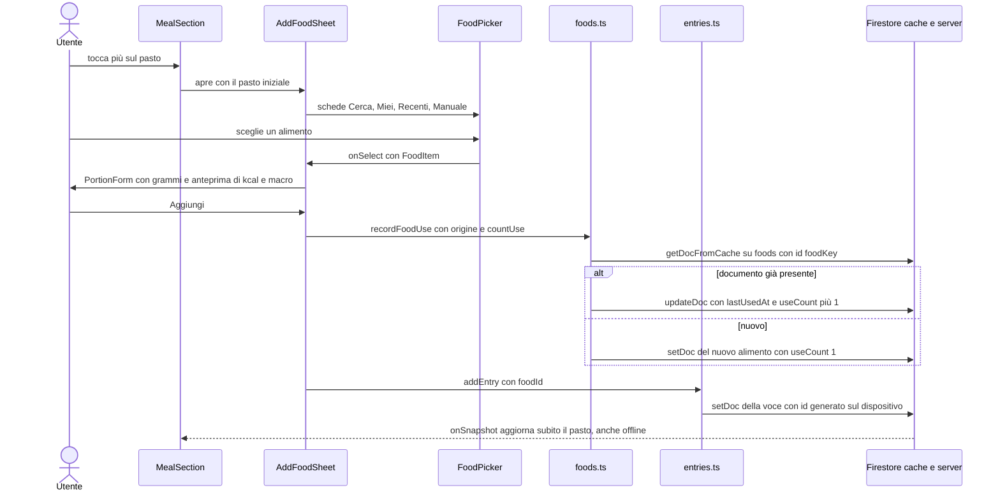

- Il tasto **+** accanto a un risultato (`onDirect`) aggiunge subito con `defaultGrams`, senza passare da `PortionForm`.
- Se l'alimento arriva da una scansione (`fromScan`), `countUse` è falso: la scansione ha già contato come utilizzo.
- "Aggiungi ai preferiti" passa `favorite: true` a `recordFoodUse`, che non toglie mai il preferito.
- Il pannello resta aperto dopo ogni aggiunta, per registrare più alimenti di fila.

## Ricerca alimenti

File: `src/features/picker/SearchTab.tsx`, `src/lib/myFoodsSearch.ts`, `src/lib/foodSearch/*`. Il dettaglio di ranking e dizionari è in `docs/SEARCH_PIPELINE.md`.

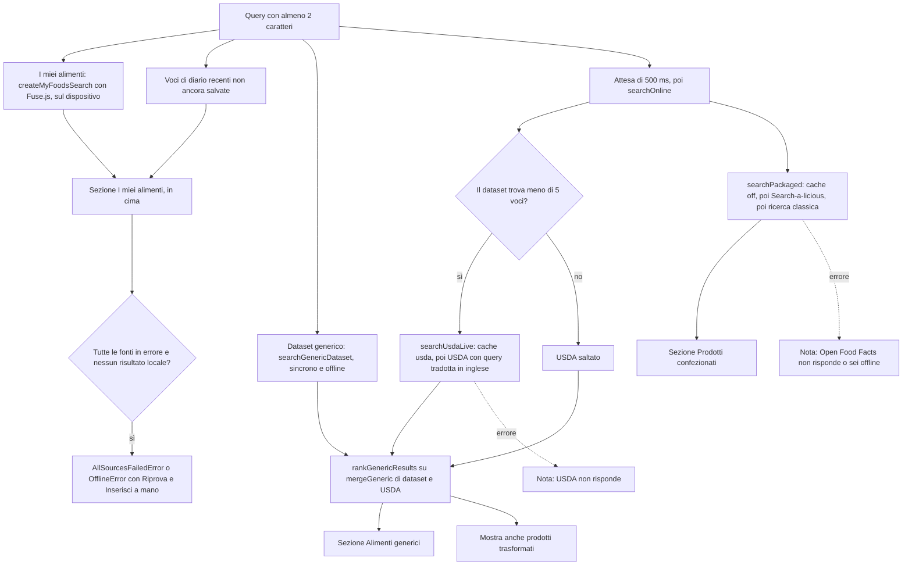

- `searchOnline` interroga USDA e Open Food Facts in parallelo con `Promise.allSettled`: l'errore di una fonte non blocca l'altra. Un `AbortError` (nuova ricerca) viene rilanciato.
- `fetchJson` (`src/lib/foodSearch/http.ts`): timeout di 8 s per tentativo, 2 ritentativi con attesa esponenziale su 5xx, 429 e timeout. La ricerca classica di OFF e il prodotto per codice ritentano anche gli errori di rete.
- Cache: `createSearchCache` (memoria + `sessionStorage`, 24 h). Il service worker tiene inoltre le risposte delle API con stale-while-revalidate.
- I risultati già presenti tra "i miei alimenti" vengono esclusi dalle altre sezioni (`notLocal` in `SearchTab`).

## Scansione del codice a barre

File: `src/features/picker/BarcodeScanner.tsx`, `src/features/picker/SearchTab.tsx`, `src/services/foods.ts`, `src/services/pendingScans.ts`, `src/hooks/usePendingScanCompletion.ts`, `src/lib/pendingScanQueue.ts`.

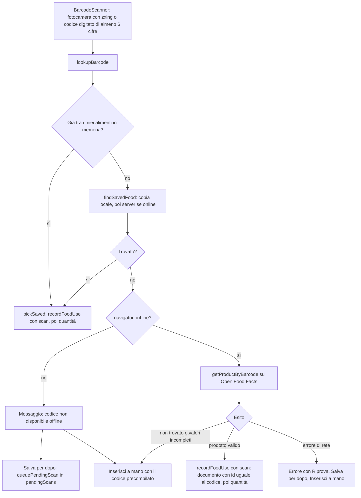

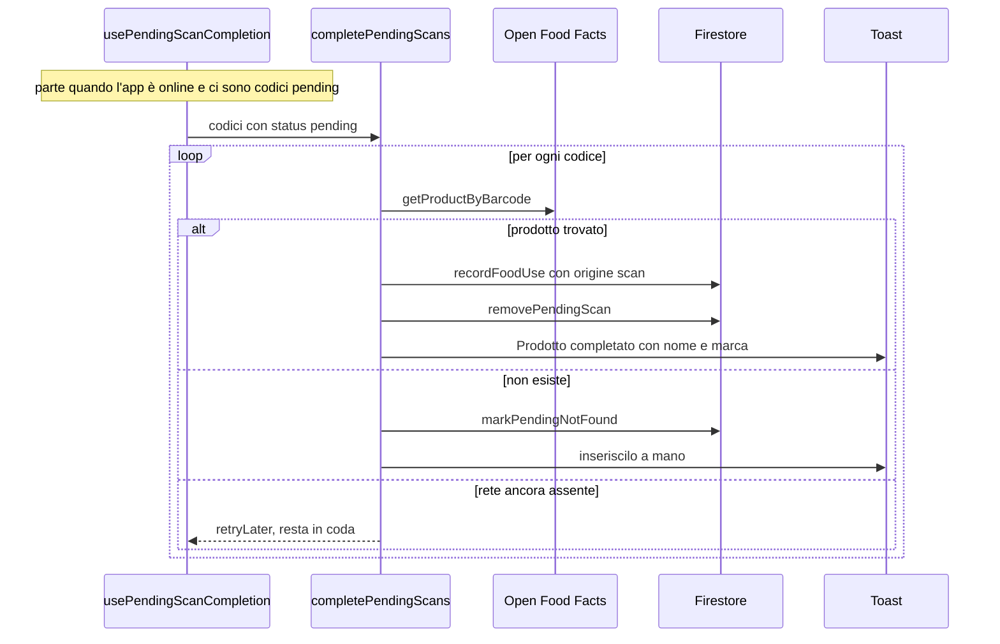

- I codici in coda compaiono nella pagina Alimenti, nella sezione "Da completare" (`src/features/foods/FoodsPage.tsx`), con il pulsante "Rimuovi".
- Un codice in `retryLater` viene ritentato solo quando cambiano lo stato online o la lista dei codici (vedi `docs/KNOWN_ISSUES.md`).

## Sincronizzazione offline

File: `src/lib/firebase.ts`, `src/hooks/useFirestore.ts`, `src/contexts/SyncContext.tsx`, `src/lib/syncState.ts`, `src/components/layout/SyncIndicator.tsx`, `src/components/ui/PendingMark.tsx`.

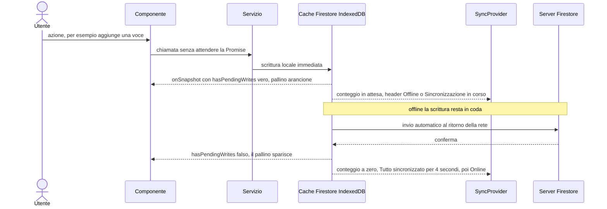

- `pendingInSnapshot` conta i documenti con scritture in attesa; se lo snapshot ha scritture in attesa ma nessun documento visibile (per esempio un'eliminazione) conta 1.
- Il conteggio considera profilo, alimenti, pesi, codici in coda e voci degli ultimi 90 giorni. Le due query sulle voci si sovrappongono: si prende il massimo, non la somma.
- Regole dei conflitti: `docs/DATA_MODEL.md`.

## Calcolo del fabbisogno calorico

File: `src/lib/nutrition.ts`, `src/features/profile/ProfileForm.tsx`, `src/services/weights.ts`.

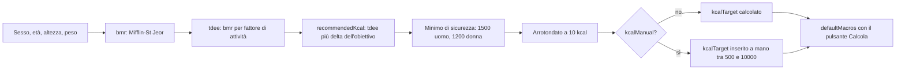

- **BMR** = 10 × peso + 6,25 × altezza − 5 × età + 5 (uomo) oppure − 161 (donna).
- **Fattori di attività** (`ACTIVITY_LEVELS`): sedentario 1,2 · leggero 1,375 · moderato 1,55 · attivo 1,725 · molto attivo 1,9.
- **Delta dell'obiettivo** (`GOALS`): dimagrire −500 · mantenere 0 · aumentare +300 kcal.
- **Macro predefiniti** (`defaultMacros`): proteine = peso × g/kg dell'obiettivo (2,0 / 1,6 / 1,8), al massimo il 40% delle kcal; grassi = 25% delle kcal / 9; carboidrati = il resto / 4.
- Registrando il **peso di oggi**, `logWeight` aggiorna `weightKg` e, se `kcalManual` è falso, ricalcola `kcalTarget` con `recommendedKcal`. I target dei macro restano invariati.

## Dashboard e storico

File: `src/features/diary/DiaryPage.tsx`, `src/features/diary/DaySummary.tsx`, `src/components/ui/Progress.tsx`, `src/features/history/*`.

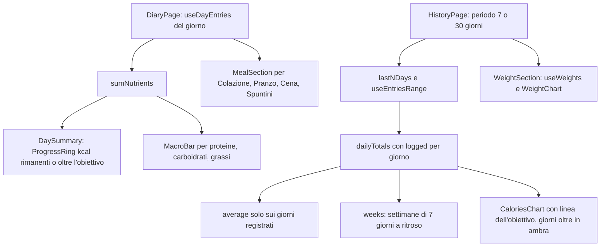

- Senza profilo il diario usa `DEFAULT_PROFILE` (2000 kcal) e mostra un invito a completare il profilo.
- "Entro l'obiettivo" conta i giorni registrati con kcal ≤ obiettivo.

## Registrazione del peso

File: `src/features/history/WeightSection.tsx`, `src/services/weights.ts`.

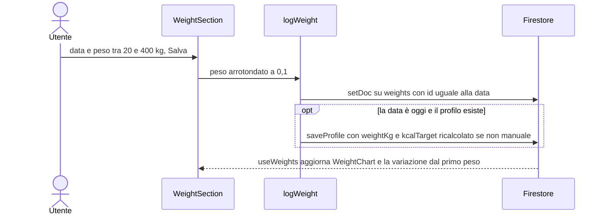

- Un solo valore per giorno: salvare di nuovo la stessa data sovrascrive.
- Eliminazione con il pulsante × (`deleteWeight`).

## Esportazione CSV e JSON

File: `src/features/profile/ExportSection.tsx`, `src/features/account/MyDataSection.tsx`, `src/services/account.ts`, `src/lib/csv.ts`.

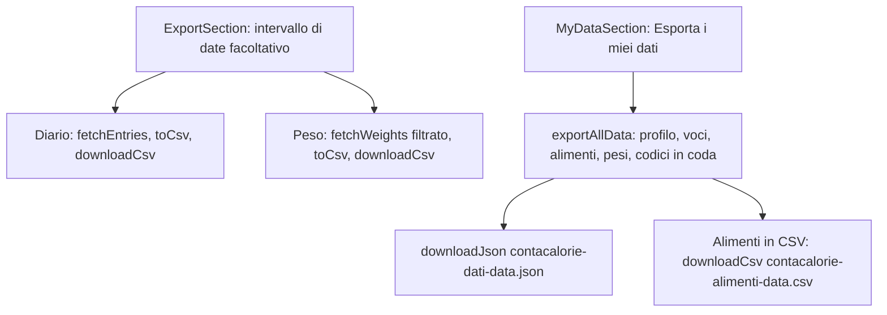

- CSV con separatore `;` e virgola decimale (per Excel in italiano), BOM UTF-8, protezione da "CSV injection" (`formatCell` in `src/lib/csv.ts`).
- Nel JSON il campo locale `pending` viene rimosso.
- Le esportazioni usano `getDocs`: offline restituiscono solo ciò che è in cache.

## Eliminazione dell'account

File: `src/features/account/MyDataSection.tsx`, `src/services/account.ts`, `src/services/session.ts`.

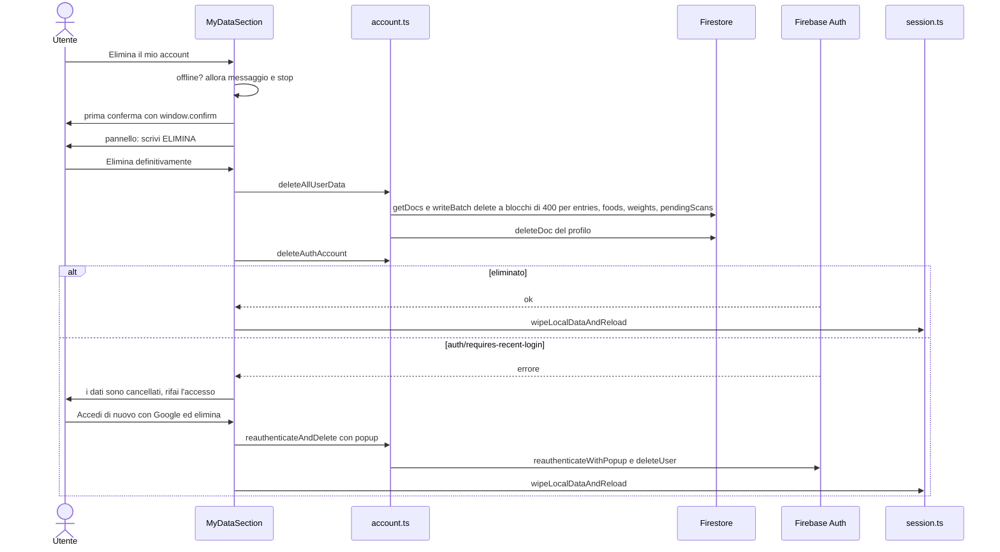
