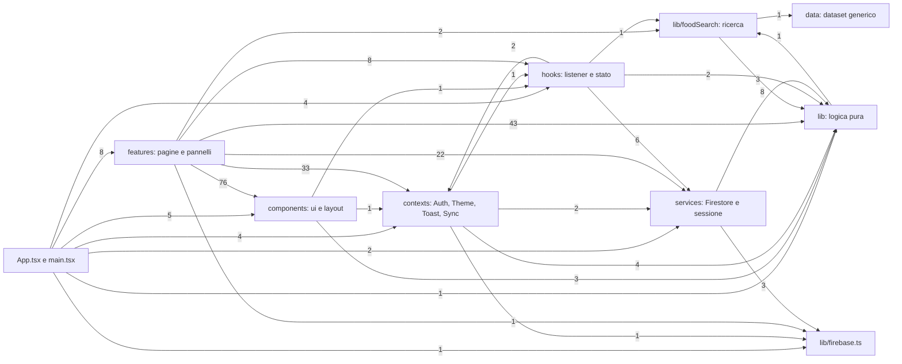

# Riferimento di funzioni, hook e componenti

> **File generato** da `npm run docs:functions` (`scripts/docs/functions.ts`): firme, righe e chiamanti vengono dal compilatore TypeScript; le descrizioni dai commenti TSDoc del codice e da `scripts/docs/descriptions.ts`. Per modificare una descrizione cambia il commento nel codice o `descriptions.ts`, poi rigenera. `npm run docs:check` segnala se il file non è aggiornato.

Totale: **322 export** in `src/` (64 componenti, 20 hook, 143 funzioni, 7 classi, 30 costanti, 58 tipi). I file di test non sono inclusi. "Usato da" elenca i file che importano il simbolo (anche tramite riesportazione o import dinamico).

## Dipendenze tra moduli

Numero di import tra i livelli (frecce: "importa da"). I tipi di `src/types.ts` sono usati ovunque e non sono disegnati.



## Indice

- **Servizi (`src/services/`)**: [exportAllData](#src-services-account-ts-exportalldata) · [deleteAllUserData](#src-services-account-ts-deletealluserdata) · [needsRecentLogin](#src-services-account-ts-needsrecentlogin) · [deleteAuthAccount](#src-services-account-ts-deleteauthaccount) · [reauthenticateAndDelete](#src-services-account-ts-reauthenticateanddelete) · [addEntry](#src-services-entries-ts-addentry) · [restoreEntry](#src-services-entries-ts-restoreentry) · [entryToItem](#src-services-entries-ts-entrytoitem) · [updateEntry](#src-services-entries-ts-updateentry) · [deleteEntry](#src-services-entries-ts-deleteentry) · [fetchEntries](#src-services-entries-ts-fetchentries) · [saveFood](#src-services-foods-ts-savefood) · [recordFoodUse](#src-services-foods-ts-recordfooduse) · [setFavorite](#src-services-foods-ts-setfavorite) · [deleteFood](#src-services-foods-ts-deletefood) · [foodToItem](#src-services-foods-ts-foodtoitem) · [findSavedFood](#src-services-foods-ts-findsavedfood) · [toEntry](#src-services-mappers-ts-toentry) · [toFood](#src-services-mappers-ts-tofood) · [toPendingScan](#src-services-mappers-ts-topendingscan) · [toWeight](#src-services-mappers-ts-toweight) · [DEFAULT_PROFILE](#src-services-mappers-ts-default-profile) · [toProfile](#src-services-mappers-ts-toprofile) · [toTutorialState](#src-services-mappers-ts-totutorialstate) · [queuePendingScan](#src-services-pendingscans-ts-queuependingscan) · [markPendingNotFound](#src-services-pendingscans-ts-markpendingnotfound) · [removePendingScan](#src-services-pendingscans-ts-removependingscan) · [saveProfile](#src-services-profile-ts-saveprofile) · [createUserDoc](#src-services-profile-ts-createuserdoc) · [userRef](#src-services-refs-ts-userref) · [entriesRef](#src-services-refs-ts-entriesref) · [foodsRef](#src-services-refs-ts-foodsref) · [weightsRef](#src-services-refs-ts-weightsref) · [pendingScansRef](#src-services-refs-ts-pendingscansref) · [isLeaving](#src-services-session-ts-isleaving) · [flushPendingWrites](#src-services-session-ts-flushpendingwrites) · [wipeLocalDataAndReload](#src-services-session-ts-wipelocaldataandreload) · [secureSignOut](#src-services-session-ts-securesignout) · [saveTutorialDone](#src-services-tutorial-ts-savetutorialdone) · [logWeight](#src-services-weights-ts-logweight) · [deleteWeight](#src-services-weights-ts-deleteweight) · [fetchWeights](#src-services-weights-ts-fetchweights)
- **Hook (`src/hooks/`)**: [useProfile](#src-hooks-data-ts-useprofile) · [useDayEntries](#src-hooks-data-ts-usedayentries) · [useEntriesRange](#src-hooks-data-ts-useentriesrange) · [useFoods](#src-hooks-data-ts-usefoods) · [useRecentFoods](#src-hooks-data-ts-userecentfoods) · [useWeights](#src-hooks-data-ts-useweights) · [usePendingScans](#src-hooks-data-ts-usependingscans) · [useTutorialState](#src-hooks-data-ts-usetutorialstate) · [useQueryData](#src-hooks-usefirestore-ts-usequerydata) · [useDocData](#src-hooks-usefirestore-ts-usedocdata) · [TABS](#src-hooks-usehashtab-ts-tabs) · [useHashTab](#src-hooks-usehashtab-ts-usehashtab) · [useInstallPrompt](#src-hooks-useinstallprompt-ts-useinstallprompt) · [useOnlineStatus](#src-hooks-useonlinestatus-ts-useonlinestatus) · [usePendingScanCompletion](#src-hooks-usependingscancompletion-ts-usependingscancompletion) · [SKIP_HINT](#src-hooks-usetutorial-ts-skip-hint) · [useTutorial](#src-hooks-usetutorial-ts-usetutorial)
- **Context (`src/contexts/`)**: [AuthProvider](#src-contexts-authcontext-tsx-authprovider) · [useAuth](#src-contexts-authcontext-tsx-useauth) · [useUid](#src-contexts-authcontext-tsx-useuid) · [SyncProvider](#src-contexts-synccontext-tsx-syncprovider) · [useSync](#src-contexts-synccontext-tsx-usesync) · [ThemeProvider](#src-contexts-themecontext-tsx-themeprovider) · [useTheme](#src-contexts-themecontext-tsx-usetheme) · [ToastProvider](#src-contexts-toastcontext-tsx-toastprovider) · [useToast](#src-contexts-toastcontext-tsx-usetoast)
- **Utilità e logica (`src/lib/`)**: [toCsv](#src-lib-csv-ts-tocsv) · [downloadCsv](#src-lib-csv-ts-downloadcsv) · [downloadJson](#src-lib-csv-ts-downloadjson) · [toDateKey](#src-lib-dates-ts-todatekey) · [parseDateKey](#src-lib-dates-ts-parsedatekey) · [todayKey](#src-lib-dates-ts-todaykey) · [addDays](#src-lib-dates-ts-adddays) · [isValidDateKey](#src-lib-dates-ts-isvaliddatekey) · [lastNDays](#src-lib-dates-ts-lastndays) · [formatDayLabel](#src-lib-dates-ts-formatdaylabel) · [formatShortDate](#src-lib-dates-ts-formatshortdate) · [missingFirebaseKeys](#src-lib-firebase-ts-missingfirebasekeys) · [isFirebaseConfigured](#src-lib-firebase-ts-isfirebaseconfigured) · [auth](#src-lib-firebase-ts-auth) · [db](#src-lib-firebase-ts-db) · [googleProvider](#src-lib-firebase-ts-googleprovider) · [cleanBarcode](#src-lib-foodlibrary-ts-cleanbarcode) · [foodKey](#src-lib-foodlibrary-ts-foodkey) · [foodTypeOf](#src-lib-foodlibrary-ts-foodtypeof) · [planFoodWrite](#src-lib-foodlibrary-ts-planfoodwrite) · [foodLabel](#src-lib-foodlibrary-ts-foodlabel) · [fmtInt](#src-lib-format-ts-fmtint) · [fmtDec](#src-lib-format-ts-fmtdec) · [fmtKcal](#src-lib-format-ts-fmtkcal) · [fmtGrams](#src-lib-format-ts-fmtgrams) · [errorMessage](#src-lib-format-ts-errormessage) · [parseNum](#src-lib-format-ts-parsenum) · [numToInput](#src-lib-format-ts-numtoinput) · [validGrams](#src-lib-format-ts-validgrams) · [detectInAppBrowser](#src-lib-inappbrowser-ts-detectinappbrowser) · [currentInAppBrowser](#src-lib-inappbrowser-ts-currentinappbrowser) · [classifySignInError](#src-lib-inappbrowser-ts-classifysigninerror) · [APP_KEY_PREFIXES](#src-lib-localdata-ts-app-key-prefixes) · [RUNTIME_CACHES](#src-lib-localdata-ts-runtime-caches) · [clearLocalAppData](#src-lib-localdata-ts-clearlocalappdata) · [browserDataEnv](#src-lib-localdata-ts-browserdataenv) · [usageScore](#src-lib-myfoodssearch-ts-usagescore) · [createMyFoodsSearch](#src-lib-myfoodssearch-ts-createmyfoodssearch) · [MEALS](#src-lib-nutrition-ts-meals) · [mealLabel](#src-lib-nutrition-ts-meallabel) · [ACTIVITY_LEVELS](#src-lib-nutrition-ts-activity-levels) · [GOALS](#src-lib-nutrition-ts-goals) · [ZERO](#src-lib-nutrition-ts-zero) · [round](#src-lib-nutrition-ts-round) · [bmr](#src-lib-nutrition-ts-bmr) · [tdee](#src-lib-nutrition-ts-tdee) · [recommendedKcal](#src-lib-nutrition-ts-recommendedkcal) · [defaultMacros](#src-lib-nutrition-ts-defaultmacros) · [kcalFromMacros](#src-lib-nutrition-ts-kcalfrommacros) · [scaleNutrients](#src-lib-nutrition-ts-scalenutrients) · [sumNutrients](#src-lib-nutrition-ts-sumnutrients) · [per100FromTotals](#src-lib-nutrition-ts-per100fromtotals) · [completePendingScans](#src-lib-pendingscanqueue-ts-completependingscans) · [pendingInSnapshot](#src-lib-syncstate-ts-pendinginsnapshot) · [syncState](#src-lib-syncstate-ts-syncstate) · [syncLabel](#src-lib-syncstate-ts-synclabel) · [normalize](#src-lib-text-ts-normalize) · [matches](#src-lib-text-ts-matches) · [TUTORIAL_VERSION](#src-lib-tutorial-ts-tutorial-version) · [shouldShowTutorial](#src-lib-tutorial-ts-shouldshowtutorial) · [parseTutorialState](#src-lib-tutorial-ts-parsetutorialstate) · [tutorialCacheKey](#src-lib-tutorial-ts-tutorialcachekey) · [readCachedVersion](#src-lib-tutorial-ts-readcachedversion) · [writeCachedVersion](#src-lib-tutorial-ts-writecachedversion) · [clearOtherTutorialCaches](#src-lib-tutorial-ts-clearothertutorialcaches) · [browserStore](#src-lib-tutorial-ts-browserstore)
- **Ricerca alimenti (`src/lib/foodSearch/`)**: [cacheKey](#src-lib-foodsearch-cache-ts-cachekey) · [createSearchCache](#src-lib-foodsearch-cache-ts-createsearchcache) · [DISPLAY_CATEGORIES](#src-lib-foodsearch-display-ts-display-categories) · [formatFoodLabel](#src-lib-foodsearch-display-ts-formatfoodlabel) · [stateRank](#src-lib-foodsearch-display-ts-staterank) · [isStateDetail](#src-lib-foodsearch-display-ts-isstatedetail) · [TIER](#src-lib-foodsearch-genericranking-ts-tier) · [matchTier](#src-lib-foodsearch-genericranking-ts-matchtier) · [isExplicitRequest](#src-lib-foodsearch-genericranking-ts-isexplicitrequest) · [dedupeByLabel](#src-lib-foodsearch-genericranking-ts-dedupebylabel) · [rankGenericResults](#src-lib-foodsearch-genericranking-ts-rankgenericresults) · [GENERIC_DATASET](#src-lib-foodsearch-genericsearch-ts-generic-dataset) · [displayOf](#src-lib-foodsearch-genericsearch-ts-displayof) · [genericToResult](#src-lib-foodsearch-genericsearch-ts-generictoresult) · [createGenericSearch](#src-lib-foodsearch-genericsearch-ts-creategenericsearch) · [searchGenericDataset](#src-lib-foodsearch-genericsearch-ts-searchgenericdataset) · [HttpError](#src-lib-foodsearch-http-ts-httperror) · [TimeoutError](#src-lib-foodsearch-http-ts-timeouterror) · [NetworkError](#src-lib-foodsearch-http-ts-networkerror) · [DEFAULT_TIMEOUT_MS](#src-lib-foodsearch-http-ts-default-timeout-ms) · [DEFAULT_RETRIES](#src-lib-foodsearch-http-ts-default-retries) · [DEFAULT_BASE_DELAY_MS](#src-lib-foodsearch-http-ts-default-base-delay-ms) · [isAbortError](#src-lib-foodsearch-http-ts-isaborterror) · [wait](#src-lib-foodsearch-http-ts-wait) · [fetchJson](#src-lib-foodsearch-http-ts-fetchjson) · [PACKAGED_SOURCES](#src-lib-foodsearch-index-ts-packaged-sources) · [SourcesFailedError](#src-lib-foodsearch-index-ts-sourcesfailederror) · [AllSourcesFailedError](#src-lib-foodsearch-index-ts-allsourcesfailederror) · [OfflineError](#src-lib-foodsearch-index-ts-offlineerror) · [searchPackaged](#src-lib-foodsearch-index-ts-searchpackaged) · [searchUsdaLive](#src-lib-foodsearch-index-ts-searchusdalive) · [searchOnline](#src-lib-foodsearch-index-ts-searchonline) · [mergeGeneric](#src-lib-foodsearch-index-ts-mergegeneric) · [allSourcesFailed](#src-lib-foodsearch-index-ts-allsourcesfailed) · [resultToItem](#src-lib-foodsearch-index-ts-resulttoitem) · [offProductToResult](#src-lib-foodsearch-openfoodfacts-ts-offproducttoresult) · [searchSearchalicious](#src-lib-foodsearch-openfoodfacts-ts-searchsearchalicious) · [searchOffLegacy](#src-lib-foodsearch-openfoodfacts-ts-searchofflegacy) · [getProductByBarcode](#src-lib-foodsearch-openfoodfacts-ts-getproductbybarcode) · [queryTokens](#src-lib-foodsearch-querytext-ts-querytokens) · [canonical](#src-lib-foodsearch-querytext-ts-canonical) · [canonicalTokens](#src-lib-foodsearch-querytext-ts-canonicaltokens) · [normalizeQuery](#src-lib-foodsearch-querytext-ts-normalizequery) · [wordMatches](#src-lib-foodsearch-querytext-ts-wordmatches) · [translateToEnglish](#src-lib-foodsearch-translate-ts-translatetoenglish) · [DICTIONARY_SIZE](#src-lib-foodsearch-translate-ts-dictionary-size) · [SOURCE_LABEL](#src-lib-foodsearch-types-ts-source-label) · [USDA_API_KEY](#src-lib-foodsearch-usda-ts-usda-api-key) · [searchUsda](#src-lib-foodsearch-usda-ts-searchusda) · [USDA_SEARCH_URL](#src-lib-foodsearch-usdamap-ts-usda-search-url) · [USDA_DATA_TYPES](#src-lib-foodsearch-usdamap-ts-usda-data-types) · [usdaNutrients](#src-lib-foodsearch-usdamap-ts-usdanutrients) · [usdaFoodToResult](#src-lib-foodsearch-usdamap-ts-usdafoodtoresult) · [mapFoodCategory](#src-lib-foodsearch-usdatoitalian-ts-mapfoodcategory) · [tokenize](#src-lib-foodsearch-usdatoitalian-ts-tokenize) · [inflect](#src-lib-foodsearch-usdatoitalian-ts-inflect) · [untranslatedReport](#src-lib-foodsearch-usdatoitalian-ts-untranslatedreport) · [resetUntranslated](#src-lib-foodsearch-usdatoitalian-ts-resetuntranslated) · [usdaToItalian](#src-lib-foodsearch-usdatoitalian-ts-usdatoitalian) · [toNumber](#src-lib-foodsearch-validate-ts-tonumber) · [servingGrams](#src-lib-foodsearch-validate-ts-servinggrams) · [isPlausible](#src-lib-foodsearch-validate-ts-isplausible) · [roundResult](#src-lib-foodsearch-validate-ts-roundresult)
- **Componenti di base (`src/components/`)**: [BottomNav](#src-components-layout-bottomnav-tsx-bottomnav) · [ErrorBoundary](#src-components-layout-errorboundary-tsx-errorboundary) · [SyncIndicator](#src-components-layout-syncindicator-tsx-syncindicator) · [Button](#src-components-ui-button-tsx-button) · [Card](#src-components-ui-card-tsx-card) · [SectionTitle](#src-components-ui-card-tsx-sectiontitle) · [ErrorNotice](#src-components-ui-feedback-tsx-errornotice) · [EmptyState](#src-components-ui-feedback-tsx-emptystate) · [TextField](#src-components-ui-fields-tsx-textfield) · [NumberField](#src-components-ui-fields-tsx-numberfield) · [SelectField](#src-components-ui-fields-tsx-selectfield) · [Segmented](#src-components-ui-fields-tsx-segmented) · [Toggle](#src-components-ui-fields-tsx-toggle) · [BookIcon](#src-components-ui-icons-tsx-bookicon) · [AppleIcon](#src-components-ui-icons-tsx-appleicon) · [ChartIcon](#src-components-ui-icons-tsx-charticon) · [UserIcon](#src-components-ui-icons-tsx-usericon) · [ChevronLeft](#src-components-ui-icons-tsx-chevronleft) · [ChevronRight](#src-components-ui-icons-tsx-chevronright) · [PlusIcon](#src-components-ui-icons-tsx-plusicon) · [StarIcon](#src-components-ui-icons-tsx-staricon) · [BarcodeIcon](#src-components-ui-icons-tsx-barcodeicon) · [SearchIcon](#src-components-ui-icons-tsx-searchicon) · [PendingMark](#src-components-ui-pendingmark-tsx-pendingmark) · [ProgressRing](#src-components-ui-progress-tsx-progressring) · [MacroBar](#src-components-ui-progress-tsx-macrobar) · [Sheet](#src-components-ui-sheet-tsx-sheet) · [Spinner](#src-components-ui-spinner-tsx-spinner) · [LoadingBlock](#src-components-ui-spinner-tsx-loadingblock)
- **Pagine e funzionalità (`src/features/`)**: [AccountSection](#src-features-account-accountsection-tsx-accountsection) · [MyDataSection](#src-features-account-mydatasection-tsx-mydatasection) · [OnboardingPage](#src-features-account-onboardingpage-tsx-onboardingpage) · [ConfigMissing](#src-features-auth-configmissing-tsx-configmissing) · [LoginPage](#src-features-auth-loginpage-tsx-loginpage) · [AddFoodSheet](#src-features-diary-addfoodsheet-tsx-addfoodsheet) · [DayNavigator](#src-features-diary-daynavigator-tsx-daynavigator) · [DaySummary](#src-features-diary-daysummary-tsx-daysummary) · [DiaryPage](#src-features-diary-diarypage-tsx-diarypage) · [EntryEditor](#src-features-diary-entryeditor-tsx-entryeditor) · [MealSection](#src-features-diary-mealsection-tsx-mealsection) · [MealSelect](#src-features-diary-mealselect-tsx-mealselect) · [FoodEditor](#src-features-foods-foodeditor-tsx-foodeditor) · [FoodsPage](#src-features-foods-foodspage-tsx-foodspage) · [RecipeEditor](#src-features-foods-recipeeditor-tsx-recipeeditor) · [CaloriesChart](#src-features-history-calorieschart-tsx-calorieschart) · [axisProps](#src-features-history-charttheme-ts-axisprops) · [tooltipStyle](#src-features-history-charttheme-ts-tooltipstyle) · [HistoryPage](#src-features-history-historypage-tsx-historypage) · [dailyTotals](#src-features-history-stats-ts-dailytotals) · [average](#src-features-history-stats-ts-average) · [weeks](#src-features-history-stats-ts-weeks) · [WeightChart](#src-features-history-weightchart-tsx-weightchart) · [WeightSection](#src-features-history-weightsection-tsx-weightsection) · [BarcodeScanner](#src-features-picker-barcodescanner-tsx-barcodescanner) · [FoodPicker](#src-features-picker-foodpicker-tsx-foodpicker) · [FoodRow](#src-features-picker-foodrow-tsx-foodrow) · [ManualFoodForm](#src-features-picker-manualfoodform-tsx-manualfoodform) · [PortionForm](#src-features-picker-portionform-tsx-portionform) · [SearchTab](#src-features-picker-searchtab-tsx-searchtab) · [ExportSection](#src-features-profile-exportsection-tsx-exportsection) · [ProfileForm](#src-features-profile-profileform-tsx-profileform) · [ProfilePage](#src-features-profile-profilepage-tsx-profilepage) · [TUTORIAL_STEPS](#src-features-tutorial-steps-ts-tutorial-steps) · [TabIcon](#src-features-tutorial-tutorialartwork-tsx-tabicon) · [TutorialArtwork](#src-features-tutorial-tutorialartwork-tsx-tutorialartwork) · [TutorialDialog](#src-features-tutorial-tutorialdialog-tsx-tutorialdialog)
- **App (`src/App.tsx`)**: [App](#src-app-tsx-app)
- **Tipi**: elencati in fondo a ogni modulo.

## Servizi (`src/services/`)

### `src/services/account.ts`

Dipendenze interne del modulo: `src/lib/firebase.ts`, `src/services/mappers.ts`, `src/services/refs.ts`.

<a id="src-services-account-ts-exportalldata"></a>
#### `exportAllData` — funzione

`src/services/account.ts:15`

```ts
exportAllData(uid: string, user: Pick<User, "email" | "displayName">): Promise<{ exportedAt: string; account: { email: string | null; displayName: string | null; }; profile: Profile | null; entries: Omit<Entry, "pending">[]; foods: Omit<Food, "pending">[]; weights: Omit<WeightEntry, "pending">[]; pendingScans: Omit<PendingScan, "pending">[]; }>
```

- **Scopo**: Tutti i dati dell'utente, per "Esporta i miei dati" (JSON). Richiede la rete per i dati non in cache.
- **Parametri e valore restituito**: uid; user: email e displayName. Restituisce { exportedAt, account, profile, entries, foods, weights, pendingScans } senza il campo locale pending.
- **Effetti collaterali**: Letture Firestore: getDoc del profilo e getDocs di tutte le sottocollezioni.
- **Usato da**: `src/features/account/MyDataSection.tsx`

<a id="src-services-account-ts-deletealluserdata"></a>
#### `deleteAllUserData` — funzione

`src/services/account.ts:44`

```ts
deleteAllUserData(uid: string): Promise<number>
```

- **Scopo**: Cancella tutte le sottocollezioni dell'utente e poi il documento del profilo. Serve la rete.
- **Parametri e valore restituito**: Restituisce il numero di documenti cancellati.
- **Effetti collaterali**: getDocs e writeBatch delete (a blocchi di 400) su entries, foods, weights e pendingScans, poi deleteDoc del profilo. Richiede la rete; irreversibile.
- **Usato da**: `src/features/account/MyDataSection.tsx`

<a id="src-services-account-ts-needsrecentlogin"></a>
#### `needsRecentLogin` — funzione

`src/services/account.ts:59`

```ts
needsRecentLogin(err: unknown): boolean
```

- **Scopo**: true se l'errore è auth/requires-recent-login.
- **Effetti collaterali**: Nessuno: funzione pura.
- **Usato da**: `src/features/account/MyDataSection.tsx`

<a id="src-services-account-ts-deleteauthaccount"></a>
#### `deleteAuthAccount` — funzione

`src/services/account.ts:62`

```ts
deleteAuthAccount(user: User): Promise<void>
```

- **Scopo**: Elimina l'account Firebase Auth. Lancia `auth/requires-recent-login` se l'accesso non è recente.
- **Effetti collaterali**: deleteUser su Firebase Authentication (irreversibile).
- **Usato da**: `src/features/account/MyDataSection.tsx`

<a id="src-services-account-ts-reauthenticateanddelete"></a>
#### `reauthenticateAndDelete` — funzione

`src/services/account.ts:67`

```ts
reauthenticateAndDelete(user: User): Promise<void>
```

- **Scopo**: Nuovo accesso con Google (richiesto da Firebase per le operazioni sensibili), poi elimina l'account.
- **Effetti collaterali**: Apre il popup Google (reauthenticateWithPopup), poi deleteUser.
- **Usato da**: `src/features/account/MyDataSection.tsx`

### `src/services/entries.ts`

Dipendenze interne del modulo: `src/lib/nutrition.ts`, `src/services/mappers.ts`, `src/services/refs.ts` (più i tipi di `src/types.ts`).

<a id="src-services-entries-ts-addentry"></a>
#### `addEntry` — funzione

`src/services/entries.ts:11`

```ts
addEntry(uid: string, date: string, mealType: MealType, item: FoodItem, grams: number, id?: string | undefined): Promise<void>
```

- **Scopo**: Crea una voce di diario con id generato sul dispositivo (o con l'id indicato) e valori calcolati per i grammi.
- **Parametri e valore restituito**: uid, date, mealType, item (FoodItem), grams, id facoltativo. Restituisce la Promise di setDoc (si risolve solo alla conferma del server: non attenderla nell'interfaccia).
- **Effetti collaterali**: setDoc su users/{uid}/entries con createdAt = serverTimestamp().
- **Usato da**: `src/features/diary/AddFoodSheet.tsx`

<a id="src-services-entries-ts-restoreentry"></a>
#### `restoreEntry` — funzione

`src/services/entries.ts:36`

```ts
restoreEntry(uid: string, e: Entry): Promise<void>
```

- **Scopo**: Ricrea una voce eliminata (per "Annulla"), con lo stesso id.
- **Effetti collaterali**: setDoc della voce con lo stesso id (il createdAt viene rigenerato).
- **Usato da**: `src/features/diary/EntryEditor.tsx`

<a id="src-services-entries-ts-entrytoitem"></a>
#### `entryToItem` — funzione

`src/services/entries.ts:40`

```ts
entryToItem(e: Entry): FoodItem
```

- **Scopo**: Converte una voce in FoodItem (per modificarla o riaggiungerla).
- **Effetti collaterali**: Nessuno: funzione pura.
- **Usato da**: `src/features/diary/EntryEditor.tsx`, `src/hooks/data.ts`

<a id="src-services-entries-ts-updateentry"></a>
#### `updateEntry` — funzione

`src/services/entries.ts:52`

```ts
updateEntry(uid: string, id: string, changes: { grams: number; mealType: MealType; date: string; per100: Nutrients; }): Promise<void>
```

- **Scopo**: Cambia grammi, pasto o giorno di una voce e ricalcola kcal e macro da per100.
- **Effetti collaterali**: updateDoc con updatedAt = serverTimestamp().
- **Usato da**: `src/features/diary/EntryEditor.tsx`

<a id="src-services-entries-ts-deleteentry"></a>
#### `deleteEntry` — funzione

`src/services/entries.ts:66`

```ts
deleteEntry(uid: string, id: string): Promise<void>
```

- **Scopo**: Elimina una voce.
- **Effetti collaterali**: deleteDoc.
- **Usato da**: `src/features/diary/EntryEditor.tsx`

<a id="src-services-entries-ts-fetchentries"></a>
#### `fetchEntries` — funzione

`src/services/entries.ts:71`

```ts
fetchEntries(uid: string, from?: string | undefined, to?: string | undefined): Promise<Entry[]>
```

- **Scopo**: Tutte le voci (opzionalmente in un intervallo di date) per l'esportazione.
- **Effetti collaterali**: Lettura Firestore con getDocs (usa la cache se offline).
- **Usato da**: `src/features/profile/ExportSection.tsx`

### `src/services/foods.ts`

Dipendenze interne del modulo: `src/lib/foodLibrary.ts`, `src/services/mappers.ts`, `src/services/refs.ts` (più i tipi di `src/types.ts`).

<a id="src-services-foods-ts-savefood"></a>
#### `saveFood` — funzione

`src/services/foods.ts:15`

```ts
saveFood(uid: string, data: FoodInput, id?: string | undefined): { id: string; done: Promise<void>; }
```

- **Scopo**: Crea o aggiorna un alimento personale/ricetta. Un nuovo alimento con codice a barre usa il codice come id (lo stesso prodotto scansionato non si duplica). Restituisce subito l'id: la Promise `done` si risolve solo quando il server conferma, quindi l'interfaccia non la attende.
- **Parametri e valore restituito**: uid; data: campi dell'editor; id facoltativo (se presente aggiorna). Restituisce subito { id, done }.
- **Effetti collaterali**: Con id: updateDoc. Senza: setDoc con id uguale al codice a barre (se valido) o generato, più source, type, origin, useCount 0, lastUsedAt e createdAt.
- **Usato da**: `src/features/foods/FoodEditor.tsx`, `src/features/foods/RecipeEditor.tsx`

<a id="src-services-foods-ts-recordfooduse"></a>
#### `recordFoodUse` — funzione

`src/services/foods.ts:55`

```ts
recordFoodUse(uid: string, item: FoodItem, opts: FoodUseOptions): { id: string; done: Promise<void>; }
```

- **Scopo**: Registra l'uso di un alimento tra i "miei alimenti": se esiste già (letto dalla copia locale, quindi funziona anche offline) aggiorna solo lastUsedAt e useCount, altrimenti lo crea. L'id è restituito subito, da usare come `foodId` della voce di diario.
- **Parametri e valore restituito**: uid; item: FoodItem; opts: { origin, countUse, favorite? }. Restituisce subito { id, done } (id = foodKey, da usare come foodId della voce).
- **Effetti collaterali**: getDocFromCache per sapere se esiste; poi setDoc (nuovo alimento) oppure updateDoc con lastUsedAt, useCount = increment(1) e favorite (se richiesto).
- **Usato da**: `src/features/diary/AddFoodSheet.tsx`, `src/features/diary/EntryEditor.tsx`, `src/features/picker/FoodPicker.tsx`, `src/features/picker/SearchTab.tsx`, `src/hooks/usePendingScanCompletion.ts`

<a id="src-services-foods-ts-setfavorite"></a>
#### `setFavorite` — funzione

`src/services/foods.ts:64`

```ts
setFavorite(uid: string, id: string, favorite: boolean): Promise<void>
```

- **Scopo**: Mette o toglie un alimento dai preferiti.
- **Effetti collaterali**: updateDoc di favorite e updatedAt.
- **Usato da**: `src/features/foods/FoodsPage.tsx`, `src/features/picker/FoodPicker.tsx`, `src/features/picker/SearchTab.tsx`

<a id="src-services-foods-ts-deletefood"></a>
#### `deleteFood` — funzione

`src/services/foods.ts:68`

```ts
deleteFood(uid: string, id: string): Promise<void>
```

- **Scopo**: Elimina un alimento o una ricetta (le voci del diario non cambiano).
- **Effetti collaterali**: deleteDoc.
- **Usato da**: `src/features/foods/FoodEditor.tsx`, `src/features/foods/RecipeEditor.tsx`

<a id="src-services-foods-ts-foodtoitem"></a>
#### `foodToItem` — funzione

`src/services/foods.ts:72`

```ts
foodToItem(f: Food): FoodItem
```

- **Scopo**: Converte un alimento salvato in FoodItem (foodId = id del documento; source "recipe" per le ricette).
- **Effetti collaterali**: Nessuno: funzione pura.
- **Usato da**: `src/features/foods/FoodsPage.tsx`, `src/features/picker/FoodPicker.tsx`, `src/features/picker/SearchTab.tsx`

<a id="src-services-foods-ts-findsavedfood"></a>
#### `findSavedFood` — funzione

`src/services/foods.ts:89`

```ts
findSavedFood(uid: string, id: string): Promise<Food | null>
```

- **Scopo**: Alimento già salvato con questo id (es. codice a barre): prima la copia locale, poi il server se c'è rete. Così un codice già scansionato non richiede di nuovo Open Food Facts.
- **Effetti collaterali**: getDocFromCache, poi getDoc dal server se online (gli errori diventano null).
- **Usato da**: `src/features/picker/SearchTab.tsx`

Tipi esportati da `src/services/foods.ts`:

| Tipo | Descrizione | Usato da |
|---|---|---|
| `FoodInput` | Campi modificabili dagli editor di alimenti personali e ricette. | — |

### `src/services/mappers.ts`

Dipendenze interne del modulo: `src/lib/nutrition.ts`, `src/lib/tutorial.ts` (più i tipi di `src/types.ts`).

<a id="src-services-mappers-ts-toentry"></a>
#### `toEntry` — funzione

`src/services/mappers.ts:20`

```ts
toEntry(d: QueryDocumentSnapshot<DocumentData, DocumentData>): Entry
```

- **Scopo**: Documento Firestore → Entry, con valori predefiniti sicuri e pending = metadata.hasPendingWrites.
- **Effetti collaterali**: Nessuno: funzione pura.
- **Usato da**: `src/hooks/data.ts`, `src/services/account.ts`, `src/services/entries.ts`

<a id="src-services-mappers-ts-tofood"></a>
#### `toFood` — funzione

`src/services/mappers.ts:44`

```ts
toFood(d: DocumentSnapshot<DocumentData, DocumentData>): Food
```

- **Scopo**: Documento → Food; per i documenti vecchi deduce source, type, origin, lastUsedAt e useCount.
- **Effetti collaterali**: Nessuno: funzione pura.
- **Usato da**: `src/hooks/data.ts`, `src/services/account.ts`, `src/services/foods.ts`

<a id="src-services-mappers-ts-topendingscan"></a>
#### `toPendingScan` — funzione

`src/services/mappers.ts:74`

```ts
toPendingScan(d: QueryDocumentSnapshot<DocumentData, DocumentData>): PendingScan
```

- **Scopo**: Documento → PendingScan (barcode = id del documento).
- **Effetti collaterali**: Nessuno: funzione pura.
- **Usato da**: `src/hooks/data.ts`, `src/services/account.ts`

<a id="src-services-mappers-ts-toweight"></a>
#### `toWeight` — funzione

`src/services/mappers.ts:84`

```ts
toWeight(d: QueryDocumentSnapshot<DocumentData, DocumentData>): WeightEntry
```

- **Scopo**: Documento → WeightEntry (date = id del documento).
- **Effetti collaterali**: Nessuno: funzione pura.
- **Usato da**: `src/hooks/data.ts`, `src/services/account.ts`, `src/services/weights.ts`

<a id="src-services-mappers-ts-default-profile"></a>
#### `DEFAULT_PROFILE` — costante

`src/services/mappers.ts:89`

```ts
DEFAULT_PROFILE: Profile
```

- **Scopo**: Profilo predefinito (uomo, 30 anni, 175 cm, 75 kg, moderato, mantenere, 2000 kcal, onboarded false), usato finché l'utente non salva il proprio.
- **Effetti collaterali**: Nessuno: funzione pura.
- **Usato da**: `src/App.tsx`, `src/features/diary/DiaryPage.tsx`, `src/features/history/HistoryPage.tsx`, `src/features/profile/ProfilePage.tsx`, `src/services/profile.ts`

<a id="src-services-mappers-ts-toprofile"></a>
#### `toProfile` — funzione

`src/services/mappers.ts:105`

```ts
toProfile(d: DocumentSnapshot<DocumentData, DocumentData>): Profile | null
```

- **Scopo**: Documento → Profile (null se non esiste); onboarded vale true se il campo manca.
- **Effetti collaterali**: Nessuno: funzione pura.
- **Usato da**: `src/hooks/data.ts`, `src/services/account.ts`

<a id="src-services-mappers-ts-totutorialstate"></a>
#### `toTutorialState` — funzione

`src/services/mappers.ts:128`

```ts
toTutorialState(d: DocumentSnapshot<DocumentData, DocumentData>): TutorialState | null
```

- **Scopo**: Documento users/{uid} → stato del tutorial (null se il documento o il campo mancano).
- **Effetti collaterali**: Nessuno: funzione pura.
- **Usato da**: `src/hooks/data.ts`

### `src/services/pendingScans.ts`

Dipendenze interne del modulo: `src/services/refs.ts`.

<a id="src-services-pendingscans-ts-queuependingscan"></a>
#### `queuePendingScan` — funzione

`src/services/pendingScans.ts:5`

```ts
queuePendingScan(uid: string, barcode: string): Promise<void>
```

- **Scopo**: "Salva per dopo": il codice scansionato offline resta in coda finché non torna la rete.
- **Effetti collaterali**: setDoc su users/{uid}/pendingScans/{codice} con status "pending".
- **Usato da**: `src/features/picker/SearchTab.tsx`

<a id="src-services-pendingscans-ts-markpendingnotfound"></a>
#### `markPendingNotFound` — funzione

`src/services/pendingScans.ts:9`

```ts
markPendingNotFound(uid: string, barcode: string): Promise<void>
```

- **Scopo**: Segna un codice in coda come non trovato su Open Food Facts.
- **Effetti collaterali**: updateDoc con status "not_found".
- **Usato da**: `src/hooks/usePendingScanCompletion.ts`

<a id="src-services-pendingscans-ts-removependingscan"></a>
#### `removePendingScan` — funzione

`src/services/pendingScans.ts:13`

```ts
removePendingScan(uid: string, barcode: string): Promise<void>
```

- **Scopo**: Toglie un codice dalla coda.
- **Effetti collaterali**: deleteDoc.
- **Usato da**: `src/features/foods/FoodsPage.tsx`, `src/hooks/usePendingScanCompletion.ts`

### `src/services/profile.ts`

Dipendenze interne del modulo: `src/services/mappers.ts`, `src/services/refs.ts` (più i tipi di `src/types.ts`).

<a id="src-services-profile-ts-saveprofile"></a>
#### `saveProfile` — funzione

`src/services/profile.ts:6`

```ts
saveProfile(uid: string, profile: Profile): Promise<void>
```

- **Scopo**: Salva il profilo (unione con i campi esistenti).
- **Effetti collaterali**: setDoc con merge e updatedAt = serverTimestamp().
- **Usato da**: `src/features/account/OnboardingPage.tsx`, `src/features/profile/ProfileForm.tsx`, `src/services/weights.ts`

<a id="src-services-profile-ts-createuserdoc"></a>
#### `createUserDoc` — funzione

`src/services/profile.ts:14`

```ts
createUserDoc(uid: string, displayName: string | null): Promise<void>
```

- **Scopo**: Primo accesso: crea users/{uid} con il profilo base. L'onboarding lo completa (onboarded = true). Va chiamata solo quando il server ha confermato che il documento non esiste.
- **Effetti collaterali**: setDoc del profilo base (DEFAULT_PROFILE, displayName, onboarded false, createdAt, updatedAt).
- **Usato da**: `src/App.tsx`

### `src/services/refs.ts`

Dipendenze interne del modulo: `src/lib/firebase.ts`.

<a id="src-services-refs-ts-userref"></a>
#### `userRef` — funzione

`src/services/refs.ts:5`

```ts
userRef(uid: string): DocumentReference<DocumentData, DocumentData>
```

- **Scopo**: Riferimento al documento users/{uid}.
- **Effetti collaterali**: Nessuno: crea solo riferimenti Firestore (nessuna lettura o scrittura).
- **Usato da**: `src/contexts/SyncContext.tsx`, `src/hooks/data.ts`, `src/services/account.ts`, `src/services/profile.ts`, `src/services/tutorial.ts`

<a id="src-services-refs-ts-entriesref"></a>
#### `entriesRef` — funzione

`src/services/refs.ts:6`

```ts
entriesRef(uid: string): CollectionReference<DocumentData, DocumentData>
```

- **Scopo**: Riferimento alla collezione users/{uid}/entries.
- **Effetti collaterali**: Nessuno: crea solo riferimenti Firestore (nessuna lettura o scrittura).
- **Usato da**: `src/contexts/SyncContext.tsx`, `src/hooks/data.ts`, `src/services/account.ts`, `src/services/entries.ts`

<a id="src-services-refs-ts-foodsref"></a>
#### `foodsRef` — funzione

`src/services/refs.ts:7`

```ts
foodsRef(uid: string): CollectionReference<DocumentData, DocumentData>
```

- **Scopo**: Riferimento alla collezione users/{uid}/foods.
- **Effetti collaterali**: Nessuno: crea solo riferimenti Firestore (nessuna lettura o scrittura).
- **Usato da**: `src/contexts/SyncContext.tsx`, `src/hooks/data.ts`, `src/services/account.ts`, `src/services/foods.ts`

<a id="src-services-refs-ts-weightsref"></a>
#### `weightsRef` — funzione

`src/services/refs.ts:8`

```ts
weightsRef(uid: string): CollectionReference<DocumentData, DocumentData>
```

- **Scopo**: Riferimento alla collezione users/{uid}/weights.
- **Effetti collaterali**: Nessuno: crea solo riferimenti Firestore (nessuna lettura o scrittura).
- **Usato da**: `src/contexts/SyncContext.tsx`, `src/hooks/data.ts`, `src/services/account.ts`, `src/services/weights.ts`

<a id="src-services-refs-ts-pendingscansref"></a>
#### `pendingScansRef` — funzione

`src/services/refs.ts:9`

```ts
pendingScansRef(uid: string): CollectionReference<DocumentData, DocumentData>
```

- **Scopo**: Riferimento alla collezione users/{uid}/pendingScans.
- **Effetti collaterali**: Nessuno: crea solo riferimenti Firestore (nessuna lettura o scrittura).
- **Usato da**: `src/contexts/SyncContext.tsx`, `src/hooks/data.ts`, `src/services/account.ts`, `src/services/pendingScans.ts`

### `src/services/session.ts`

Dipendenze interne del modulo: `src/lib/firebase.ts`, `src/lib/localData.ts`.

<a id="src-services-session-ts-isleaving"></a>
#### `isLeaving` — funzione

`src/services/session.ts:9`

```ts
isLeaving(): boolean
```

- **Scopo**: true mentre questa scheda sta uscendo (per non ripetere la pulizia quando arriva l'evento di logout).
- **Effetti collaterali**: Nessuno.
- **Usato da**: `src/contexts/AuthContext.tsx`

<a id="src-services-session-ts-flushpendingwrites"></a>
#### `flushPendingWrites` — funzione

`src/services/session.ts:15`

```ts
flushPendingWrites(timeoutMs?: number): Promise<boolean>
```

- **Scopo**: Attende che il server confermi le modifiche in attesa. Restituisce false se non ci riesce entro il tempo massimo (rete lenta o assente).
- **Parametri e valore restituito**: timeoutMs (predefinito 15000). Restituisce true se tutte le scritture sono state confermate in tempo.
- **Effetti collaterali**: waitForPendingWrites su Firestore.
- **Usato da**: `src/features/account/AccountSection.tsx`

<a id="src-services-session-ts-wipelocaldataandreload"></a>
#### `wipeLocalDataAndReload` — funzione

`src/services/session.ts:45`

```ts
wipeLocalDataAndReload(): Promise<void>
```

- **Scopo**: Pulisce tutto ciò che resta sul dispositivo (Firestore, cache dell'app) e ricarica l'app.
- **Effetti collaterali**: terminate(db), clearIndexedDbPersistence (fino a 5 tentativi), clearLocalAppData, poi location.replace senza hash (ricarica sul Diario).
- **Usato da**: `src/contexts/AuthContext.tsx`, `src/features/account/MyDataSection.tsx`

<a id="src-services-session-ts-securesignout"></a>
#### `secureSignOut` — funzione

`src/services/session.ts:61`

```ts
secureSignOut(): Promise<void>
```

- **Scopo**: Logout sicuro per dispositivi condivisi: esce da Google/Firebase, termina Firestore, cancella la sua copia locale e le cache dell'app, poi ricarica. Le modifiche non sincronizzate vanno gestite PRIMA (vedi AccountSection): dopo questa chiamata sono perse.
- **Effetti collaterali**: signOut di Firebase Auth, poi wipeLocalDataAndReload.
- **Usato da**: `src/contexts/AuthContext.tsx`

### `src/services/tutorial.ts`

Dipendenze interne del modulo: `src/lib/tutorial.ts`, `src/services/refs.ts`.

<a id="src-services-tutorial-ts-savetutorialdone"></a>
#### `saveTutorialDone` — funzione

`src/services/tutorial.ts:10`

```ts
saveTutorialDone(uid: string, skipped: boolean, version?: number): Promise<void>
```

- **Scopo**: Segna il tutorial come completato (o saltato) in users/{uid}.tutorial. Con merge si tocca solo questo campo (più updatedAt): il profilo resta com'è. Offline la scrittura va nella coda di Firestore; il chiamante non la attende.
- **Effetti collaterali**: setDoc con merge di tutorial (completed true, completedAt = serverTimestamp(), version, skipped) e updatedAt = serverTimestamp(); offline resta nella coda di Firestore.
- **Usato da**: `src/hooks/useTutorial.ts`

### `src/services/weights.ts`

Dipendenze interne del modulo: `src/lib/dates.ts`, `src/lib/nutrition.ts`, `src/services/mappers.ts`, `src/services/profile.ts`, `src/services/refs.ts` (più i tipi di `src/types.ts`).

<a id="src-services-weights-ts-logweight"></a>
#### `logWeight` — funzione

`src/services/weights.ts:13`

```ts
logWeight(uid: string, date: string, kg: number, profile: Profile | null): Promise<unknown>
```

- **Scopo**: Registra il peso del giorno (l'id del documento è la data, quindi un solo valore al giorno). Se è il peso di oggi aggiorna anche il profilo e, se l'obiettivo non è manuale, ricalcola le kcal.
- **Parametri e valore restituito**: uid, date, kg, profile (o null). Restituisce la Promise di tutte le scritture.
- **Effetti collaterali**: setDoc su users/{uid}/weights/{data}; se la data è oggi e c'è un profilo, saveProfile con weightKg e kcalTarget ricalcolato (se non manuale).
- **Usato da**: `src/features/history/WeightSection.tsx`

<a id="src-services-weights-ts-deleteweight"></a>
#### `deleteWeight` — funzione

`src/services/weights.ts:23`

```ts
deleteWeight(uid: string, date: string): Promise<void>
```

- **Scopo**: Elimina il peso di un giorno.
- **Effetti collaterali**: deleteDoc.
- **Usato da**: `src/features/history/WeightSection.tsx`

<a id="src-services-weights-ts-fetchweights"></a>
#### `fetchWeights` — funzione

`src/services/weights.ts:27`

```ts
fetchWeights(uid: string): Promise<WeightEntry[]>
```

- **Scopo**: Tutti i pesi in ordine di data (per l'esportazione).
- **Effetti collaterali**: Lettura Firestore con getDocs.
- **Usato da**: `src/features/profile/ExportSection.tsx`

## Hook (`src/hooks/`)

### `src/hooks/data.ts`

Dipendenze interne del modulo: `src/hooks/useFirestore.ts`, `src/services/entries.ts`, `src/services/mappers.ts`, `src/services/refs.ts` (più i tipi di `src/types.ts`).

<a id="src-hooks-data-ts-useprofile"></a>
#### `useProfile` — hook

`src/hooks/data.ts:12`

```ts
useProfile(uid: string): Result<Profile | null> & { fromCache: boolean; }
```

- **Scopo**: Listener sul documento users/{uid}: profilo (o null), loading, error, fromCache.
- **Effetti collaterali**: Listener onSnapshot (con metadati) finché il componente è montato.
- **Usato da**: `src/App.tsx`

<a id="src-hooks-data-ts-usedayentries"></a>
#### `useDayEntries` — hook

`src/hooks/data.ts:17`

```ts
useDayEntries(uid: string, date: string): { data: Entry[]; loading: boolean; error: Error | null; }
```

- **Scopo**: Voci del giorno indicato, ordinate per createdAt.
- **Effetti collaterali**: Listener onSnapshot su entries con date == giorno.
- **Usato da**: `src/features/diary/DiaryPage.tsx`

<a id="src-hooks-data-ts-useentriesrange"></a>
#### `useEntriesRange` — hook

`src/hooks/data.ts:27`

```ts
useEntriesRange(uid: string, from: string, to: string): Result<Entry[]>
```

- **Scopo**: Voci in un intervallo di date, ordinate per data.
- **Effetti collaterali**: Listener onSnapshot su entries (date >= da, date <= a).
- **Usato da**: `src/features/history/HistoryPage.tsx`

<a id="src-hooks-data-ts-usefoods"></a>
#### `useFoods` — hook

`src/hooks/data.ts:35`

```ts
useFoods(uid: string): { data: Food[]; loading: boolean; error: Error | null; }
```

- **Scopo**: I miei alimenti e ricette: preferiti prima, poi in ordine alfabetico.
- **Effetti collaterali**: Listener onSnapshot su foods ordinati per nome.
- **Usato da**: `src/features/foods/FoodsPage.tsx`, `src/features/picker/FoodPicker.tsx`

<a id="src-hooks-data-ts-userecentfoods"></a>
#### `useRecentFoods` — hook

`src/hooks/data.ts:56`

```ts
useRecentFoods(uid: string): { data: FoodItem[]; all: FoodItem[]; loading: boolean; error: Error | null; }
```

- **Scopo**: "Ultimi usati": alimenti distinti dalle voci di diario più recenti. `data` sono i primi 20 (scheda Recenti); `all` fino a 100, ricercabili anche offline.
- **Effetti collaterali**: Listener onSnapshot sulle ultime 400 voci (orderBy createdAt desc).
- **Usato da**: `src/features/picker/FoodPicker.tsx`

<a id="src-hooks-data-ts-useweights"></a>
#### `useWeights` — hook

`src/hooks/data.ts:75`

```ts
useWeights(uid: string): Result<WeightEntry[]>
```

- **Scopo**: Pesi registrati in ordine di data.
- **Effetti collaterali**: Listener onSnapshot su weights.
- **Usato da**: `src/features/history/WeightSection.tsx`

<a id="src-hooks-data-ts-usependingscans"></a>
#### `usePendingScans` — hook

`src/hooks/data.ts:81`

```ts
usePendingScans(uid: string): Result<PendingScan[]>
```

- **Scopo**: Codici a barre salvati offline in attesa di essere completati.
- **Effetti collaterali**: Listener onSnapshot su pendingScans.
- **Usato da**: `src/features/foods/FoodsPage.tsx`, `src/hooks/usePendingScanCompletion.ts`

<a id="src-hooks-data-ts-usetutorialstate"></a>
#### `useTutorialState` — hook

`src/hooks/data.ts:87`

```ts
useTutorialState(uid: string): Result<TutorialState | null> & { fromCache: boolean; }
```

- **Scopo**: Stato del tutorial di benvenuto (stesso documento del profilo: Firestore condivide il listener).
- **Effetti collaterali**: Listener onSnapshot (con metadati) sul documento users/{uid} finché il componente è montato.
- **Usato da**: `src/hooks/useTutorial.ts`

### `src/hooks/useFirestore.ts`

Dipendenze interne del modulo: nessuna.

<a id="src-hooks-usefirestore-ts-usequerydata"></a>
#### `useQueryData` — hook

`src/hooks/useFirestore.ts:21`

```ts
useQueryData<T>(q: Query<DocumentData, DocumentData> | null, map: (d: QueryDocumentSnapshot<DocumentData, DocumentData>) => T): Result<T[]>
```

- **Scopo**: Listener in tempo reale su una query. La query va memoizzata dal chiamante (useMemo) e `map` deve essere stabile (funzione di modulo). Con `includeMetadataChanges` ogni voce si aggiorna anche quando il server conferma una scrittura fatta offline (campo `pending`).
- **Effetti collaterali**: Apre e chiude un listener onSnapshot (includeMetadataChanges) quando cambia la query.
- **Usato da**: `src/hooks/data.ts`

<a id="src-hooks-usefirestore-ts-usedocdata"></a>
#### `useDocData` — hook

`src/hooks/useFirestore.ts:46`

```ts
useDocData<T>(ref: DocumentReference<DocumentData, DocumentData> | null, map: (d: DocumentSnapshot<DocumentData, DocumentData>) => T): Result<T | null> & { fromCache: boolean; }
```

- **Scopo**: Listener in tempo reale su un singolo documento. `fromCache` dice se il dato arriva dalla copia locale (es. offline): un documento "inesistente" in cache potrebbe esistere sul server.
- **Effetti collaterali**: Apre e chiude un listener onSnapshot (includeMetadataChanges) quando cambia il riferimento.
- **Usato da**: `src/hooks/data.ts`

### `src/hooks/useHashTab.ts`

Dipendenze interne del modulo: nessuna.

<a id="src-hooks-usehashtab-ts-tabs"></a>
#### `TABS` — costante

`src/hooks/useHashTab.ts:3`

```ts
TABS: readonly ["diario", "alimenti", "storico", "profilo"]
```

- **Scopo**: Elenco delle schede: diario, alimenti, storico, profilo.
- **Effetti collaterali**: Nessuno: funzione pura.
- **Usato da**: nessun altro modulo (solo uso interno o nei test)

<a id="src-hooks-usehashtab-ts-usehashtab"></a>
#### `useHashTab` — hook

`src/hooks/useHashTab.ts:17`

```ts
useHashTab(): ["diario" | "alimenti" | "storico" | "profilo", (t: "diario" | "alimenti" | "storico" | "profilo") => void]
```

- **Scopo**: Sezione corrente salvata nell'hash dell'URL: funziona su GitHub Pages e con il tasto Indietro.
- **Effetti collaterali**: Ascolta hashchange; setTab scrive window.location.hash e torna in cima alla pagina.
- **Usato da**: `src/App.tsx`

Tipi esportati da `src/hooks/useHashTab.ts`:

| Tipo | Descrizione | Usato da |
|---|---|---|
| `Tab` | Nome di una scheda: "diario", "alimenti", "storico", "profilo". | `src/App.tsx`, `src/components/layout/BottomNav.tsx` |

### `src/hooks/useInstallPrompt.ts`

Dipendenze interne del modulo: nessuna.

<a id="src-hooks-useinstallprompt-ts-useinstallprompt"></a>
#### `useInstallPrompt` — hook

`src/hooks/useInstallPrompt.ts:9`

```ts
useInstallPrompt(): (() => Promise<void>) | null
```

- **Scopo**: Pulsante "Installa app" sui browser che lo supportano (Chrome/Edge/Android).
- **Parametri e valore restituito**: Restituisce una funzione install() oppure null se il browser non offre l'installazione.
- **Effetti collaterali**: Ascolta beforeinstallprompt e appinstalled; install() mostra il prompt del browser.
- **Usato da**: `src/features/profile/ProfilePage.tsx`

### `src/hooks/useOnlineStatus.ts`

Dipendenze interne del modulo: nessuna.

<a id="src-hooks-useonlinestatus-ts-useonlinestatus"></a>
#### `useOnlineStatus` — hook

`src/hooks/useOnlineStatus.ts:12`

```ts
useOnlineStatus(): boolean
```

- **Scopo**: true se il browser è online (navigator.onLine), aggiornato sugli eventi online e offline.
- **Effetti collaterali**: Ascolta gli eventi online e offline di window.
- **Usato da**: `src/contexts/SyncContext.tsx`, `src/features/auth/LoginPage.tsx`, `src/features/foods/FoodsPage.tsx`, `src/hooks/usePendingScanCompletion.ts`

### `src/hooks/usePendingScanCompletion.ts`

Dipendenze interne del modulo: `src/contexts/ToastContext.tsx`, `src/hooks/data.ts`, `src/hooks/useOnlineStatus.ts`, `src/lib/foodSearch/index.ts`, `src/lib/pendingScanQueue.ts`, `src/services/foods.ts`, `src/services/pendingScans.ts`.

<a id="src-hooks-usependingscancompletion-ts-usependingscancompletion"></a>
#### `usePendingScanCompletion` — hook

`src/hooks/usePendingScanCompletion.ts:14`

```ts
usePendingScanCompletion(uid: string): void
```

- **Scopo**: Appena c'è connessione completa i codici a barre "salvati per dopo": recupera i dati da Open Food Facts, salva il prodotto tra i miei alimenti e avvisa con una notifica.
- **Effetti collaterali**: Quando l'app è online e ci sono codici "pending": chiamate a Open Food Facts, recordFoodUse, removePendingScan o markPendingNotFound, notifiche.
- **Usato da**: `src/App.tsx`

### `src/hooks/useTutorial.ts`

Dipendenze interne del modulo: `src/contexts/ToastContext.tsx`, `src/hooks/data.ts`, `src/lib/tutorial.ts`, `src/services/tutorial.ts`.

<a id="src-hooks-usetutorial-ts-skip-hint"></a>
#### `SKIP_HINT` — costante

`src/hooks/useTutorial.ts:14`

```ts
SKIP_HINT: "Puoi rivederlo da Account"
```

- **Scopo**: Avviso mostrato una volta dopo "Salta tutorial": "Puoi rivederlo da Account".
- **Effetti collaterali**: Nessuno.
- **Usato da**: nessun altro modulo (solo uso interno o nei test)

<a id="src-hooks-usetutorial-ts-usetutorial"></a>
#### `useTutorial` — hook

`src/hooks/useTutorial.ts:29`

```ts
useTutorial(uid: string, blocked: boolean): TutorialControl
```

- **Scopo**: Tutorial di benvenuto: compare da solo al primo accesso, dopo l'onboarding del profilo (`blocked` finché il profilo è in caricamento o da completare), e si riapre a richiesta da Account.
- **Parametri e valore restituito**: uid dell'utente; blocked = true finché il profilo è in caricamento, in errore, assente o nell'onboarding.
- **Effetti collaterali**: Legge e scrive la cache locale contacalorie:tutorial:{uid} e cancella quelle di altri uid; alla chiusura del primo tutorial chiama saveTutorialDone senza attendere (errori a reportError) e, se saltato, notify con SKIP_HINT. In modalità replay nessuna scrittura.
- **Usato da**: `src/App.tsx`

Tipi esportati da `src/hooks/useTutorial.ts`:

| Tipo | Descrizione | Usato da |
|---|---|---|
| `TutorialControl` | Valore di useTutorial: open, mode (first o replay), finish e replay. | — |

## Context (`src/contexts/`)

### `src/contexts/AuthContext.tsx`

Dipendenze interne del modulo: `src/lib/firebase.ts`, `src/lib/inAppBrowser.ts`, `src/services/session.ts`.

<a id="src-contexts-authcontext-tsx-authprovider"></a>
#### `AuthProvider` — componente

`src/contexts/AuthContext.tsx:28`

```ts
AuthProvider({ children }: { children: ReactNode; }): Element
```

- **Scopo**: Fornisce utente, stato di caricamento, errore, popupUnavailable, signIn e signOut. signIn avvia signInWithPopup in modo sincrono nel click (niente redirect) e classifica gli errori con classifySignInError.
- **Effetti collaterali**: Ascolta onAuthStateChanged; se l'utente cambia o esce in un'altra scheda (e questa non sta già uscendo) chiama wipeLocalDataAndReload. signIn apre il popup di Google; signOut esegue secureSignOut (logout, pulizia dei dati locali, ricarica).
- **Usato da**: `src/App.tsx`

<a id="src-contexts-authcontext-tsx-useauth"></a>
#### `useAuth` — hook

`src/contexts/AuthContext.tsx:73`

```ts
useAuth(): AuthValue
```

- **Scopo**: Accesso al contesto di autenticazione (user, loading, error, popupUnavailable, signIn, signOut).
- **Effetti collaterali**: Nessuno. Lancia un errore se usato fuori da AuthProvider.
- **Usato da**: `src/App.tsx`, `src/features/account/AccountSection.tsx`, `src/features/account/MyDataSection.tsx`, `src/features/account/OnboardingPage.tsx`, `src/features/auth/LoginPage.tsx`, `src/features/profile/ProfilePage.tsx`

<a id="src-contexts-authcontext-tsx-useuid"></a>
#### `useUid` — hook

`src/contexts/AuthContext.tsx:80`

```ts
useUid(): string
```

- **Scopo**: uid dell'utente autenticato: da usare solo nelle schermate protette.
- **Effetti collaterali**: Nessuno. Lancia un errore se non c'è un utente autenticato.
- **Usato da**: `src/App.tsx`, `src/features/account/MyDataSection.tsx`, `src/features/account/OnboardingPage.tsx`, `src/features/diary/AddFoodSheet.tsx`, `src/features/diary/DiaryPage.tsx`, `src/features/diary/EntryEditor.tsx`, `src/features/foods/FoodEditor.tsx`, `src/features/foods/FoodsPage.tsx`, `src/features/foods/RecipeEditor.tsx`, `src/features/history/HistoryPage.tsx`, `src/features/history/WeightSection.tsx`, `src/features/picker/FoodPicker.tsx`, `src/features/picker/SearchTab.tsx`, `src/features/profile/ExportSection.tsx`, `src/features/profile/ProfileForm.tsx`

### `src/contexts/SyncContext.tsx`

Dipendenze interne del modulo: `src/hooks/useOnlineStatus.ts`, `src/lib/dates.ts`, `src/lib/syncState.ts`, `src/services/refs.ts`.

<a id="src-contexts-synccontext-tsx-syncprovider"></a>
#### `SyncProvider` — componente

`src/contexts/SyncContext.tsx:25`

```ts
SyncProvider({ uid, children }: { uid: string; children: ReactNode; }): Element
```

- **Scopo**: Conta le scritture in attesa ascoltando i dati dell'utente con `includeMetadataChanges`: `hasPendingWrites` resta vero finché il server non conferma (Firestore le invia da solo al ritorno della rete).
- **Effetti collaterali**: Apre 6 listener onSnapshot con includeMetadataChanges (profilo, voci degli ultimi 90 giorni, ultime 50 voci, alimenti, pesi, codici in coda); dopo una sincronizzazione completa mostra "Tutto sincronizzato" per 4 secondi.
- **Usato da**: `src/App.tsx`

<a id="src-contexts-synccontext-tsx-usesync"></a>
#### `useSync` — hook

`src/contexts/SyncContext.tsx:68`

```ts
useSync(): SyncValue
```

- **Scopo**: Stato di sincronizzazione: online, pendingCount (modifiche in attesa) e state (offline, syncing, synced, online).
- **Effetti collaterali**: Nessuno. Lancia un errore se usato fuori da SyncProvider.
- **Usato da**: `src/components/layout/SyncIndicator.tsx`, `src/features/account/AccountSection.tsx`, `src/features/account/MyDataSection.tsx`

### `src/contexts/ThemeContext.tsx`

Dipendenze interne del modulo: nessuna.

<a id="src-contexts-themecontext-tsx-themeprovider"></a>
#### `ThemeProvider` — componente

`src/contexts/ThemeContext.tsx:16`

```ts
ThemeProvider({ children }: { children: ReactNode; }): Element
```

- **Scopo**: Gestisce la preferenza di tema (system, light, dark).
- **Effetti collaterali**: Salva la preferenza in localStorage ("theme"), aggiunge o toglie la classe dark su <html>, aggiorna meta theme-color, ascolta prefers-color-scheme.
- **Usato da**: `src/App.tsx`

<a id="src-contexts-themecontext-tsx-usetheme"></a>
#### `useTheme` — hook

`src/contexts/ThemeContext.tsx:40`

```ts
useTheme(): { theme: ThemePref; setTheme: (t: ThemePref) => void; }
```

- **Scopo**: Legge e imposta il tema ({ theme, setTheme }).
- **Effetti collaterali**: Nessuno. Lancia un errore se usato fuori da ThemeProvider.
- **Usato da**: `src/features/profile/ProfilePage.tsx`

Tipi esportati da `src/contexts/ThemeContext.tsx`:

| Tipo | Descrizione | Usato da |
|---|---|---|
| `ThemePref` | Preferenza di tema: "system", "light" o "dark". | `src/features/profile/ProfilePage.tsx` |

### `src/contexts/ToastContext.tsx`

Dipendenze interne del modulo: `src/lib/format.ts`.

<a id="src-contexts-toastcontext-tsx-toastprovider"></a>
#### `ToastProvider` — componente

`src/contexts/ToastContext.tsx:18`

```ts
ToastProvider({ children }: { children: ReactNode; }): Element
```

- **Scopo**: Notifiche temporanee in alto (al massimo 3): informative per 4 s, errori per 6 s, con azione facoltativa (es. "Annulla").
- **Effetti collaterali**: Timer per la chiusura automatica; reportError scrive anche in console.
- **Usato da**: `src/App.tsx`

<a id="src-contexts-toastcontext-tsx-usetoast"></a>
#### `useToast` — hook

`src/contexts/ToastContext.tsx:79`

```ts
useToast(): ToastValue
```

- **Scopo**: Restituisce notify(messaggio, azione?) e reportError(errore).
- **Effetti collaterali**: Nessuno. Lancia un errore se usato fuori da ToastProvider.
- **Usato da**: `src/App.tsx`, `src/features/account/AccountSection.tsx`, `src/features/account/MyDataSection.tsx`, `src/features/account/OnboardingPage.tsx`, `src/features/diary/AddFoodSheet.tsx`, `src/features/diary/EntryEditor.tsx`, `src/features/foods/FoodEditor.tsx`, `src/features/foods/FoodsPage.tsx`, `src/features/foods/RecipeEditor.tsx`, `src/features/history/WeightSection.tsx`, `src/features/picker/FoodPicker.tsx`, `src/features/picker/SearchTab.tsx`, `src/features/profile/ExportSection.tsx`, `src/features/profile/ProfileForm.tsx`, `src/hooks/usePendingScanCompletion.ts`, `src/hooks/useTutorial.ts`

## Utilità e logica (`src/lib/`)

### `src/lib/csv.ts`

Dipendenze interne del modulo: nessuna.

<a id="src-lib-csv-ts-tocsv"></a>
#### `toCsv` — funzione

`src/lib/csv.ts:14`

```ts
toCsv(header: string[], rows: CsvCell[][]): string
```

- **Scopo**: Crea un CSV con separatore ";" e virgola decimale (per Excel in italiano), con protezione dalla "CSV injection".
- **Effetti collaterali**: Nessuno: funzione pura.
- **Usato da**: `src/features/account/MyDataSection.tsx`, `src/features/profile/ExportSection.tsx`

<a id="src-lib-csv-ts-downloadcsv"></a>
#### `downloadCsv` — funzione

`src/lib/csv.ts:18`

```ts
downloadCsv(filename: string, csv: string): void
```

- **Scopo**: Scarica un CSV come file (con BOM UTF-8 per gli accenti in Excel).
- **Effetti collaterali**: Crea un Blob e un link temporaneo nel DOM e avvia il download.
- **Usato da**: `src/features/account/MyDataSection.tsx`, `src/features/profile/ExportSection.tsx`

<a id="src-lib-csv-ts-downloadjson"></a>
#### `downloadJson` — funzione

`src/lib/csv.ts:23`

```ts
downloadJson(filename: string, data: unknown): void
```

- **Scopo**: Scarica dati come file JSON indentato.
- **Effetti collaterali**: Crea un Blob e un link temporaneo nel DOM e avvia il download.
- **Usato da**: `src/features/account/MyDataSection.tsx`

Tipi esportati da `src/lib/csv.ts`:

| Tipo | Descrizione | Usato da |
|---|---|---|
| `CsvCell` | Valore di una cella CSV: testo, numero, null o undefined. | — |

### `src/lib/dates.ts`

Dipendenze interne del modulo: nessuna.

<a id="src-lib-dates-ts-todatekey"></a>
#### `toDateKey` — funzione

`src/lib/dates.ts:5`

```ts
toDateKey(d: Date): string
```

- **Scopo**: Data → chiave locale "YYYY-MM-DD" (mai UTC).
- **Effetti collaterali**: Nessuno: funzione pura.
- **Usato da**: nessun altro modulo (solo uso interno o nei test)

<a id="src-lib-dates-ts-parsedatekey"></a>
#### `parseDateKey` — funzione

`src/lib/dates.ts:9`

```ts
parseDateKey(key: string): Date
```

- **Scopo**: Chiave "YYYY-MM-DD" → Date a mezzanotte locale.
- **Effetti collaterali**: Nessuno: funzione pura.
- **Usato da**: nessun altro modulo (solo uso interno o nei test)

<a id="src-lib-dates-ts-todaykey"></a>
#### `todayKey` — funzione

`src/lib/dates.ts:14`

```ts
todayKey(): string
```

- **Scopo**: Chiave del giorno corrente.
- **Effetti collaterali**: Nessuno (legge l'orologio).
- **Usato da**: `src/App.tsx`, `src/contexts/SyncContext.tsx`, `src/features/account/MyDataSection.tsx`, `src/features/diary/DayNavigator.tsx`, `src/features/history/HistoryPage.tsx`, `src/features/history/WeightSection.tsx`, `src/features/profile/ExportSection.tsx`, `src/services/weights.ts`

<a id="src-lib-dates-ts-adddays"></a>
#### `addDays` — funzione

`src/lib/dates.ts:18`

```ts
addDays(key: string, days: number): string
```

- **Scopo**: Aggiunge (o toglie) giorni a una chiave di data.
- **Effetti collaterali**: Nessuno: funzione pura.
- **Usato da**: `src/contexts/SyncContext.tsx`, `src/features/diary/DayNavigator.tsx`

<a id="src-lib-dates-ts-isvaliddatekey"></a>
#### `isValidDateKey` — funzione

`src/lib/dates.ts:24`

```ts
isValidDateKey(key: string): boolean
```

- **Scopo**: true se la stringa è una data valida in formato YYYY-MM-DD.
- **Effetti collaterali**: Nessuno: funzione pura.
- **Usato da**: `src/features/diary/DayNavigator.tsx`, `src/features/diary/EntryEditor.tsx`, `src/features/history/WeightSection.tsx`, `src/features/profile/ExportSection.tsx`

<a id="src-lib-dates-ts-lastndays"></a>
#### `lastNDays` — funzione

`src/lib/dates.ts:29`

```ts
lastNDays(endKey: string, days: number): string[]
```

- **Scopo**: Elenco di `days` date consecutive che terminano con `endKey` (incluso).
- **Effetti collaterali**: Nessuno: funzione pura.
- **Usato da**: `src/features/history/HistoryPage.tsx`

<a id="src-lib-dates-ts-formatdaylabel"></a>
#### `formatDayLabel` — funzione

`src/lib/dates.ts:36`

```ts
formatDayLabel(key: string, today?: string): string
```

- **Scopo**: Etichetta del giorno: "Oggi", "Ieri", "Domani" o la data estesa in italiano.
- **Effetti collaterali**: Nessuno: funzione pura.
- **Usato da**: `src/features/diary/DayNavigator.tsx`

<a id="src-lib-dates-ts-formatshortdate"></a>
#### `formatShortDate` — funzione

`src/lib/dates.ts:44`

```ts
formatShortDate(key: string): string
```

- **Scopo**: Data breve in italiano (es. "8 ott").
- **Effetti collaterali**: Nessuno: funzione pura.
- **Usato da**: `src/features/diary/DiaryPage.tsx`, `src/features/history/CaloriesChart.tsx`, `src/features/history/HistoryPage.tsx`, `src/features/history/WeightChart.tsx`, `src/features/history/WeightSection.tsx`

### `src/lib/firebase.ts`

Dipendenze interne del modulo: nessuna.

<a id="src-lib-firebase-ts-missingfirebasekeys"></a>
#### `missingFirebaseKeys` — costante

`src/lib/firebase.ts:40`

```ts
missingFirebaseKeys: string[]
```

- **Scopo**: Nomi delle variabili Firebase obbligatorie mancanti (VITE_FIREBASE_API_KEY, _AUTH_DOMAIN, _PROJECT_ID, _APP_ID).
- **Effetti collaterali**: Nessuno.
- **Usato da**: `src/features/auth/ConfigMissing.tsx`

<a id="src-lib-firebase-ts-isfirebaseconfigured"></a>
#### `isFirebaseConfigured` — costante

`src/lib/firebase.ts:44`

```ts
isFirebaseConfigured: boolean
```

- **Scopo**: true se tutte le variabili Firebase obbligatorie sono presenti.
- **Effetti collaterali**: Nessuno.
- **Usato da**: `src/App.tsx`

<a id="src-lib-firebase-ts-auth"></a>
#### `auth` — costante

`src/lib/firebase.ts:69`

```ts
auth: Auth
```

- **Scopo**: Istanza Firebase Auth creata con initializeAuth: persistenza localStorage, poi IndexedDB, poi sessionStorage; resolver per il popup; emulatore se VITE_USE_EMULATORS=true in sviluppo.
- **Effetti collaterali**: Inizializzata all'import del modulo (solo se la configurazione è presente).
- **Usato da**: `src/contexts/AuthContext.tsx`, `src/services/session.ts`

<a id="src-lib-firebase-ts-db"></a>
#### `db` — costante

`src/lib/firebase.ts:70`

```ts
db: Firestore
```

- **Scopo**: Istanza Firestore con cache persistente IndexedDB e gestione multi-scheda (persistentLocalCache + persistentMultipleTabManager).
- **Effetti collaterali**: Inizializzata all'import del modulo (solo se la configurazione è presente).
- **Usato da**: `src/services/account.ts`, `src/services/refs.ts`, `src/services/session.ts`

<a id="src-lib-firebase-ts-googleprovider"></a>
#### `googleProvider` — costante

`src/lib/firebase.ts:72`

```ts
googleProvider: GoogleAuthProvider
```

- **Scopo**: Provider Google con prompt "select_account" (scelta dell'account a ogni accesso), usato da signInWithPopup e reauthenticateWithPopup.
- **Effetti collaterali**: Nessuno.
- **Usato da**: `src/contexts/AuthContext.tsx`, `src/services/account.ts`

### `src/lib/foodLibrary.ts`

Dipendenze interne del modulo: `src/lib/text.ts` (più i tipi di `src/types.ts`).

<a id="src-lib-foodlibrary-ts-cleanbarcode"></a>
#### `cleanBarcode` — funzione

`src/lib/foodLibrary.ts:15`

```ts
cleanBarcode(code: string | null | undefined): string | null
```

- **Scopo**: Tiene solo le cifre; restituisce il codice se ha da 6 a 14 cifre, altrimenti null.
- **Effetti collaterali**: Nessuno: funzione pura.
- **Usato da**: `src/features/picker/SearchTab.tsx`, `src/services/foods.ts`

<a id="src-lib-foodlibrary-ts-foodkey"></a>
#### `foodKey` — funzione

`src/lib/foodLibrary.ts:26`

```ts
foodKey(item: Pick<FoodItem, "key" | "name" | "foodId" | "barcode" | "brand">): string
```

- **Scopo**: Id del documento per un alimento: id esistente, codice a barre, chiave del risultato o nome+marca.
- **Effetti collaterali**: Nessuno: funzione pura.
- **Usato da**: `src/features/picker/SearchTab.tsx`

<a id="src-lib-foodlibrary-ts-foodtypeof"></a>
#### `foodTypeOf` — funzione

`src/lib/foodLibrary.ts:35`

```ts
foodTypeOf(item: Pick<FoodItem, "barcode" | "source">): FoodType
```

- **Scopo**: Tipo dell'alimento salvato: recipe, packaged (Open Food Facts o con codice a barre), generic (USDA) o custom.
- **Effetti collaterali**: Nessuno: funzione pura.
- **Usato da**: `src/services/foods.ts`

<a id="src-lib-foodlibrary-ts-planfoodwrite"></a>
#### `planFoodWrite` — funzione

`src/lib/foodLibrary.ts:75`

```ts
planFoodWrite(existing: Pick<Food, "id"> | null | undefined, item: FoodItem, opts: FoodUseOptions): FoodWrite
```

- **Scopo**: Decide come registrare un alimento: se il documento esiste già si aggiornano solo lastUsedAt/useCount (ed eventualmente il preferito), altrimenti si crea.
- **Effetti collaterali**: Nessuno: funzione pura.
- **Usato da**: `src/services/foods.ts`

<a id="src-lib-foodlibrary-ts-foodlabel"></a>
#### `foodLabel` — funzione

`src/lib/foodLibrary.ts:100`

```ts
foodLabel(f: Pick<Food, "name" | "brand">): string
```

- **Scopo**: Nome mostrato tra i miei alimenti: "Nome prodotto - Marca" per i prodotti con marca.
- **Effetti collaterali**: Nessuno: funzione pura.
- **Usato da**: `src/features/foods/FoodsPage.tsx`, `src/features/picker/FoodPicker.tsx`, `src/features/picker/SearchTab.tsx`

Tipi esportati da `src/lib/foodLibrary.ts`:

| Tipo | Descrizione | Usato da |
|---|---|---|
| `NewFoodData` | Campi di un nuovo documento (senza i timestamp, aggiunti da chi scrive). | — |
| `FoodWrite` | Piano di scrittura di un alimento: "create" con i dati oppure "touch" (aggiorna utilizzo e/o preferito). | `src/services/foods.ts` |
| `FoodUseOptions` | Opzioni di recordFoodUse e planFoodWrite: origin, countUse, favorite. | `src/services/foods.ts` |

### `src/lib/format.ts`

Dipendenze interne del modulo: nessuna.

<a id="src-lib-format-ts-fmtint"></a>
#### `fmtInt` — funzione

`src/lib/format.ts:4`

```ts
fmtInt(n: number): string
```

- **Scopo**: Numero intero formattato in italiano (es. 1.234).
- **Effetti collaterali**: Nessuno: funzione pura.
- **Usato da**: `src/components/ui/Progress.tsx`, `src/features/diary/AddFoodSheet.tsx`, `src/features/diary/DaySummary.tsx`, `src/features/diary/MealSection.tsx`, `src/features/foods/RecipeEditor.tsx`, `src/features/history/CaloriesChart.tsx`, `src/features/history/HistoryPage.tsx`, `src/features/picker/FoodRow.tsx`, `src/features/picker/PortionForm.tsx`, `src/features/profile/ProfileForm.tsx`

<a id="src-lib-format-ts-fmtdec"></a>
#### `fmtDec` — funzione

`src/lib/format.ts:5`

```ts
fmtDec(n: number): string
```

- **Scopo**: Numero con al massimo un decimale, in italiano (es. 12,5).
- **Effetti collaterali**: Nessuno: funzione pura.
- **Usato da**: `src/components/ui/Progress.tsx`, `src/features/diary/MealSection.tsx`, `src/features/foods/RecipeEditor.tsx`, `src/features/history/HistoryPage.tsx`, `src/features/history/WeightChart.tsx`, `src/features/history/WeightSection.tsx`, `src/features/picker/FoodRow.tsx`, `src/features/picker/PortionForm.tsx`

<a id="src-lib-format-ts-fmtkcal"></a>
#### `fmtKcal` — funzione

`src/lib/format.ts:6`

```ts
fmtKcal(n: number): string
```

- **Scopo**: Numero + " kcal". Non usato nel codice (vedi KNOWN_ISSUES).
- **Effetti collaterali**: Nessuno: funzione pura.
- **Usato da**: nessun altro modulo (solo uso interno o nei test)

<a id="src-lib-format-ts-fmtgrams"></a>
#### `fmtGrams` — funzione

`src/lib/format.ts:7`

```ts
fmtGrams(n: number): string
```

- **Scopo**: Numero + " g". Non usato nel codice (vedi KNOWN_ISSUES).
- **Effetti collaterali**: Nessuno: funzione pura.
- **Usato da**: nessun altro modulo (solo uso interno o nei test)

<a id="src-lib-format-ts-errormessage"></a>
#### `errorMessage` — funzione

`src/lib/format.ts:10`

```ts
errorMessage(err: unknown): string
```

- **Scopo**: Messaggio leggibile per errori Firebase / di rete.
- **Effetti collaterali**: Nessuno: funzione pura.
- **Usato da**: `src/components/ui/Feedback.tsx`, `src/contexts/ToastContext.tsx`

<a id="src-lib-format-ts-parsenum"></a>
#### `parseNum` — funzione

`src/lib/format.ts:29`

```ts
parseNum(s: string): number
```

- **Scopo**: Converte l'input testuale in numero accettando la virgola decimale; NaN se non valido.
- **Effetti collaterali**: Nessuno: funzione pura.
- **Usato da**: `src/features/foods/FoodEditor.tsx`, `src/features/foods/RecipeEditor.tsx`, `src/features/history/WeightSection.tsx`, `src/features/picker/ManualFoodForm.tsx`, `src/features/picker/PortionForm.tsx`, `src/features/profile/ProfileForm.tsx`

<a id="src-lib-format-ts-numtoinput"></a>
#### `numToInput` — funzione

`src/lib/format.ts:35`

```ts
numToInput(n: number | null | undefined): string
```

- **Scopo**: Numero → stringa per i campi di input, con virgola decimale.
- **Effetti collaterali**: Nessuno: funzione pura.
- **Usato da**: `src/features/foods/FoodEditor.tsx`, `src/features/foods/RecipeEditor.tsx`, `src/features/history/WeightSection.tsx`, `src/features/profile/ProfileForm.tsx`

<a id="src-lib-format-ts-validgrams"></a>
#### `validGrams` — funzione

`src/lib/format.ts:38`

```ts
validGrams(s: string): number | null
```

- **Scopo**: Valida i grammi inseriti: numero > 0 e ≤ 10 kg.
- **Effetti collaterali**: Nessuno: funzione pura.
- **Usato da**: `src/features/diary/AddFoodSheet.tsx`, `src/features/diary/EntryEditor.tsx`, `src/features/foods/RecipeEditor.tsx`, `src/features/picker/ManualFoodForm.tsx`

### `src/lib/inAppBrowser.ts`

Dipendenze interne del modulo: nessuna.

<a id="src-lib-inappbrowser-ts-detectinappbrowser"></a>
#### `detectInAppBrowser` — funzione

`src/lib/inAppBrowser.ts:29`

```ts
detectInAppBrowser(ua: string, standalone?: boolean): InAppBrowser
```

- **Scopo**: Riconosce dallo user agent i browser interni di WhatsApp, Instagram, Messenger, Facebook, TikTok, LINE, LinkedIn e le WebView Android/iOS (dove Google blocca il login). L'app installata sulla schermata Home (standalone) non è considerata WebView.
- **Parametri e valore restituito**: ua: user agent; standalone: app installata. Restituisce { inApp, app }.
- **Effetti collaterali**: Nessuno: funzione pura.
- **Usato da**: nessun altro modulo (solo uso interno o nei test)

<a id="src-lib-inappbrowser-ts-currentinappbrowser"></a>
#### `currentInAppBrowser` — funzione

`src/lib/inAppBrowser.ts:42`

```ts
currentInAppBrowser(): InAppBrowser
```

- **Scopo**: Rilevamento nel browser corrente.
- **Effetti collaterali**: Nessuno (legge navigator.userAgent, navigator.standalone e matchMedia).
- **Usato da**: `src/features/auth/LoginPage.tsx`

<a id="src-lib-inappbrowser-ts-classifysigninerror"></a>
#### `classifySignInError` — funzione

`src/lib/inAppBrowser.ts:53`

```ts
classifySignInError(err: unknown): SignInFailure
```

- **Scopo**: Classifica un errore di signInWithPopup: "ignore" (popup chiuso o annullato), "popup-unavailable" (popup bloccato o non supportato), "error" (tutto il resto).
- **Effetti collaterali**: Nessuno: funzione pura.
- **Usato da**: `src/contexts/AuthContext.tsx`

Tipi esportati da `src/lib/inAppBrowser.ts`:

| Tipo | Descrizione | Usato da |
|---|---|---|
| `InAppBrowser` | Esito di detectInAppBrowser: inApp e nome dell'app (o "WebView"). | — |
| `SignInFailure` | Esito di un errore del popup di Google: da ignorare, popup non utilizzabile, o errore vero. | — |

### `src/lib/localData.ts`

Dipendenze interne del modulo: nessuna.

<a id="src-lib-localdata-ts-app-key-prefixes"></a>
#### `APP_KEY_PREFIXES` — costante

`src/lib/localData.ts:13`

```ts
APP_KEY_PREFIXES: string[]
```

- **Scopo**: Prefissi delle chiavi dell'app (cache delle ricerche) e di Firebase (coordinamento tra schede).
- **Effetti collaterali**: Nessuno.
- **Usato da**: nessun altro modulo (solo uso interno o nei test)

<a id="src-lib-localdata-ts-runtime-caches"></a>
#### `RUNTIME_CACHES` — costante

`src/lib/localData.ts:15`

```ts
RUNTIME_CACHES: string[]
```

- **Scopo**: Cache del service worker con le risposte di Open Food Facts/USDA (l'app shell resta, serve offline).
- **Effetti collaterali**: Nessuno.
- **Usato da**: nessun altro modulo (solo uso interno o nei test)

<a id="src-lib-localdata-ts-clearlocalappdata"></a>
#### `clearLocalAppData` — funzione

`src/lib/localData.ts:34`

```ts
clearLocalAppData(env: LocalDataEnv): Promise<{ removedKeys: string[]; removedCaches: string[]; }>
```

- **Scopo**: Rimuove da localStorage e sessionStorage le chiavi con i prefissi dell'app e di Firebase e cancella le cache del service worker con le risposte delle API; tiene il tema e i dati di altri siti sulla stessa origine.
- **Parametri e valore restituito**: env: archivi da pulire (iniettabili per i test). Restituisce le chiavi e le cache rimosse.
- **Effetti collaterali**: Cancella dati dal browser (Storage e CacheStorage).
- **Usato da**: `src/services/session.ts`

<a id="src-lib-localdata-ts-browserdataenv"></a>
#### `browserDataEnv` — funzione

`src/lib/localData.ts:46`

```ts
browserDataEnv(): LocalDataEnv
```

- **Scopo**: Ambiente reale del browser (ogni accesso è protetto: l'archiviazione può essere bloccata).
- **Effetti collaterali**: Nessuno (raccoglie i riferimenti agli archivi, gestendo gli accessi bloccati).
- **Usato da**: `src/services/session.ts`

Tipi esportati da `src/lib/localData.ts`:

| Tipo | Descrizione | Usato da |
|---|---|---|
| `LocalDataEnv` | Archivi da pulire: localStorage, sessionStorage, CacheStorage (ognuno facoltativo). | — |

### `src/lib/myFoodsSearch.ts`

Dipendenze interne del modulo: `src/lib/text.ts` (più i tipi di `src/types.ts`).

<a id="src-lib-myfoodssearch-ts-usagescore"></a>
#### `usageScore` — funzione

`src/lib/myFoodsSearch.ts:16`

```ts
usageScore(f: Pick<Food, "useCount" | "lastUsedAt">, now: number): number
```

- **Scopo**: Punteggio di utilizzo: più usi e uso recente = più in alto.
- **Effetti collaterali**: Nessuno: funzione pura.
- **Usato da**: nessun altro modulo (solo uso interno o nei test)

<a id="src-lib-myfoodssearch-ts-createmyfoodssearch"></a>
#### `createMyFoodsSearch` — funzione

`src/lib/myFoodsSearch.ts:29`

```ts
createMyFoodsSearch(foods: Food[], now?: number): (query: string, limit?: number) => Food[]
```

- **Scopo**: Crea la funzione di ricerca nei miei alimenti: indice Fuse.js su nome, marca e codice (normalizzati); prima chi contiene tutte le parole o il prefisso del codice, poi le corrispondenze approssimate; ogni gruppo ordinato per usageScore.
- **Parametri e valore restituito**: foods: lista dei miei alimenti; now: istante di riferimento. Restituisce search(query, limit = 8).
- **Effetti collaterali**: Nessuno: funzione pura.
- **Usato da**: `src/features/picker/SearchTab.tsx`

### `src/lib/nutrition.ts`

Dipendenze interne del modulo: nessuna (più i tipi di `src/types.ts`).

<a id="src-lib-nutrition-ts-meals"></a>
#### `MEALS` — costante

`src/lib/nutrition.ts:3`

```ts
MEALS: { type: MealType; label: string; icon: string; }[]
```

- **Scopo**: Pasti con etichetta e icona: Colazione, Pranzo, Cena, Spuntini.
- **Effetti collaterali**: Nessuno: funzione pura.
- **Usato da**: `src/features/diary/DiaryPage.tsx`, `src/features/diary/MealSelect.tsx`

<a id="src-lib-nutrition-ts-meallabel"></a>
#### `mealLabel` — funzione

`src/lib/nutrition.ts:10`

```ts
mealLabel(t: MealType): string
```

- **Scopo**: Etichetta italiana di un pasto.
- **Effetti collaterali**: Nessuno: funzione pura.
- **Usato da**: `src/features/diary/AddFoodSheet.tsx`, `src/features/profile/ExportSection.tsx`

<a id="src-lib-nutrition-ts-activity-levels"></a>
#### `ACTIVITY_LEVELS` — costante

`src/lib/nutrition.ts:12`

```ts
ACTIVITY_LEVELS: { value: ActivityLevel; label: string; hint: string; factor: number; }[]
```

- **Scopo**: Livelli di attività con etichetta, suggerimento e fattore (1,2 · 1,375 · 1,55 · 1,725 · 1,9).
- **Effetti collaterali**: Nessuno: funzione pura.
- **Usato da**: `src/features/profile/ProfileForm.tsx`

<a id="src-lib-nutrition-ts-goals"></a>
#### `GOALS` — costante

`src/lib/nutrition.ts:20`

```ts
GOALS: { value: Goal; label: string; kcalDelta: number; proteinPerKg: number; }[]
```

- **Scopo**: Obiettivi con variazione di kcal (−500, 0, +300) e proteine in g/kg (2,0, 1,6, 1,8).
- **Effetti collaterali**: Nessuno: funzione pura.
- **Usato da**: `src/features/profile/ProfileForm.tsx`

<a id="src-lib-nutrition-ts-zero"></a>
#### `ZERO` — costante

`src/lib/nutrition.ts:26`

```ts
ZERO: Nutrients
```

- **Scopo**: Valori nutrizionali a zero.
- **Effetti collaterali**: Nessuno: funzione pura.
- **Usato da**: `src/services/mappers.ts`

<a id="src-lib-nutrition-ts-round"></a>
#### `round` — funzione

`src/lib/nutrition.ts:30`

```ts
round(n: number, digits?: number): number
```

- **Scopo**: Arrotonda a un numero di decimali (predefinito 0).
- **Effetti collaterali**: Nessuno: funzione pura.
- **Usato da**: `src/features/foods/FoodEditor.tsx`, `src/features/foods/RecipeEditor.tsx`, `src/features/history/stats.ts`, `src/features/picker/ManualFoodForm.tsx`, `src/lib/foodSearch/validate.ts`

<a id="src-lib-nutrition-ts-bmr"></a>
#### `bmr` — funzione

`src/lib/nutrition.ts:38`

```ts
bmr({ sex, age, heightCm, weightKg }: BodyData): number
```

- **Scopo**: Metabolismo basale secondo Mifflin-St Jeor.
- **Effetti collaterali**: Nessuno: funzione pura.
- **Usato da**: `src/features/profile/ProfileForm.tsx`

<a id="src-lib-nutrition-ts-tdee"></a>
#### `tdee` — funzione

`src/lib/nutrition.ts:43`

```ts
tdee(p: BodyData & Pick<Profile, "activityLevel">): number
```

- **Scopo**: Fabbisogno totale (TDEE) = BMR × fattore di attività.
- **Effetti collaterali**: Nessuno: funzione pura.
- **Usato da**: `src/features/profile/ProfileForm.tsx`

<a id="src-lib-nutrition-ts-recommendedkcal"></a>
#### `recommendedKcal` — funzione

`src/lib/nutrition.ts:49`

```ts
recommendedKcal(p: BodyData & Pick<Profile, "activityLevel" | "goal">): number
```

- **Scopo**: Obiettivo calorico consigliato, arrotondato a 10 kcal e mai sotto una soglia minima di sicurezza.
- **Effetti collaterali**: Nessuno: funzione pura.
- **Usato da**: `src/features/profile/ProfileForm.tsx`, `src/services/weights.ts`

<a id="src-lib-nutrition-ts-defaultmacros"></a>
#### `defaultMacros` — funzione

`src/lib/nutrition.ts:56`

```ts
defaultMacros(kcal: number, weightKg: number, goal: Goal): { proteinTarget: number; carbsTarget: number; fatTarget: number; }
```

- **Scopo**: Ripartizione macro predefinita: proteine in g/kg, grassi al 25% delle kcal, carboidrati il resto.
- **Effetti collaterali**: Nessuno: funzione pura.
- **Usato da**: `src/features/profile/ProfileForm.tsx`

<a id="src-lib-nutrition-ts-kcalfrommacros"></a>
#### `kcalFromMacros` — funzione

`src/lib/nutrition.ts:65`

```ts
kcalFromMacros(protein: number, carbs: number, fat: number): number
```

- **Scopo**: Kcal derivate dai macro (4/4/9), utile per mostrare la coerenza dei target.
- **Effetti collaterali**: Nessuno: funzione pura.
- **Usato da**: `src/features/profile/ProfileForm.tsx`

<a id="src-lib-nutrition-ts-scalenutrients"></a>
#### `scaleNutrients` — funzione

`src/lib/nutrition.ts:68`

```ts
scaleNutrients(per100: Nutrients, grams: number): Nutrients
```

- **Scopo**: Valori nutrizionali per una certa quantità a partire dai valori per 100 g.
- **Effetti collaterali**: Nessuno: funzione pura.
- **Usato da**: `src/features/foods/RecipeEditor.tsx`, `src/features/picker/PortionForm.tsx`, `src/services/entries.ts`

<a id="src-lib-nutrition-ts-sumnutrients"></a>
#### `sumNutrients` — funzione

`src/lib/nutrition.ts:78`

```ts
sumNutrients(items: Nutrients[]): Nutrients
```

- **Scopo**: Somma i valori nutrizionali (kcal intere, macro a un decimale).
- **Effetti collaterali**: Nessuno: funzione pura.
- **Usato da**: `src/features/diary/DiaryPage.tsx`, `src/features/diary/MealSection.tsx`, `src/features/foods/RecipeEditor.tsx`, `src/features/history/stats.ts`

<a id="src-lib-nutrition-ts-per100fromtotals"></a>
#### `per100FromTotals` — funzione

`src/lib/nutrition.ts:92`

```ts
per100FromTotals(totals: Nutrients, grams: number): Nutrients
```

- **Scopo**: Valori per 100 g a partire dai totali di una quantità (es. una ricetta).
- **Effetti collaterali**: Nessuno: funzione pura.
- **Usato da**: `src/features/foods/RecipeEditor.tsx`, `src/features/picker/ManualFoodForm.tsx`

### `src/lib/pendingScanQueue.ts`

Dipendenze interne del modulo: `src/lib/foodSearch/types.ts` (più i tipi di `src/types.ts`).

<a id="src-lib-pendingscanqueue-ts-completependingscans"></a>
#### `completePendingScans` — funzione

`src/lib/pendingScanQueue.ts:26`

```ts
completePendingScans(items: PendingScan[], deps: PendingScanDeps): Promise<PendingScanOutcome>
```

- **Scopo**: Completa i codici a barre salvati offline ("Salva per dopo"): per ciascuno recupera i dati da Open Food Facts, salva il prodotto tra i miei alimenti e lo toglie dalla coda, avvisando l'utente. I codici inesistenti restano in coda come "non trovato" (da inserire a mano).
- **Parametri e valore restituito**: items: codici in coda; deps: lookup, save, markNotFound, remove, notify (iniettati per i test). Restituisce { completed, notFound, retryLater }.
- **Effetti collaterali**: Solo tramite le dipendenze iniettate: chiamate di rete (lookup) e scritture (save, remove, markNotFound), notifiche.
- **Usato da**: `src/hooks/usePendingScanCompletion.ts`

Tipi esportati da `src/lib/pendingScanQueue.ts`:

| Tipo | Descrizione | Usato da |
|---|---|---|
| `PendingScanDeps` | Dipendenze iniettate in completePendingScans: lookup, save, markNotFound, remove, notify. | — |
| `PendingScanOutcome` | Esito di completePendingScans: completed, notFound, retryLater. | — |

### `src/lib/syncState.ts`

Dipendenze interne del modulo: nessuna.

<a id="src-lib-syncstate-ts-pendinginsnapshot"></a>
#### `pendingInSnapshot` — funzione

`src/lib/syncState.ts:8`

```ts
pendingInSnapshot(docsPending: number, snapshotHasPendingWrites: boolean): number
```

- **Scopo**: Modifiche in attesa in uno snapshot: i documenti con scritture non confermate, oppure almeno 1 se lo snapshot ha scritture in attesa ma nessun documento visibile (es. un'eliminazione).
- **Effetti collaterali**: Nessuno: funzione pura.
- **Usato da**: `src/contexts/SyncContext.tsx`

<a id="src-lib-syncstate-ts-syncstate"></a>
#### `syncState` — funzione

`src/lib/syncState.ts:12`

```ts
syncState(online: boolean, pendingCount: number, justSynced: boolean): SyncState
```

- **Scopo**: Stato da mostrare: offline, syncing (modifiche in attesa), synced (appena sincronizzato) oppure online.
- **Effetti collaterali**: Nessuno: funzione pura.
- **Usato da**: `src/contexts/SyncContext.tsx`

<a id="src-lib-syncstate-ts-synclabel"></a>
#### `syncLabel` — funzione

`src/lib/syncState.ts:18`

```ts
syncLabel(state: SyncState, pendingCount: number): string
```

- **Scopo**: Testo dell'indicatore: "Offline", "Offline · N modifiche in attesa", "Sincronizzazione in corso (N modifiche in attesa)", "Tutto sincronizzato", "Online".
- **Effetti collaterali**: Nessuno: funzione pura.
- **Usato da**: `src/components/layout/SyncIndicator.tsx`

Tipi esportati da `src/lib/syncState.ts`:

| Tipo | Descrizione | Usato da |
|---|---|---|
| `SyncState` | Stato della sincronizzazione mostrato nell'header. | `src/contexts/SyncContext.tsx` |

### `src/lib/text.ts`

Dipendenze interne del modulo: nessuna.

<a id="src-lib-text-ts-normalize"></a>
#### `normalize` — funzione

`src/lib/text.ts:2`

```ts
normalize(s: string): string
```

- **Scopo**: Minuscolo e senza accenti, per confronti di ricerca tolleranti.
- **Effetti collaterali**: Nessuno: funzione pura.
- **Usato da**: `src/features/picker/SearchTab.tsx`, `src/lib/foodLibrary.ts`, `src/lib/foodSearch/queryText.ts`, `src/lib/foodSearch/translate.ts`, `src/lib/myFoodsSearch.ts`

<a id="src-lib-text-ts-matches"></a>
#### `matches` — funzione

`src/lib/text.ts:9`

```ts
matches(text: string, query: string): boolean
```

- **Scopo**: true se il testo contiene la query, ignorando accenti e maiuscole.
- **Effetti collaterali**: Nessuno: funzione pura.
- **Usato da**: `src/features/foods/FoodsPage.tsx`, `src/features/picker/SearchTab.tsx`

### `src/lib/tutorial.ts`

Dipendenze interne del modulo: nessuna.

<a id="src-lib-tutorial-ts-tutorial-version"></a>
#### `TUTORIAL_VERSION` — costante

`src/lib/tutorial.ts:10`

```ts
TUTORIAL_VERSION: 1
```

- **Scopo**: Versione corrente dei contenuti: aumentandola, chi ha visto una versione precedente lo rivede.
- **Effetti collaterali**: Nessuno.
- **Usato da**: `src/hooks/useTutorial.ts`, `src/services/tutorial.ts`

<a id="src-lib-tutorial-ts-shouldshowtutorial"></a>
#### `shouldShowTutorial` — funzione

`src/lib/tutorial.ts:38`

```ts
shouldShowTutorial({ blocked, error, fromCache, state, cachedVersion, version }: TutorialInput): boolean
```

- **Scopo**: true solo se è certo che l'utente non ha completato la versione corrente: in caso di errore, di dato solo locale o di dubbio il tutorial NON compare (mai in loop, mai un "flash").
- **Effetti collaterali**: Nessuno: funzione pura.
- **Usato da**: `src/hooks/useTutorial.ts`

<a id="src-lib-tutorial-ts-parsetutorialstate"></a>
#### `parseTutorialState` — funzione

`src/lib/tutorial.ts:46`

```ts
parseTutorialState(v: unknown): TutorialState | null
```

- **Scopo**: Lettura difensiva del campo dal documento (dati vecchi o malformati valgono come "assente").
- **Effetti collaterali**: Nessuno: funzione pura.
- **Usato da**: `src/services/mappers.ts`

<a id="src-lib-tutorial-ts-tutorialcachekey"></a>
#### `tutorialCacheKey` — funzione

`src/lib/tutorial.ts:63`

```ts
tutorialCacheKey(uid: string): string
```

- **Scopo**: Chiave della cache locale del tutorial per un utente: contacalorie:tutorial:{uid}.
- **Effetti collaterali**: Nessuno: funzione pura.
- **Usato da**: nessun altro modulo (solo uso interno o nei test)

<a id="src-lib-tutorial-ts-readcachedversion"></a>
#### `readCachedVersion` — funzione

`src/lib/tutorial.ts:65`

```ts
readCachedVersion(store: Store | null, uid: string): number | null
```

- **Scopo**: Versione del tutorial già vista secondo la cache locale (null se assente o archiviazione bloccata).
- **Effetti collaterali**: Legge da Storage.
- **Usato da**: `src/hooks/useTutorial.ts`

<a id="src-lib-tutorial-ts-writecachedversion"></a>
#### `writeCachedVersion` — funzione

`src/lib/tutorial.ts:74`

```ts
writeCachedVersion(store: Store | null, uid: string, version: number): void
```

- **Scopo**: Ricorda sul dispositivo la versione del tutorial vista.
- **Effetti collaterali**: Scrive in Storage (errori ignorati).
- **Usato da**: `src/hooks/useTutorial.ts`

<a id="src-lib-tutorial-ts-clearothertutorialcaches"></a>
#### `clearOtherTutorialCaches` — funzione

`src/lib/tutorial.ts:86`

```ts
clearOtherTutorialCaches(store: Store | null, uid: string): void
```

- **Scopo**: Cancella le cache del tutorial di altri utenti (cambio di account sullo stesso dispositivo). Il logout le cancella già tutte insieme alle altre chiavi "contacalorie:".
- **Effetti collaterali**: Rimuove da Storage le chiavi contacalorie:tutorial: di altri uid.
- **Usato da**: `src/hooks/useTutorial.ts`

<a id="src-lib-tutorial-ts-browserstore"></a>
#### `browserStore` — funzione

`src/lib/tutorial.ts:100`

```ts
browserStore(): Store | null
```

- **Scopo**: localStorage del browser, o null se l'accesso è bloccato.
- **Effetti collaterali**: Nessuno.
- **Usato da**: `src/hooks/useTutorial.ts`

Tipi esportati da `src/lib/tutorial.ts`:

| Tipo | Descrizione | Usato da |
|---|---|---|
| `TutorialState` | Campo users/{uid}.tutorial come letto da Firestore. | `src/services/mappers.ts` |
| `TutorialInput` | Dati per decidere se mostrare il tutorial: profilo pronto, errore, provenienza dalla cache, stato salvato e versione in cache locale. | — |

## Ricerca alimenti (`src/lib/foodSearch/`)

### `src/lib/foodSearch/cache.ts`

Dipendenze interne del modulo: `src/lib/foodSearch/types.ts`.

<a id="src-lib-foodsearch-cache-ts-cachekey"></a>
#### `cacheKey` — funzione

`src/lib/foodSearch/cache.ts:32`

```ts
cacheKey(query: string): string
```

- **Scopo**: Chiave di cache di una query: minuscolo, spazi compattati.
- **Effetti collaterali**: Nessuno: funzione pura.
- **Usato da**: nessun altro modulo (solo uso interno o nei test)

<a id="src-lib-foodsearch-cache-ts-createsearchcache"></a>
#### `createSearchCache` — funzione

`src/lib/foodSearch/cache.ts:35`

```ts
createSearchCache({ ttlMs, storage, now }?: SearchCacheOptions): { get(query: string): CachedSearch | null; set(query: string, value: CachedSearch): void; }
```

- **Scopo**: Cache dei risultati per query: memoria + sessionStorage, con scadenza (24 ore di default).
- **Parametri e valore restituito**: opzioni: ttlMs (24 h), storage (sessionStorage o null), now. Restituisce { get(query), set(query, valore) }.
- **Effetti collaterali**: Legge e scrive sessionStorage con il prefisso contacalorie:food-search:v2: (gli errori di archiviazione sono ignorati).
- **Usato da**: `src/lib/foodSearch/index.ts`

Tipi esportati da `src/lib/foodSearch/cache.ts`:

| Tipo | Descrizione | Usato da |
|---|---|---|
| `CachedSearch` | Valore in cache: risultati e fonte. | — |
| `SearchCacheOptions` | Opzioni di createSearchCache: ttlMs, storage, now. | — |
| `SearchCache` | Tipo della cache restituita da createSearchCache. | `src/lib/foodSearch/index.ts` |

### `src/lib/foodSearch/display.ts`

Dipendenze interne del modulo: nessuna.

<a id="src-lib-foodsearch-display-ts-display-categories"></a>
#### `DISPLAY_CATEGORIES` — costante

`src/lib/foodSearch/display.ts:2`

```ts
DISPLAY_CATEGORIES: readonly ["Frutta", "Verdura", "Legumi", "Cereali e derivati", "Carne", "Salumi", "Pesce", "Uova", "Latticini", "Grassi e oli", "Frutta secca", "Dolci", "Bevande", "Altro"]
```

- **Scopo**: Categorie mostrate davanti al nome degli alimenti generici (elenco chiuso).
- **Effetti collaterali**: Nessuno: funzione pura.
- **Usato da**: nessun altro modulo (solo uso interno o nei test)

<a id="src-lib-foodsearch-display-ts-formatfoodlabel"></a>
#### `formatFoodLabel` — funzione

`src/lib/foodSearch/display.ts:36`

```ts
formatFoodLabel(d: GenericFoodDisplay): string
```

- **Scopo**: "Categoria - Alimento, taglio (dettaglio, dettaglio)": es. "Carne - Pollo, petto (crudo)".
- **Effetti collaterali**: Nessuno: funzione pura.
- **Usato da**: `src/lib/foodSearch/genericRanking.ts`, `src/lib/foodSearch/genericSearch.ts`, `src/lib/foodSearch/index.ts`, `src/lib/foodSearch/usdaMap.ts`

<a id="src-lib-foodsearch-display-ts-staterank"></a>
#### `stateRank` — funzione

`src/lib/foodSearch/display.ts:58`

```ts
stateRank(detail: string): number
```

- **Scopo**: Posizione dello stato di cottura (-1 se il dettaglio non è uno stato).
- **Effetti collaterali**: Nessuno: funzione pura.
- **Usato da**: `src/lib/foodSearch/genericRanking.ts`

<a id="src-lib-foodsearch-display-ts-isstatedetail"></a>
#### `isStateDetail` — funzione

`src/lib/foodSearch/display.ts:62`

```ts
isStateDetail(detail: string): boolean
```

- **Scopo**: true se il dettaglio è uno stato di cottura o conservazione riconosciuto.
- **Effetti collaterali**: Nessuno: funzione pura.
- **Usato da**: `src/lib/foodSearch/genericRanking.ts`

Tipi esportati da `src/lib/foodSearch/display.ts`:

| Tipo | Descrizione | Usato da |
|---|---|---|
| `DisplayCategory` | Una delle categorie di DISPLAY_CATEGORIES. | `src/lib/foodSearch/genericTypes.ts`, `src/lib/foodSearch/usdaToItalian.ts` |
| `GenericFoodDisplay` | Nome strutturato di un alimento generico, in italiano. I campi restano separati per ordinare e raggruppare; la stringa mostrata si ottiene con `formatFoodLabel`. | `src/lib/foodSearch/genericSearch.ts`, `src/lib/foodSearch/index.ts`, `src/lib/foodSearch/types.ts`, `src/lib/foodSearch/usdaToItalian.ts` |

### `src/lib/foodSearch/genericRanking.ts`

Dipendenze interne del modulo: `src/lib/foodSearch/display.ts`, `src/lib/foodSearch/queryText.ts`, `src/lib/foodSearch/types.ts`.

<a id="src-lib-foodsearch-genericranking-ts-tier"></a>
#### `TIER` — costante

`src/lib/foodSearch/genericRanking.ts:6`

```ts
TIER: { readonly baseExact: 100; readonly synonym: 95; readonly primary: 80; readonly anyWord: 60; readonly other: 10; }
```

- **Scopo**: Livelli di corrispondenza tra query e alimento generico.
- **Effetti collaterali**: Nessuno: funzione pura.
- **Usato da**: nessun altro modulo (solo uso interno o nei test)

<a id="src-lib-foodsearch-genericranking-ts-matchtier"></a>
#### `matchTier` — funzione

`src/lib/foodSearch/genericRanking.ts:23`

```ts
matchTier(q: string[], r: FoodResult, allowPrefix?: boolean): number
```

- **Scopo**: Quanto bene l'alimento corrisponde alla query (0 = per niente). Con `allowPrefix` l'ultima parola può essere incompleta ("zucch" → zucchina): si usa solo se le parole intere non trovano nulla, altrimenti "mela" troverebbe anche melanzana e melone.
- **Effetti collaterali**: Nessuno: funzione pura.
- **Usato da**: `src/lib/foodSearch/genericSearch.ts`

<a id="src-lib-foodsearch-genericranking-ts-isexplicitrequest"></a>
#### `isExplicitRequest` — funzione

`src/lib/foodSearch/genericRanking.ts:41`

```ts
isExplicitRequest(q: string[], r: FoodResult): boolean
```

- **Scopo**: Un prodotto trasformato è cercato esplicitamente se la query inizia con il suo nome ("succo di mela", "strudel", "salsiccia") o contiene una parola da trasformato ("torta di mele").
- **Effetti collaterali**: Nessuno: funzione pura.
- **Usato da**: nessun altro modulo (solo uso interno o nei test)

<a id="src-lib-foodsearch-genericranking-ts-dedupebylabel"></a>
#### `dedupeByLabel` — funzione

`src/lib/foodSearch/genericRanking.ts:58`

```ts
dedupeByLabel(results: FoodResult[]): FoodResult[]
```

- **Scopo**: Rimuove i doppioni con la stessa etichetta italiana, tenendo la fonte preferita.
- **Effetti collaterali**: Nessuno: funzione pura.
- **Usato da**: nessun altro modulo (solo uso interno o nei test)

<a id="src-lib-foodsearch-genericranking-ts-rankgenericresults"></a>
#### `rankGenericResults` — funzione

`src/lib/foodSearch/genericRanking.ts:108`

```ts
rankGenericResults(query: string, results: FoodResult[], limit?: number): RankedGeneric
```

- **Scopo**: Ordina gli alimenti generici (dataset + USDA live) e separa i trasformati non richiesti.
- **Effetti collaterali**: Nessuno: funzione pura.
- **Usato da**: `src/features/picker/SearchTab.tsx`, `src/lib/foodSearch/index.ts`

Tipi esportati da `src/lib/foodSearch/genericRanking.ts`:

| Tipo | Descrizione | Usato da |
|---|---|---|
| `RankedGeneric` | Risultato di rankGenericResults: main (in ordine) e processed (trasformati non richiesti). | `src/lib/foodSearch/index.ts` |

### `src/lib/foodSearch/genericSearch.ts`

Dipendenze interne del modulo: `src/data/genericFoods.it.json`, `src/lib/foodSearch/display.ts`, `src/lib/foodSearch/genericRanking.ts`, `src/lib/foodSearch/genericTypes.ts`, `src/lib/foodSearch/queryText.ts`, `src/lib/foodSearch/types.ts`.

<a id="src-lib-foodsearch-genericsearch-ts-generic-dataset"></a>
#### `GENERIC_DATASET` — costante

`src/lib/foodSearch/genericSearch.ts:12`

```ts
GENERIC_DATASET: GenericFoodsDataset
```

- **Scopo**: Dataset incluso nell'app: funziona offline e anche se le API esterne non rispondono.
- **Effetti collaterali**: Nessuno: funzione pura.
- **Usato da**: `src/lib/foodSearch/index.ts`

<a id="src-lib-foodsearch-genericsearch-ts-displayof"></a>
#### `displayOf` — funzione

`src/lib/foodSearch/genericSearch.ts:14`

```ts
displayOf(f: GenericFood): GenericFoodDisplay
```

- **Scopo**: Nome strutturato (GenericFoodDisplay) di una voce del dataset.
- **Effetti collaterali**: Nessuno: funzione pura.
- **Usato da**: nessun altro modulo (solo uso interno o nei test)

<a id="src-lib-foodsearch-genericsearch-ts-generictoresult"></a>
#### `genericToResult` — funzione

`src/lib/foodSearch/genericSearch.ts:17`

```ts
genericToResult(f: GenericFood): FoodResult
```

- **Scopo**: Converte una voce del dataset in FoodResult (id "gen:<id>", nome formattato, porzioni, sinonimi, isPrimitive).
- **Effetti collaterali**: Nessuno: funzione pura.
- **Usato da**: nessun altro modulo (solo uso interno o nei test)

<a id="src-lib-foodsearch-genericsearch-ts-creategenericsearch"></a>
#### `createGenericSearch` — funzione

`src/lib/foodSearch/genericSearch.ts:46`

```ts
createGenericSearch(foods: GenericFood[]): (query: string, limit?: number) => FoodResult[]
```

- **Scopo**: Ricerca nel dataset: corrispondenze su nome, taglio, dettagli e sinonimi (singolare/plurale, prefissi mentre si scrive) più una ricerca approssimata per gli errori di battitura. L'ordinamento finale è fatto da `rankGenericResults`.
- **Parametri e valore restituito**: foods: voci del dataset. Restituisce search(query, limit = 40).
- **Effetti collaterali**: Nessuno: funzione pura.
- **Usato da**: nessun altro modulo (solo uso interno o nei test)

<a id="src-lib-foodsearch-genericsearch-ts-searchgenericdataset"></a>
#### `searchGenericDataset` — funzione

`src/lib/foodSearch/genericSearch.ts:68`

```ts
searchGenericDataset(query: string, limit?: number): FoodResult[]
```

- **Scopo**: Alimenti generici dal dataset incluso nell'app (sincrono, istantaneo, offline).
- **Effetti collaterali**: Nessuno: funzione pura.
- **Usato da**: `src/features/picker/SearchTab.tsx`, `src/lib/foodSearch/index.ts`

### `src/lib/foodSearch/genericTypes.ts`

Dipendenze interne del modulo: `src/lib/foodSearch/display.ts`, `src/lib/foodSearch/types.ts`.

Tipi esportati da `src/lib/foodSearch/genericTypes.ts`:

| Tipo | Descrizione | Usato da |
|---|---|---|
| `GenericFood` | Voce del dataset generico incluso nell'app (generato da scripts/build-generic-foods.ts). | `src/lib/foodSearch/genericSearch.ts` |
| `GenericFoodsDataset` | Struttura di genericFoods.it.json: generatedAt, source, dataTypes, count, foods. | `src/lib/foodSearch/genericSearch.ts` |

### `src/lib/foodSearch/http.ts`

Dipendenze interne del modulo: nessuna.

<a id="src-lib-foodsearch-http-ts-httperror"></a>
#### `HttpError` — classe

`src/lib/foodSearch/http.ts:2`

```ts
HttpError: typeof HttpError
```

- **Scopo**: Risposta HTTP non riuscita (status ≠ 2xx).
- **Effetti collaterali**: Nessuno.
- **Usato da**: nessun altro modulo (solo uso interno o nei test)

<a id="src-lib-foodsearch-http-ts-timeouterror"></a>
#### `TimeoutError` — classe

`src/lib/foodSearch/http.ts:12`

```ts
TimeoutError: typeof TimeoutError
```

- **Scopo**: La richiesta ha superato il timeout.
- **Effetti collaterali**: Nessuno.
- **Usato da**: nessun altro modulo (solo uso interno o nei test)

<a id="src-lib-foodsearch-http-ts-networkerror"></a>
#### `NetworkError` — classe

`src/lib/foodSearch/http.ts:20`

```ts
NetworkError: typeof NetworkError
```

- **Scopo**: Errore di rete/CORS: il browser non espone lo status (es. un 503 senza intestazione CORS).
- **Effetti collaterali**: Nessuno.
- **Usato da**: nessun altro modulo (solo uso interno o nei test)

<a id="src-lib-foodsearch-http-ts-default-timeout-ms"></a>
#### `DEFAULT_TIMEOUT_MS` — costante

`src/lib/foodSearch/http.ts:44`

```ts
DEFAULT_TIMEOUT_MS: 8000
```

- **Scopo**: Timeout predefinito di ogni tentativo: 8000 ms.
- **Effetti collaterali**: Nessuno.
- **Usato da**: nessun altro modulo (solo uso interno o nei test)

<a id="src-lib-foodsearch-http-ts-default-retries"></a>
#### `DEFAULT_RETRIES` — costante

`src/lib/foodSearch/http.ts:45`

```ts
DEFAULT_RETRIES: 2
```

- **Scopo**: Ritentativi predefiniti: 2.
- **Effetti collaterali**: Nessuno.
- **Usato da**: nessun altro modulo (solo uso interno o nei test)

<a id="src-lib-foodsearch-http-ts-default-base-delay-ms"></a>
#### `DEFAULT_BASE_DELAY_MS` — costante

`src/lib/foodSearch/http.ts:46`

```ts
DEFAULT_BASE_DELAY_MS: 500
```

- **Scopo**: Attesa prima del primo ritentativo: 500 ms (raddoppia a ogni tentativo).
- **Effetti collaterali**: Nessuno.
- **Usato da**: nessun altro modulo (solo uso interno o nei test)

<a id="src-lib-foodsearch-http-ts-isaborterror"></a>
#### `isAbortError` — funzione

`src/lib/foodSearch/http.ts:48`

```ts
isAbortError(err: unknown): boolean
```

- **Scopo**: true se l'errore è un annullamento (AbortError).
- **Effetti collaterali**: Nessuno: funzione pura.
- **Usato da**: `src/features/picker/SearchTab.tsx`, `src/lib/foodSearch/index.ts`

<a id="src-lib-foodsearch-http-ts-wait"></a>
#### `wait` — funzione

`src/lib/foodSearch/http.ts:54`

```ts
wait(ms: number, signal?: AbortSignal | undefined): Promise<void>
```

- **Scopo**: Attende un certo tempo, interrompibile con un AbortSignal.
- **Effetti collaterali**: Timer.
- **Usato da**: nessun altro modulo (solo uso interno o nei test)

<a id="src-lib-foodsearch-http-ts-fetchjson"></a>
#### `fetchJson` — funzione

`src/lib/foodSearch/http.ts:101`

```ts
fetchJson(url: string, opts?: FetchJsonOptions): Promise<unknown>
```

- **Scopo**: GET JSON con timeout per tentativo e retry con backoff esponenziale su 5xx, 429 e timeout.
- **Parametri e valore restituito**: url; opzioni: signal, timeoutMs, retries, baseDelayMs, retryNetworkErrors, allow404. Restituisce il JSON (o null per il 404 se allow404).
- **Effetti collaterali**: Richiesta HTTP GET (fetch) con timeout per tentativo e ritentativi su 5xx, 429, timeout (e errori di rete se richiesto). Lancia HttpError, TimeoutError, NetworkError o AbortError.
- **Usato da**: `src/lib/foodSearch/openFoodFacts.ts`, `src/lib/foodSearch/usda.ts`

Tipi esportati da `src/lib/foodSearch/http.ts`:

| Tipo | Descrizione | Usato da |
|---|---|---|
| `FetchJsonOptions` | Opzioni di fetchJson: signal, timeoutMs, retries, baseDelayMs, retryNetworkErrors, allow404. | — |

### `src/lib/foodSearch/index.ts`

Dipendenze interne del modulo: `src/lib/foodSearch/cache.ts`, `src/lib/foodSearch/display.ts`, `src/lib/foodSearch/genericRanking.ts`, `src/lib/foodSearch/genericSearch.ts`, `src/lib/foodSearch/http.ts`, `src/lib/foodSearch/openFoodFacts.ts`, `src/lib/foodSearch/types.ts`, `src/lib/foodSearch/usda.ts` (più i tipi di `src/types.ts`).

<a id="src-lib-foodsearch-index-ts-packaged-sources"></a>
#### `PACKAGED_SOURCES` — costante

`src/lib/foodSearch/index.ts:28`

```ts
PACKAGED_SOURCES: PackagedSource[]
```

- **Scopo**: Fonti dei prodotti confezionati, in ordine: Search-a-licious, poi la ricerca classica di Open Food Facts.
- **Effetti collaterali**: Nessuno.
- **Usato da**: nessun altro modulo (solo uso interno o nei test)

<a id="src-lib-foodsearch-index-ts-sourcesfailederror"></a>
#### `SourcesFailedError` — classe

`src/lib/foodSearch/index.ts:39`

```ts
SourcesFailedError: typeof SourcesFailedError
```

- **Scopo**: Tutte le fonti di un gruppo hanno fallito con un errore (non semplicemente "nessun risultato").
- **Effetti collaterali**: Nessuno.
- **Usato da**: nessun altro modulo (solo uso interno o nei test)

<a id="src-lib-foodsearch-index-ts-allsourcesfailederror"></a>
#### `AllSourcesFailedError` — classe

`src/lib/foodSearch/index.ts:49`

```ts
AllSourcesFailedError: typeof AllSourcesFailedError
```

- **Scopo**: Messaggio mostrato solo quando TUTTE le fonti (anche locali) non danno nulla per un errore.
- **Effetti collaterali**: Nessuno.
- **Usato da**: `src/features/picker/SearchTab.tsx`

<a id="src-lib-foodsearch-index-ts-offlineerror"></a>
#### `OfflineError` — classe

`src/lib/foodSearch/index.ts:59`

```ts
OfflineError: typeof OfflineError
```

- **Scopo**: Errore "Sei offline": la ricerca online non è disponibile.
- **Effetti collaterali**: Nessuno.
- **Usato da**: `src/features/picker/SearchTab.tsx`

<a id="src-lib-foodsearch-index-ts-searchpackaged"></a>
#### `searchPackaged` — funzione

`src/lib/foodSearch/index.ts:75`

```ts
searchPackaged(query: string, { signal, cache, sources }?: GroupOptions & { sources?: PackagedSource[] | undefined; }): Promise<FoodResult[]>
```

- **Scopo**: Prodotti confezionati: Open Food Facts, con fallback tra i due motori su errore o risultati vuoti.
- **Parametri e valore restituito**: query; opzioni: signal, cache, sources. Restituisce i risultati, [] se nessuna fonte trova nulla.
- **Effetti collaterali**: Rete (Open Food Facts) e cache delle ricerche (chiave "off|query"). Lancia OfflineError se offline, SourcesFailedError se tutte le fonti falliscono.
- **Usato da**: nessun altro modulo (solo uso interno o nei test)

<a id="src-lib-foodsearch-index-ts-searchusdalive"></a>
#### `searchUsdaLive` — funzione

`src/lib/foodSearch/index.ts:103`

```ts
searchUsdaLive(query: string, { signal, cache, search }?: GroupOptions & { search?: ((query: string, signal?: AbortSignal | undefined) => Promise<FoodResult[]>) | undefined; }): Promise<FoodResult[]>
```

- **Scopo**: Alimenti generici da USDA FoodData Central live (query tradotta in inglese).
- **Parametri e valore restituito**: query; opzioni: signal, cache, search. Restituisce i risultati USDA tradotti.
- **Effetti collaterali**: Rete (USDA) e cache delle ricerche (chiave "usda|query"). Lancia OfflineError se offline.
- **Usato da**: nessun altro modulo (solo uso interno o nei test)

<a id="src-lib-foodsearch-index-ts-searchonline"></a>
#### `searchOnline` — funzione

`src/lib/foodSearch/index.ts:133`

```ts
searchOnline(query: string, opts?: OnlineOptions): Promise<OnlineOutcome>
```

- **Scopo**: Fonti online in parallelo (Promise.allSettled): un errore di una non blocca le altre.
- **Parametri e valore restituito**: query; opzioni: includeUsda (predefinito true), signal, cache, usdaSearch, packagedSources. Restituisce { usda, packaged, usdaError, packagedError, usdaSkipped }.
- **Effetti collaterali**: Rete verso USDA e Open Food Facts in parallelo; rilancia solo gli AbortError.
- **Usato da**: `src/features/picker/SearchTab.tsx`

<a id="src-lib-foodsearch-index-ts-mergegeneric"></a>
#### `mergeGeneric` — funzione

`src/lib/foodSearch/index.ts:151`

```ts
mergeGeneric(dataset: FoodResult[], live: FoodResult[], limit?: number): FoodResult[]
```

- **Scopo**: Generici: prima il dataset (nomi italiani), poi USDA live senza doppioni dello stesso alimento.
- **Effetti collaterali**: Nessuno: funzione pura.
- **Usato da**: `src/features/picker/SearchTab.tsx`

<a id="src-lib-foodsearch-index-ts-allsourcesfailed"></a>
#### `allSourcesFailed` — funzione

`src/lib/foodSearch/index.ts:160`

```ts
allSourcesFailed(localCount: number, datasetCount: number, online: OnlineOutcome): boolean
```

- **Scopo**: Vero solo se TUTTE le fonti hanno fallito: nessun risultato locale né dal dataset, ed errore (non semplicemente "zero risultati") sia da USDA sia da Open Food Facts.
- **Effetti collaterali**: Nessuno: funzione pura.
- **Usato da**: `src/features/picker/SearchTab.tsx`

<a id="src-lib-foodsearch-index-ts-resulttoitem"></a>
#### `resultToItem` — funzione

`src/lib/foodSearch/index.ts:167`

```ts
resultToItem(r: FoodResult): FoodItem
```

- **Scopo**: Da risultato di ricerca ad alimento da aggiungere al diario.
- **Parametri e valore restituito**: Restituisce un FoodItem con per100, defaultGrams (porzione del produttore o 100), porzioni, servingGrams e key (id del risultato reso valido come id di documento).
- **Effetti collaterali**: Nessuno: funzione pura.
- **Usato da**: `src/features/picker/SearchTab.tsx`, `src/hooks/usePendingScanCompletion.ts`

Tipi esportati da `src/lib/foodSearch/index.ts`:

| Tipo | Descrizione | Usato da |
|---|---|---|
| `PackagedSource` | Fonte di prodotti confezionati: nome e funzione search(query, signal). | — |
| `SourceFailure` | Fonte fallita: nome ed errore. | — |
| `OnlineOutcome` | Esito di searchOnline: risultati e errori di USDA e Open Food Facts, usdaSkipped. | `src/features/picker/SearchTab.tsx` |
| `OnlineOptions` | Opzioni di searchOnline. | — |

### `src/lib/foodSearch/openFoodFacts.ts`

Dipendenze interne del modulo: `src/lib/foodSearch/http.ts`, `src/lib/foodSearch/types.ts`, `src/lib/foodSearch/validate.ts`.

<a id="src-lib-foodsearch-openfoodfacts-ts-offproducttoresult"></a>
#### `offProductToResult` — funzione

`src/lib/foodSearch/openFoodFacts.ts:49`

```ts
offProductToResult(p: OffProduct): FoodResult | null
```

- **Scopo**: Converte un prodotto OFF; null se mancano nome, kcal o macro, o se i valori sono incoerenti.
- **Effetti collaterali**: Nessuno: funzione pura.
- **Usato da**: nessun altro modulo (solo uso interno o nei test)

<a id="src-lib-foodsearch-openfoodfacts-ts-searchsearchalicious"></a>
#### `searchSearchalicious` — funzione

`src/lib/foodSearch/openFoodFacts.ts:83`

```ts
searchSearchalicious(query: string, signal?: AbortSignal | undefined): Promise<FoodResult[]>
```

- **Scopo**: 1ª fonte: Search-a-licious, il nuovo motore di ricerca di Open Food Facts.
- **Effetti collaterali**: Rete: GET search.openfoodfacts.org (20 risultati, lingue it ed en).
- **Usato da**: `src/lib/foodSearch/index.ts`

<a id="src-lib-foodsearch-openfoodfacts-ts-searchofflegacy"></a>
#### `searchOffLegacy` — funzione

`src/lib/foodSearch/openFoodFacts.ts:93`

```ts
searchOffLegacy(query: string, signal?: AbortSignal | undefined): Promise<FoodResult[]>
```

- **Scopo**: 2ª fonte: la ricerca classica. Risponde spesso 503 senza intestazione CORS, che il browser mostra come errore di rete: per questo qui si ritentano anche gli errori di rete.
- **Effetti collaterali**: Rete: GET it.openfoodfacts.org/cgi/search.pl, ritentando anche gli errori di rete.
- **Usato da**: `src/lib/foodSearch/index.ts`

<a id="src-lib-foodsearch-openfoodfacts-ts-getproductbybarcode"></a>
#### `getProductByBarcode` — funzione

`src/lib/foodSearch/openFoodFacts.ts:109`

```ts
getProductByBarcode(code: string, signal?: AbortSignal | undefined): Promise<FoodResult | null>
```

- **Scopo**: Prodotto per codice a barre; null se non esiste o non ha valori nutrizionali completi.
- **Effetti collaterali**: Rete: GET world.openfoodfacts.org/api/v2/product/{codice}.json (404 → null, ritenta gli errori di rete).
- **Usato da**: `src/features/picker/SearchTab.tsx`, `src/hooks/usePendingScanCompletion.ts`, `src/lib/foodSearch/index.ts`

Tipi esportati da `src/lib/foodSearch/openFoodFacts.ts`:

| Tipo | Descrizione | Usato da |
|---|---|---|
| `OffProduct` | Prodotto come restituito da Open Food Facts (nome, marche, nutrienti, porzione, immagine). | — |

### `src/lib/foodSearch/queryText.ts`

Dipendenze interne del modulo: `src/lib/text.ts`.

<a id="src-lib-foodsearch-querytext-ts-querytokens"></a>
#### `queryTokens` — funzione

`src/lib/foodSearch/queryText.ts:9`

```ts
queryTokens(text: string): string[]
```

- **Scopo**: Parole della query: minuscolo, senza accenti né punteggiatura, senza preposizioni e articoli.
- **Effetti collaterali**: Nessuno: funzione pura.
- **Usato da**: `src/lib/foodSearch/genericSearch.ts`

<a id="src-lib-foodsearch-querytext-ts-canonical"></a>
#### `canonical` — funzione

`src/lib/foodSearch/queryText.ts:20`

```ts
canonical(word: string): string
```

- **Scopo**: Forma canonica per confrontare singolare e plurale: senza la vocale finale (mela/mele → "mel", zucchina/zucchine → "zucchin", uovo/uova → "uov", crudo/cruda → "crud").
- **Effetti collaterali**: Nessuno: funzione pura.
- **Usato da**: `src/lib/foodSearch/genericSearch.ts`

<a id="src-lib-foodsearch-querytext-ts-canonicaltokens"></a>
#### `canonicalTokens` — funzione

`src/lib/foodSearch/queryText.ts:24`

```ts
canonicalTokens(text: string): string[]
```

- **Scopo**: Parole della query in forma canonica (queryTokens + canonical): singolare e plurale coincidono.
- **Effetti collaterali**: Nessuno: funzione pura.
- **Usato da**: `src/lib/foodSearch/genericRanking.ts`, `src/lib/foodSearch/genericSearch.ts`

<a id="src-lib-foodsearch-querytext-ts-normalizequery"></a>
#### `normalizeQuery` — funzione

`src/lib/foodSearch/queryText.ts:27`

```ts
normalizeQuery(text: string): string
```

- **Scopo**: Query normalizzata (usata anche come chiave di cache).
- **Effetti collaterali**: Nessuno: funzione pura.
- **Usato da**: `src/lib/foodSearch/genericSearch.ts`

<a id="src-lib-foodsearch-querytext-ts-wordmatches"></a>
#### `wordMatches` — funzione

`src/lib/foodSearch/queryText.ts:32`

```ts
wordMatches(q: string, word: string, allowPrefix: boolean): boolean
```

- **Scopo**: Parola della query (canonica) uguale a quella dell'alimento, o suo prefisso mentre si scrive.
- **Effetti collaterali**: Nessuno: funzione pura.
- **Usato da**: `src/lib/foodSearch/genericRanking.ts`

### `src/lib/foodSearch/translate.ts`

Dipendenze interne del modulo: `src/lib/text.ts`.

<a id="src-lib-foodsearch-translate-ts-translatetoenglish"></a>
#### `translateToEnglish` — funzione

`src/lib/foodSearch/translate.ts:116`

```ts
translateToEnglish(query: string): { text: string; translated: boolean; }
```

- **Scopo**: Traduce la query per USDA; `translated` è false se nessuna parola è nel dizionario.
- **Effetti collaterali**: Nessuno: funzione pura.
- **Usato da**: `src/lib/foodSearch/usda.ts`

<a id="src-lib-foodsearch-translate-ts-dictionary-size"></a>
#### `DICTIONARY_SIZE` — costante

`src/lib/foodSearch/translate.ts:153`

```ts
DICTIONARY_SIZE: number
```

- **Scopo**: Numero di voci del dizionario (usato nei test).
- **Effetti collaterali**: Nessuno: funzione pura.
- **Usato da**: nessun altro modulo (solo uso interno o nei test)

### `src/lib/foodSearch/types.ts`

Dipendenze interne del modulo: `src/lib/foodSearch/display.ts` (più i tipi di `src/types.ts`).

<a id="src-lib-foodsearch-types-ts-source-label"></a>
#### `SOURCE_LABEL` — costante

`src/lib/foodSearch/types.ts:42`

```ts
SOURCE_LABEL: Record<ExternalSource, string>
```

- **Scopo**: Nomi leggibili delle fonti esterne (Open Food Facts, USDA). Riesportato dall'index ma non usato nell'interfaccia.
- **Effetti collaterali**: Nessuno: funzione pura.
- **Usato da**: `src/lib/foodSearch/index.ts`

Tipi esportati da `src/lib/foodSearch/types.ts`:

| Tipo | Descrizione | Usato da |
|---|---|---|
| `ExternalSource` | Fonti esterne di dati nutrizionali. | `src/lib/foodSearch/cache.ts`, `src/lib/foodSearch/index.ts` |
| `FoodKind` | Alimento generico (sfuso: frutta, carne, cereali…) o prodotto confezionato con marca. | `src/lib/foodSearch/index.ts` |
| `FoodResult` | Risultato normalizzato di una ricerca, qualunque sia la fonte. Valori per 100 g. | `src/lib/foodSearch/cache.ts`, `src/lib/foodSearch/genericRanking.ts`, `src/lib/foodSearch/genericSearch.ts`, `src/lib/foodSearch/index.ts`, `src/lib/foodSearch/openFoodFacts.ts`, `src/lib/foodSearch/usda.ts`, `src/lib/foodSearch/usdaMap.ts`, `src/lib/foodSearch/validate.ts`, `src/lib/pendingScanQueue.ts` |

### `src/lib/foodSearch/usda.ts`

Dipendenze interne del modulo: `src/lib/foodSearch/http.ts`, `src/lib/foodSearch/translate.ts`, `src/lib/foodSearch/types.ts`, `src/lib/foodSearch/usdaMap.ts`.

<a id="src-lib-foodsearch-usda-ts-usda-api-key"></a>
#### `USDA_API_KEY` — costante

`src/lib/foodSearch/usda.ts:9`

```ts
USDA_API_KEY: string
```

- **Scopo**: Chiave gratuita da https://fdc.nal.usda.gov/api-key-signup; DEMO_KEY ha limiti molto bassi.
- **Effetti collaterali**: Nessuno (letta da VITE_USDA_API_KEY, altrimenti "DEMO_KEY").
- **Usato da**: nessun altro modulo (solo uso interno o nei test)

<a id="src-lib-foodsearch-usda-ts-searchusda"></a>
#### `searchUsda` — funzione

`src/lib/foodSearch/usda.ts:14`

```ts
searchUsda(query: string, signal?: AbortSignal | undefined): Promise<FoodResult[]>
```

- **Scopo**: USDA FoodData Central live (Foundation e SR Legacy), con la query tradotta in inglese.
- **Effetti collaterali**: Rete: GET api.nal.usda.gov/fdc/v1/foods/search (15 risultati, Foundation e SR Legacy).
- **Usato da**: `src/lib/foodSearch/index.ts`

### `src/lib/foodSearch/usdaMap.ts`

Dipendenze interne del modulo: `src/lib/foodSearch/display.ts`, `src/lib/foodSearch/types.ts`, `src/lib/foodSearch/usdaToItalian.ts`, `src/lib/foodSearch/validate.ts`.

<a id="src-lib-foodsearch-usdamap-ts-usda-search-url"></a>
#### `USDA_SEARCH_URL` — costante

`src/lib/foodSearch/usdaMap.ts:25`

```ts
USDA_SEARCH_URL: "https://api.nal.usda.gov/fdc/v1/foods/search"
```

- **Scopo**: URL dell'endpoint di ricerca di USDA FoodData Central.
- **Effetti collaterali**: Nessuno.
- **Usato da**: `src/lib/foodSearch/usda.ts`

<a id="src-lib-foodsearch-usdamap-ts-usda-data-types"></a>
#### `USDA_DATA_TYPES` — costante

`src/lib/foodSearch/usdaMap.ts:26`

```ts
USDA_DATA_TYPES: "Foundation,SR Legacy"
```

- **Scopo**: Dataset USDA interrogati: "Foundation,SR Legacy".
- **Effetti collaterali**: Nessuno.
- **Usato da**: `src/lib/foodSearch/usda.ts`

<a id="src-lib-foodsearch-usdamap-ts-usdanutrients"></a>
#### `usdaNutrients` — funzione

`src/lib/foodSearch/usdaMap.ts:51`

```ts
usdaNutrients(f: UsdaFood): Pick<FoodResult, "kcal100" | "protein100" | "carbs100" | "fat100"> | null
```

- **Scopo**: Valori per 100 g (Foundation e SR Legacy sono espressi per 100 g); null se incompleti o incoerenti.
- **Effetti collaterali**: Nessuno: funzione pura.
- **Usato da**: nessun altro modulo (solo uso interno o nei test)

<a id="src-lib-foodsearch-usdamap-ts-usdafoodtoresult"></a>
#### `usdaFoodToResult` — funzione

`src/lib/foodSearch/usdaMap.ts:65`

```ts
usdaFoodToResult(f: UsdaFood): FoodResult | null
```

- **Scopo**: Converte una voce USDA in risultato con nome italiano strutturato. Restituisce null se i nutrienti sono incompleti o incoerenti, o se la descrizione non è traducibile (mai inglese in UI).
- **Effetti collaterali**: Nessuno, a parte il conteggio dei token non tradotti in usdaToItalian.
- **Usato da**: `src/lib/foodSearch/usda.ts`

Tipi esportati da `src/lib/foodSearch/usdaMap.ts`:

| Tipo | Descrizione | Usato da |
|---|---|---|
| `UsdaNutrient` | Nutriente di una voce USDA (id, numero, nome, unità, valore). | — |
| `UsdaFood` | Voce restituita dalla ricerca USDA: fdcId, descrizione, dataset, categoria e nutrienti. | `src/lib/foodSearch/usda.ts` |

### `src/lib/foodSearch/usdaToItalian.ts`

Dipendenze interne del modulo: `src/lib/foodSearch/display.ts`.

<a id="src-lib-foodsearch-usdatoitalian-ts-mapfoodcategory"></a>
#### `mapFoodCategory` — funzione

`src/lib/foodSearch/usdaToItalian.ts:310`

```ts
mapFoodCategory(foodCategory: string | undefined): "Frutta" | "Verdura" | "Legumi" | "Cereali e derivati" | "Carne" | "Salumi" | "Pesce" | "Uova" | "Latticini" | "Grassi e oli" | "Frutta secca" | "Dolci" | "Bevande" | "Altro" | null
```

- **Scopo**: Categoria USDA (es. "Fruits and Fruit Juices") → categoria italiana, oppure null.
- **Effetti collaterali**: Nessuno: funzione pura.
- **Usato da**: nessun altro modulo (solo uso interno o nei test)

<a id="src-lib-foodsearch-usdatoitalian-ts-tokenize"></a>
#### `tokenize` — funzione

`src/lib/foodSearch/usdaToItalian.ts:330`

```ts
tokenize(description: string): string[]
```

- **Scopo**: Divide una descrizione USDA in token (virgole), ignorando il testo tra parentesi e togliendo i marchi noti.
- **Effetti collaterali**: Nessuno: funzione pura.
- **Usato da**: nessun altro modulo (solo uso interno o nei test)

<a id="src-lib-foodsearch-usdatoitalian-ts-inflect"></a>
#### `inflect` — funzione

`src/lib/foodSearch/usdaToItalian.ts:347`

```ts
inflect(adj: string, g: Gender): string
```

- **Scopo**: Accorda un aggettivo in -o al genere ("crudo" → "cruda"); "=" iniziale = invariabile.
- **Effetti collaterali**: Nessuno: funzione pura.
- **Usato da**: nessun altro modulo (solo uso interno o nei test)

<a id="src-lib-foodsearch-usdatoitalian-ts-untranslatedreport"></a>
#### `untranslatedReport` — funzione

`src/lib/foodSearch/usdaToItalian.ts:373`

```ts
untranslatedReport(): { token: string; count: number; example: string; }[]
```

- **Scopo**: Token non tradotti incontrati finora, con conteggio ed esempio (per ampliare i dizionari).
- **Effetti collaterali**: Nessuno (legge il registro interno dei token non tradotti).
- **Usato da**: nessun altro modulo (solo uso interno o nei test)

<a id="src-lib-foodsearch-usdatoitalian-ts-resetuntranslated"></a>
#### `resetUntranslated` — funzione

`src/lib/foodSearch/usdaToItalian.ts:377`

```ts
resetUntranslated(): void
```

- **Scopo**: Svuota il registro dei token non tradotti (usato nei test).
- **Effetti collaterali**: Modifica il registro interno al modulo.
- **Usato da**: nessun altro modulo (solo uso interno o nei test)

<a id="src-lib-foodsearch-usdatoitalian-ts-usdatoitalian"></a>
#### `usdaToItalian` — funzione

`src/lib/foodSearch/usdaToItalian.ts:385`

```ts
usdaToItalian(description: string, foodCategory?: string | undefined): UsdaTranslation | null
```

- **Scopo**: Traduce una descrizione USDA. Restituisce null se un token non è riconosciuto (la voce va scartata) o se l'alimento non va mai mostrato (es. alimenti per l'infanzia).
- **Parametri e valore restituito**: description: descrizione USDA; foodCategory: categoria USDA facoltativa. Restituisce { display, isPrimitive } o null.
- **Effetti collaterali**: Registra i token sconosciuti nel registro interno; in sviluppo (import.meta.env.DEV) li scrive in console.
- **Usato da**: `src/lib/foodSearch/usdaMap.ts`

Tipi esportati da `src/lib/foodSearch/usdaToItalian.ts`:

| Tipo | Descrizione | Usato da |
|---|---|---|
| `UsdaTranslation` | Esito di usdaToItalian: display e isPrimitive. | — |

### `src/lib/foodSearch/validate.ts`

Dipendenze interne del modulo: `src/lib/foodSearch/types.ts`, `src/lib/nutrition.ts`.

<a id="src-lib-foodsearch-validate-ts-tonumber"></a>
#### `toNumber` — funzione

`src/lib/foodSearch/validate.ts:5`

```ts
toNumber(v: unknown): number | null
```

- **Scopo**: Converte numeri o stringhe ("1,5") in numero; null se assente o non valido.
- **Effetti collaterali**: Nessuno: funzione pura.
- **Usato da**: `src/lib/foodSearch/openFoodFacts.ts`

<a id="src-lib-foodsearch-validate-ts-servinggrams"></a>
#### `servingGrams` — funzione

`src/lib/foodSearch/validate.ts:14`

```ts
servingGrams(quantity: unknown, size?: unknown): number | null
```

- **Scopo**: Porzione in grammi: prima `serving_quantity` (già in grammi per Open Food Facts), poi il testo di `serving_size` come "30 g", "125g", "250 ml (1 bicchiere)".
- **Effetti collaterali**: Nessuno: funzione pura.
- **Usato da**: `src/lib/foodSearch/openFoodFacts.ts`

<a id="src-lib-foodsearch-validate-ts-isplausible"></a>
#### `isPlausible` — funzione

`src/lib/foodSearch/validate.ts:26`

```ts
isPlausible(r: Pick<FoodResult, "name" | "kcal100" | "protein100" | "carbs100" | "fat100">): boolean
```

- **Scopo**: Scarta i valori non credibili: kcal mancanti o fuori scala, macro negativi o oltre 100 g per 100 g, somma dei macro oltre 100 g, o kcal molto più basse di quanto i macro impongono.
- **Effetti collaterali**: Nessuno: funzione pura.
- **Usato da**: `src/lib/foodSearch/openFoodFacts.ts`, `src/lib/foodSearch/usdaMap.ts`

<a id="src-lib-foodsearch-validate-ts-roundresult"></a>
#### `roundResult` — funzione

`src/lib/foodSearch/validate.ts:40`

```ts
roundResult(r: FoodResult): FoodResult
```

- **Scopo**: Arrotonda i valori in modo uniforme per tutte le fonti.
- **Effetti collaterali**: Nessuno: funzione pura.
- **Usato da**: `src/lib/foodSearch/openFoodFacts.ts`, `src/lib/foodSearch/usdaMap.ts`

## Componenti di base (`src/components/`)

### `src/components/layout/BottomNav.tsx`

Dipendenze interne del modulo: `src/components/ui/Icons.tsx`, `src/hooks/useHashTab.ts`.

<a id="src-components-layout-bottomnav-tsx-bottomnav"></a>
#### `BottomNav` — componente

`src/components/layout/BottomNav.tsx:12`

```ts
BottomNav({ tab, onChange }: { tab: "diario" | "alimenti" | "storico" | "profilo"; onChange: (t: "diario" | "alimenti" | "storico" | "profilo") => void; }): Element
```

- **Scopo**: Barra di navigazione fissa in basso con le quattro schede (Diario, Alimenti, Storico, Profilo).
- **Parametri e valore restituito**: tab: scheda attiva; onChange: chiamata con la scheda scelta.
- **Effetti collaterali**: Solo interfaccia: nessuna scrittura su Firestore né chiamata di rete.
- **Usato da**: `src/App.tsx`

### `src/components/layout/ErrorBoundary.tsx`

Dipendenze interne del modulo: nessuna.

<a id="src-components-layout-errorboundary-tsx-errorboundary"></a>
#### `ErrorBoundary` — classe

`src/components/layout/ErrorBoundary.tsx:3`

```ts
ErrorBoundary: typeof ErrorBoundary
```

- **Scopo**: Componente a classe che intercetta gli errori di rendering e mostra "Qualcosa è andato storto" con il pulsante "Ricarica l'app".
- **Effetti collaterali**: Scrive l'errore in console; il pulsante ricarica la pagina.
- **Usato da**: `src/App.tsx`

### `src/components/layout/SyncIndicator.tsx`

Dipendenze interne del modulo: `src/contexts/SyncContext.tsx`, `src/lib/syncState.ts`.

<a id="src-components-layout-syncindicator-tsx-syncindicator"></a>
#### `SyncIndicator` — componente

`src/components/layout/SyncIndicator.tsx:19`

```ts
SyncIndicator(): Element
```

- **Scopo**: Stato della connessione e della sincronizzazione, discreto nell'header.
- **Effetti collaterali**: Solo interfaccia: legge lo stato da useSync.
- **Usato da**: `src/App.tsx`

### `src/components/ui/Button.tsx`

Dipendenze interne del modulo: `src/components/ui/Spinner.tsx`.

<a id="src-components-ui-button-tsx-button"></a>
#### `Button` — componente

`src/components/ui/Button.tsx:27`

```ts
Button({ variant, size, loading, className, children, disabled, ...rest }: Props): Element
```

- **Scopo**: Pulsante con varianti (primary, secondary, ghost, danger), dimensioni e stato loading (spinner, disattivato).
- **Effetti collaterali**: Solo interfaccia: nessuna scrittura su Firestore né chiamata di rete.
- **Usato da**: `src/features/account/AccountSection.tsx`, `src/features/account/MyDataSection.tsx`, `src/features/auth/LoginPage.tsx`, `src/features/diary/AddFoodSheet.tsx`, `src/features/diary/DiaryPage.tsx`, `src/features/diary/EntryEditor.tsx`, `src/features/foods/FoodEditor.tsx`, `src/features/foods/FoodsPage.tsx`, `src/features/foods/RecipeEditor.tsx`, `src/features/history/WeightSection.tsx`, `src/features/picker/BarcodeScanner.tsx`, `src/features/picker/ManualFoodForm.tsx`, `src/features/picker/SearchTab.tsx`, `src/features/profile/ExportSection.tsx`, `src/features/profile/ProfileForm.tsx`, `src/features/profile/ProfilePage.tsx`, `src/features/tutorial/TutorialDialog.tsx`

### `src/components/ui/Card.tsx`

Dipendenze interne del modulo: nessuna.

<a id="src-components-ui-card-tsx-card"></a>
#### `Card` — componente

`src/components/ui/Card.tsx:3`

```ts
Card({ className, ...rest }: HTMLAttributes<HTMLDivElement>): Element
```

- **Scopo**: Contenitore con bordo arrotondato e sfondo, per raggruppare sezioni.
- **Effetti collaterali**: Solo interfaccia: nessuna scrittura su Firestore né chiamata di rete.
- **Usato da**: `src/features/account/AccountSection.tsx`, `src/features/account/MyDataSection.tsx`, `src/features/diary/DaySummary.tsx`, `src/features/diary/DiaryPage.tsx`, `src/features/diary/MealSection.tsx`, `src/features/foods/FoodsPage.tsx`, `src/features/history/HistoryPage.tsx`, `src/features/history/WeightSection.tsx`, `src/features/profile/ExportSection.tsx`, `src/features/profile/ProfileForm.tsx`, `src/features/profile/ProfilePage.tsx`

<a id="src-components-ui-card-tsx-sectiontitle"></a>
#### `SectionTitle` — componente

`src/components/ui/Card.tsx:12`

```ts
SectionTitle({ children, action }: { children: ReactNode; action?: ReactNode; }): Element
```

- **Scopo**: Titolo di sezione dentro una Card, con un'azione facoltativa a destra.
- **Effetti collaterali**: Solo interfaccia: nessuna scrittura su Firestore né chiamata di rete.
- **Usato da**: `src/features/account/AccountSection.tsx`, `src/features/account/MyDataSection.tsx`, `src/features/history/HistoryPage.tsx`, `src/features/history/WeightSection.tsx`, `src/features/profile/ExportSection.tsx`, `src/features/profile/ProfileForm.tsx`, `src/features/profile/ProfilePage.tsx`

### `src/components/ui/Feedback.tsx`

Dipendenze interne del modulo: `src/lib/format.ts`.

<a id="src-components-ui-feedback-tsx-errornotice"></a>
#### `ErrorNotice` — componente

`src/components/ui/Feedback.tsx:4`

```ts
ErrorNotice({ error, title }: { error: unknown; title?: string | undefined; }): Element
```

- **Scopo**: Riquadro d'errore con titolo e messaggio leggibile (errorMessage).
- **Effetti collaterali**: Solo interfaccia: nessuna scrittura su Firestore né chiamata di rete.
- **Usato da**: `src/App.tsx`, `src/features/auth/LoginPage.tsx`, `src/features/diary/DiaryPage.tsx`, `src/features/foods/FoodsPage.tsx`, `src/features/history/HistoryPage.tsx`, `src/features/history/WeightSection.tsx`, `src/features/picker/FoodPicker.tsx`, `src/features/picker/SearchTab.tsx`

<a id="src-components-ui-feedback-tsx-emptystate"></a>
#### `EmptyState` — componente

`src/components/ui/Feedback.tsx:16`

```ts
EmptyState({ icon, title, children }: { icon: string; title: string; children?: ReactNode; }): Element
```

- **Scopo**: Stato vuoto con icona, titolo e testo facoltativo.
- **Effetti collaterali**: Solo interfaccia: nessuna scrittura su Firestore né chiamata di rete.
- **Usato da**: `src/features/foods/FoodsPage.tsx`, `src/features/foods/RecipeEditor.tsx`, `src/features/history/HistoryPage.tsx`, `src/features/history/WeightSection.tsx`, `src/features/picker/FoodPicker.tsx`, `src/features/picker/SearchTab.tsx`

### `src/components/ui/Fields.tsx`

Dipendenze interne del modulo: nessuna.

<a id="src-components-ui-fields-tsx-textfield"></a>
#### `TextField` — componente

`src/components/ui/Fields.tsx:12`

```ts
TextField({ label, hint, suffix, className, ...rest }: FieldProps & InputHTMLAttributes<HTMLInputElement>): Element
```

- **Scopo**: Campo di testo con etichetta, suggerimento e suffisso facoltativi.
- **Effetti collaterali**: Solo interfaccia: nessuna scrittura su Firestore né chiamata di rete.
- **Usato da**: `src/features/account/MyDataSection.tsx`, `src/features/diary/EntryEditor.tsx`, `src/features/foods/FoodEditor.tsx`, `src/features/foods/RecipeEditor.tsx`, `src/features/history/WeightSection.tsx`, `src/features/picker/BarcodeScanner.tsx`, `src/features/picker/ManualFoodForm.tsx`, `src/features/profile/ExportSection.tsx`

<a id="src-components-ui-fields-tsx-numberfield"></a>
#### `NumberField` — componente

`src/components/ui/Fields.tsx:33`

```ts
NumberField(props: FieldProps & Omit<InputHTMLAttributes<HTMLInputElement>, "type">): Element
```

- **Scopo**: Campo numerico come testo: accetta sia "1,5" sia "1.5" e mostra il tastierino decimale su mobile.
- **Effetti collaterali**: Solo interfaccia: nessuna scrittura su Firestore né chiamata di rete.
- **Usato da**: `src/features/foods/FoodEditor.tsx`, `src/features/foods/RecipeEditor.tsx`, `src/features/history/WeightSection.tsx`, `src/features/picker/ManualFoodForm.tsx`, `src/features/picker/PortionForm.tsx`, `src/features/profile/ProfileForm.tsx`

<a id="src-components-ui-fields-tsx-selectfield"></a>
#### `SelectField` — componente

`src/components/ui/Fields.tsx:37`

```ts
SelectField({ label, hint, children, className, ...rest }: FieldProps & SelectHTMLAttributes<HTMLSelectElement>): Element
```

- **Scopo**: Menu a tendina con etichetta e suggerimento.
- **Effetti collaterali**: Solo interfaccia: nessuna scrittura su Firestore né chiamata di rete.
- **Usato da**: `src/features/profile/ProfileForm.tsx`

<a id="src-components-ui-fields-tsx-segmented"></a>
#### `Segmented` — componente

`src/components/ui/Fields.tsx:67`

```ts
Segmented<T extends string>({ value, onChange, options, label, className }: SegmentedProps<T>): Element
```

- **Scopo**: Gruppo di pulsanti mutuamente esclusivi (es. tab, scelta sesso, periodo).
- **Effetti collaterali**: Solo interfaccia: nessuna scrittura su Firestore né chiamata di rete.
- **Usato da**: `src/features/diary/MealSelect.tsx`, `src/features/foods/FoodsPage.tsx`, `src/features/history/HistoryPage.tsx`, `src/features/picker/FoodPicker.tsx`, `src/features/picker/ManualFoodForm.tsx`, `src/features/profile/ProfileForm.tsx`, `src/features/profile/ProfilePage.tsx`

<a id="src-components-ui-fields-tsx-toggle"></a>
#### `Toggle` — componente

`src/components/ui/Fields.tsx:90`

```ts
Toggle({ checked, onChange, label }: { checked: boolean; onChange: (v: boolean) => void; label: string; }): Element
```

- **Scopo**: Interruttore on/off con etichetta.
- **Effetti collaterali**: Solo interfaccia: nessuna scrittura su Firestore né chiamata di rete.
- **Usato da**: `src/features/diary/AddFoodSheet.tsx`, `src/features/foods/FoodEditor.tsx`, `src/features/foods/RecipeEditor.tsx`, `src/features/picker/ManualFoodForm.tsx`, `src/features/profile/ProfileForm.tsx`

### `src/components/ui/Icons.tsx`

Dipendenze interne del modulo: nessuna.

<a id="src-components-ui-icons-tsx-bookicon"></a>
#### `BookIcon` — componente

`src/components/ui/Icons.tsx:17`

```ts
BookIcon(p: P): Element
```

- **Scopo**: Icona SVG del libro (scheda Diario).
- **Effetti collaterali**: Solo interfaccia: nessuna scrittura su Firestore né chiamata di rete.
- **Usato da**: `src/components/layout/BottomNav.tsx`, `src/features/tutorial/TutorialArtwork.tsx`

<a id="src-components-ui-icons-tsx-appleicon"></a>
#### `AppleIcon` — componente

`src/components/ui/Icons.tsx:23`

```ts
AppleIcon(p: P): Element
```

- **Scopo**: Icona SVG della mela (scheda Alimenti).
- **Effetti collaterali**: Solo interfaccia: nessuna scrittura su Firestore né chiamata di rete.
- **Usato da**: `src/components/layout/BottomNav.tsx`, `src/features/tutorial/TutorialArtwork.tsx`

<a id="src-components-ui-icons-tsx-charticon"></a>
#### `ChartIcon` — componente

`src/components/ui/Icons.tsx:29`

```ts
ChartIcon(p: P): Element
```

- **Scopo**: Icona SVG del grafico (scheda Storico).
- **Effetti collaterali**: Solo interfaccia: nessuna scrittura su Firestore né chiamata di rete.
- **Usato da**: `src/components/layout/BottomNav.tsx`, `src/features/tutorial/TutorialArtwork.tsx`

<a id="src-components-ui-icons-tsx-usericon"></a>
#### `UserIcon` — componente

`src/components/ui/Icons.tsx:35`

```ts
UserIcon(p: P): Element
```

- **Scopo**: Icona SVG dell'utente (scheda Profilo).
- **Effetti collaterali**: Solo interfaccia: nessuna scrittura su Firestore né chiamata di rete.
- **Usato da**: `src/components/layout/BottomNav.tsx`, `src/features/tutorial/TutorialArtwork.tsx`

<a id="src-components-ui-icons-tsx-chevronleft"></a>
#### `ChevronLeft` — componente

`src/components/ui/Icons.tsx:41`

```ts
ChevronLeft(p: P): Element
```

- **Scopo**: Freccia a sinistra (giorno precedente).
- **Effetti collaterali**: Solo interfaccia: nessuna scrittura su Firestore né chiamata di rete.
- **Usato da**: `src/features/diary/DayNavigator.tsx`

<a id="src-components-ui-icons-tsx-chevronright"></a>
#### `ChevronRight` — componente

`src/components/ui/Icons.tsx:46`

```ts
ChevronRight(p: P): Element
```

- **Scopo**: Freccia a destra (giorno successivo).
- **Effetti collaterali**: Solo interfaccia: nessuna scrittura su Firestore né chiamata di rete.
- **Usato da**: `src/features/diary/DayNavigator.tsx`

<a id="src-components-ui-icons-tsx-plusicon"></a>
#### `PlusIcon` — componente

`src/components/ui/Icons.tsx:51`

```ts
PlusIcon(p: P): Element
```

- **Scopo**: Icona "+" per aggiungere.
- **Effetti collaterali**: Solo interfaccia: nessuna scrittura su Firestore né chiamata di rete.
- **Usato da**: `src/features/diary/MealSection.tsx`, `src/features/picker/FoodPicker.tsx`

<a id="src-components-ui-icons-tsx-staricon"></a>
#### `StarIcon` — componente

`src/components/ui/Icons.tsx:56`

```ts
StarIcon({ filled, ...p }: P & { filled?: boolean | undefined; }): Element
```

- **Scopo**: Stella dei preferiti, piena o vuota (prop filled).
- **Effetti collaterali**: Solo interfaccia: nessuna scrittura su Firestore né chiamata di rete.
- **Usato da**: `src/features/foods/FoodsPage.tsx`, `src/features/picker/FoodPicker.tsx`, `src/features/picker/SearchTab.tsx`

<a id="src-components-ui-icons-tsx-barcodeicon"></a>
#### `BarcodeIcon` — componente

`src/components/ui/Icons.tsx:61`

```ts
BarcodeIcon(p: P): Element
```

- **Scopo**: Icona del codice a barre (apre lo scanner).
- **Effetti collaterali**: Solo interfaccia: nessuna scrittura su Firestore né chiamata di rete.
- **Usato da**: `src/features/picker/SearchTab.tsx`, `src/features/tutorial/TutorialArtwork.tsx`

<a id="src-components-ui-icons-tsx-searchicon"></a>
#### `SearchIcon` — componente

`src/components/ui/Icons.tsx:66`

```ts
SearchIcon(p: P): Element
```

- **Scopo**: Lente della ricerca.
- **Effetti collaterali**: Solo interfaccia: nessuna scrittura su Firestore né chiamata di rete.
- **Usato da**: `src/features/picker/SearchTab.tsx`, `src/features/tutorial/TutorialArtwork.tsx`

### `src/components/ui/PendingMark.tsx`

Dipendenze interne del modulo: nessuna.

<a id="src-components-ui-pendingmark-tsx-pendingmark"></a>
#### `PendingMark` — componente

`src/components/ui/PendingMark.tsx:2`

```ts
PendingMark(): Element
```

- **Scopo**: Piccolo segno sulle voci salvate sul dispositivo ma non ancora inviate al server.
- **Effetti collaterali**: Solo interfaccia: nessuna scrittura su Firestore né chiamata di rete.
- **Usato da**: `src/features/diary/MealSection.tsx`, `src/features/foods/FoodsPage.tsx`, `src/features/history/WeightSection.tsx`, `src/features/picker/FoodRow.tsx`

### `src/components/ui/Progress.tsx`

Dipendenze interne del modulo: `src/lib/format.ts`.

<a id="src-components-ui-progress-tsx-progressring"></a>
#### `ProgressRing` — componente

`src/components/ui/Progress.tsx:13`

```ts
ProgressRing({ value, target, size, stroke, children }: RingProps): Element
```

- **Scopo**: Anello di avanzamento: verde entro l'obiettivo, ambra oltre.
- **Effetti collaterali**: Solo interfaccia: nessuna scrittura su Firestore né chiamata di rete.
- **Usato da**: `src/features/diary/DaySummary.tsx`

<a id="src-components-ui-progress-tsx-macrobar"></a>
#### `MacroBar` — componente

`src/components/ui/Progress.tsx:49`

```ts
MacroBar({ label, value, target, color, unit }: BarProps): Element
```

- **Scopo**: Barra di avanzamento di un macronutriente (valore / obiettivo) con colore e etichetta.
- **Effetti collaterali**: Solo interfaccia: nessuna scrittura su Firestore né chiamata di rete.
- **Usato da**: `src/features/diary/DaySummary.tsx`

### `src/components/ui/Sheet.tsx`

Dipendenze interne del modulo: nessuna.

<a id="src-components-ui-sheet-tsx-sheet"></a>
#### `Sheet` — componente

`src/components/ui/Sheet.tsx:17`

```ts
Sheet({ title, onClose, children, footer, tall }: Props): ReactPortal
```

- **Scopo**: Pannello modale: "bottom sheet" su mobile, finestra centrata su schermi larghi.
- **Effetti collaterali**: Blocca lo scroll della pagina mentre è aperto, sposta il focus sul pannello e lo restituisce alla chiusura; ascolta Esc (chiude solo il pannello in primo piano). Usa un portal su document.body.
- **Usato da**: `src/features/account/MyDataSection.tsx`, `src/features/diary/AddFoodSheet.tsx`, `src/features/diary/EntryEditor.tsx`, `src/features/foods/FoodEditor.tsx`, `src/features/foods/RecipeEditor.tsx`, `src/features/picker/BarcodeScanner.tsx`

### `src/components/ui/Spinner.tsx`

Dipendenze interne del modulo: nessuna.

<a id="src-components-ui-spinner-tsx-spinner"></a>
#### `Spinner` — componente

`src/components/ui/Spinner.tsx:1`

```ts
Spinner({ className }: { className?: string | undefined; }): Element
```

- **Scopo**: Indicatore di caricamento animato.
- **Effetti collaterali**: Solo interfaccia: nessuna scrittura su Firestore né chiamata di rete.
- **Usato da**: `src/components/ui/Button.tsx`, `src/features/picker/BarcodeScanner.tsx`, `src/features/picker/SearchTab.tsx`

<a id="src-components-ui-spinner-tsx-loadingblock"></a>
#### `LoadingBlock` — componente

`src/components/ui/Spinner.tsx:10`

```ts
LoadingBlock({ label }: { label?: string | undefined; }): Element
```

- **Scopo**: Blocco centrato con spinner ed etichetta (predefinita "Caricamento…").
- **Effetti collaterali**: Solo interfaccia: nessuna scrittura su Firestore né chiamata di rete.
- **Usato da**: `src/App.tsx`, `src/features/diary/DiaryPage.tsx`, `src/features/foods/FoodsPage.tsx`, `src/features/history/HistoryPage.tsx`, `src/features/history/WeightSection.tsx`, `src/features/picker/FoodPicker.tsx`, `src/features/picker/SearchTab.tsx`

## Pagine e funzionalità (`src/features/`)

### `src/features/account/AccountSection.tsx`

Dipendenze interne del modulo: `src/components/ui/Button.tsx`, `src/components/ui/Card.tsx`, `src/contexts/AuthContext.tsx`, `src/contexts/SyncContext.tsx`, `src/contexts/ToastContext.tsx`, `src/services/session.ts`.

<a id="src-features-account-accountsection-tsx-accountsection"></a>
#### `AccountSection` — componente

`src/features/account/AccountSection.tsx:15`

```ts
AccountSection({ onReplayTutorial }: { onReplayTutorial: () => void; }): Element | null
```

- **Scopo**: Account Google: foto, nome, email, ultimo accesso e logout sicuro per dispositivi condivisi.
- **Effetti collaterali**: Al tocco su "Esci": online attende flushPendingWrites (15 s), offline chiede conferma con window.confirm; poi signOut (logout sicuro: cancella i dati locali e ricarica). "Rivedi il tutorial" chiama onReplayTutorial (nessuna scrittura).
- **Usato da**: `src/features/profile/ProfilePage.tsx`

### `src/features/account/MyDataSection.tsx`

Dipendenze interne del modulo: `src/components/ui/Button.tsx`, `src/components/ui/Card.tsx`, `src/components/ui/Fields.tsx`, `src/components/ui/Sheet.tsx`, `src/contexts/AuthContext.tsx`, `src/contexts/SyncContext.tsx`, `src/contexts/ToastContext.tsx`, `src/lib/csv.ts`, `src/lib/dates.ts`, `src/services/account.ts`, `src/services/session.ts`.

<a id="src-features-account-mydatasection-tsx-mydatasection"></a>
#### `MyDataSection` — componente

`src/features/account/MyDataSection.tsx:19`

```ts
MyDataSection(): Element
```

- **Scopo**: "Esporta i miei dati" (JSON completo e alimenti in CSV) ed eliminazione dell'account con doppia conferma.
- **Effetti collaterali**: Export: legge tutto con exportAllData (rete o cache) e scarica un JSON e un CSV. Eliminazione: deleteAllUserData (cancella i documenti su Firestore), deleteAuthAccount o reauthenticateAndDelete (popup Google), poi wipeLocalDataAndReload.
- **Usato da**: `src/features/profile/ProfilePage.tsx`

### `src/features/account/OnboardingPage.tsx`

Dipendenze interne del modulo: `src/contexts/AuthContext.tsx`, `src/contexts/ToastContext.tsx`, `src/features/profile/ProfileForm.tsx`, `src/services/profile.ts` (più i tipi di `src/types.ts`).

<a id="src-features-account-onboardingpage-tsx-onboardingpage"></a>
#### `OnboardingPage` — componente

`src/features/account/OnboardingPage.tsx:8`

```ts
OnboardingPage({ profile }: { profile: Profile; }): Element
```

- **Scopo**: Onboarding breve del nuovo utente: peso, altezza, età, sesso, attività e obiettivo.
- **Effetti collaterali**: Tramite ProfileForm salva il profilo con onboarded: true; "Salta per ora" chiama saveProfile con i valori attuali e onboarded: true.
- **Usato da**: `src/App.tsx`

### `src/features/auth/ConfigMissing.tsx`

Dipendenze interne del modulo: `src/lib/firebase.ts`.

<a id="src-features-auth-configmissing-tsx-configmissing"></a>
#### `ConfigMissing` — componente

`src/features/auth/ConfigMissing.tsx:4`

```ts
ConfigMissing(): Element
```

- **Scopo**: Mostrata se mancano le variabili d'ambiente Firebase (es. `.env` assente o GitHub Secrets non impostati).
- **Effetti collaterali**: Solo interfaccia: nessuna scrittura su Firestore né chiamata di rete.
- **Usato da**: `src/App.tsx`

### `src/features/auth/LoginPage.tsx`

Dipendenze interne del modulo: `src/components/ui/Button.tsx`, `src/components/ui/Feedback.tsx`, `src/contexts/AuthContext.tsx`, `src/hooks/useOnlineStatus.ts`, `src/lib/inAppBrowser.ts`.

<a id="src-features-auth-loginpage-tsx-loginpage"></a>
#### `LoginPage` — componente

`src/features/auth/LoginPage.tsx:8`

```ts
LoginPage(): Element
```

- **Scopo**: Schermata di accesso: logo, "Accedi con Google", avvisi per offline, browser in-app (con "Copia link") e popup bloccato (con "Riprova"), errore di accesso.
- **Effetti collaterali**: Chiama signIn (popup di Google) direttamente nel click; "Copia link" scrive negli appunti (navigator.clipboard, altrimenti window.prompt).
- **Usato da**: `src/App.tsx`

### `src/features/diary/AddFoodSheet.tsx`

Dipendenze interne del modulo: `src/components/ui/Button.tsx`, `src/components/ui/Fields.tsx`, `src/components/ui/Sheet.tsx`, `src/contexts/AuthContext.tsx`, `src/contexts/ToastContext.tsx`, `src/features/diary/MealSelect.tsx`, `src/features/picker/FoodPicker.tsx`, `src/features/picker/PortionForm.tsx`, `src/lib/format.ts`, `src/lib/nutrition.ts`, `src/services/entries.ts`, `src/services/foods.ts` (più i tipi di `src/types.ts`).

<a id="src-features-diary-addfoodsheet-tsx-addfoodsheet"></a>
#### `AddFoodSheet` — componente

`src/features/diary/AddFoodSheet.tsx:26`

```ts
AddFoodSheet({ date, initialMeal, onClose }: Props): Element
```

- **Scopo**: Aggiunta di alimenti al diario. Il pannello resta aperto dopo ogni aggiunta per poter registrare più alimenti di fila.
- **Effetti collaterali**: Per ogni aggiunta: recordFoodUse (crea o aggiorna l'alimento in users/{uid}/foods) e addEntry (nuova voce); le Promise non sono attese, gli errori vanno a reportError; notifica di conferma.
- **Usato da**: `src/features/diary/DiaryPage.tsx`

### `src/features/diary/DayNavigator.tsx`

Dipendenze interne del modulo: `src/components/ui/Icons.tsx`, `src/lib/dates.ts`.

<a id="src-features-diary-daynavigator-tsx-daynavigator"></a>
#### `DayNavigator` — componente

`src/features/diary/DayNavigator.tsx:11`

```ts
DayNavigator({ date, onChange }: Props): Element
```

- **Scopo**: Giorno precedente/successivo, ritorno a oggi e calendario nativo.
- **Effetti collaterali**: Solo interfaccia: nessuna scrittura su Firestore né chiamata di rete.
- **Usato da**: `src/features/diary/DiaryPage.tsx`

### `src/features/diary/DaySummary.tsx`

Dipendenze interne del modulo: `src/components/ui/Card.tsx`, `src/components/ui/Progress.tsx`, `src/lib/format.ts` (più i tipi di `src/types.ts`).

<a id="src-features-diary-daysummary-tsx-daysummary"></a>
#### `DaySummary` — componente

`src/features/diary/DaySummary.tsx:12`

```ts
DaySummary({ totals, targets }: Props): Element
```

- **Scopo**: Dashboard del giorno: calorie consumate vs obiettivo, rimanenti e macro.
- **Effetti collaterali**: Solo interfaccia: nessuna scrittura su Firestore né chiamata di rete.
- **Usato da**: `src/features/diary/DiaryPage.tsx`

### `src/features/diary/DiaryPage.tsx`

Dipendenze interne del modulo: `src/components/ui/Button.tsx`, `src/components/ui/Card.tsx`, `src/components/ui/Feedback.tsx`, `src/components/ui/Spinner.tsx`, `src/contexts/AuthContext.tsx`, `src/features/diary/AddFoodSheet.tsx`, `src/features/diary/DayNavigator.tsx`, `src/features/diary/DaySummary.tsx`, `src/features/diary/EntryEditor.tsx`, `src/features/diary/MealSection.tsx`, `src/features/foods/RecipeEditor.tsx`, `src/hooks/data.ts`, `src/lib/dates.ts`, `src/lib/nutrition.ts`, `src/services/mappers.ts` (più i tipi di `src/types.ts`).

<a id="src-features-diary-diarypage-tsx-diarypage"></a>
#### `DiaryPage` — componente

`src/features/diary/DiaryPage.tsx:26`

```ts
DiaryPage({ date, onDateChange, profile, onOpenProfile }: Props): Element
```

- **Scopo**: Pagina Diario: navigazione tra i giorni, riepilogo del giorno, i quattro pasti, invito a completare il profilo se manca; apre AddFoodSheet, EntryEditor e RecipeEditor ("Salva il pasto come ricetta").
- **Effetti collaterali**: Ascolta le voci del giorno con useDayEntries (listener Firestore).
- **Usato da**: `src/App.tsx`

### `src/features/diary/EntryEditor.tsx`

Dipendenze interne del modulo: `src/components/ui/Button.tsx`, `src/components/ui/Fields.tsx`, `src/components/ui/Sheet.tsx`, `src/contexts/AuthContext.tsx`, `src/contexts/ToastContext.tsx`, `src/features/diary/MealSelect.tsx`, `src/features/picker/PortionForm.tsx`, `src/lib/dates.ts`, `src/lib/format.ts`, `src/services/entries.ts`, `src/services/foods.ts` (più i tipi di `src/types.ts`).

<a id="src-features-diary-entryeditor-tsx-entryeditor"></a>
#### `EntryEditor` — componente

`src/features/diary/EntryEditor.tsx:21`

```ts
EntryEditor({ entry, onClose }: Props): Element
```

- **Scopo**: Modifica quantità, pasto o giorno di una voce; eliminazione con "Annulla".
- **Effetti collaterali**: updateEntry, deleteEntry (con "Annulla" che chiama restoreEntry) e, per le voci senza foodId, recordFoodUse con favorite: true.
- **Usato da**: `src/features/diary/DiaryPage.tsx`

### `src/features/diary/MealSection.tsx`

Dipendenze interne del modulo: `src/components/ui/Card.tsx`, `src/components/ui/Icons.tsx`, `src/components/ui/PendingMark.tsx`, `src/lib/format.ts`, `src/lib/nutrition.ts` (più i tipi di `src/types.ts`).

<a id="src-features-diary-mealsection-tsx-mealsection"></a>
#### `MealSection` — componente

`src/features/diary/MealSection.tsx:17`

```ts
MealSection({ label, icon, entries, onAdd, onEdit, onSaveRecipe }: Props): Element
```

- **Scopo**: Card di un pasto: icona, totali, pulsante +, elenco delle voci (con segno se non sincronizzate) e "Salva il pasto come ricetta" se ci sono almeno 2 voci.
- **Effetti collaterali**: Solo interfaccia: nessuna scrittura su Firestore né chiamata di rete.
- **Usato da**: `src/features/diary/DiaryPage.tsx`

### `src/features/diary/MealSelect.tsx`

Dipendenze interne del modulo: `src/components/ui/Fields.tsx`, `src/lib/nutrition.ts` (più i tipi di `src/types.ts`).

<a id="src-features-diary-mealselect-tsx-mealselect"></a>
#### `MealSelect` — componente

`src/features/diary/MealSelect.tsx:5`

```ts
MealSelect({ value, onChange }: { value: MealType; onChange: (m: MealType) => void; }): Element
```

- **Scopo**: Selettore del pasto (Colazione, Pranzo, Cena, Spuntini) basato su Segmented.
- **Effetti collaterali**: Solo interfaccia: nessuna scrittura su Firestore né chiamata di rete.
- **Usato da**: `src/features/diary/AddFoodSheet.tsx`, `src/features/diary/EntryEditor.tsx`

### `src/features/foods/FoodEditor.tsx`

Dipendenze interne del modulo: `src/components/ui/Button.tsx`, `src/components/ui/Fields.tsx`, `src/components/ui/Sheet.tsx`, `src/contexts/AuthContext.tsx`, `src/contexts/ToastContext.tsx`, `src/lib/format.ts`, `src/lib/nutrition.ts`, `src/services/foods.ts` (più i tipi di `src/types.ts`).

<a id="src-features-foods-foodeditor-tsx-foodeditor"></a>
#### `FoodEditor` — componente

`src/features/foods/FoodEditor.tsx:18`

```ts
FoodEditor({ food, onClose }: Props): Element
```

- **Scopo**: Creazione/modifica di un alimento personale (valori per 100 g).
- **Effetti collaterali**: saveFood (crea o aggiorna; con codice a barre usa il codice come id) e deleteFood, dopo window.confirm.
- **Usato da**: `src/features/foods/FoodsPage.tsx`

### `src/features/foods/FoodsPage.tsx`

Dipendenze interne del modulo: `src/components/ui/Button.tsx`, `src/components/ui/Card.tsx`, `src/components/ui/Feedback.tsx`, `src/components/ui/Fields.tsx`, `src/components/ui/Icons.tsx`, `src/components/ui/PendingMark.tsx`, `src/components/ui/Spinner.tsx`, `src/contexts/AuthContext.tsx`, `src/contexts/ToastContext.tsx`, `src/features/foods/FoodEditor.tsx`, `src/features/foods/RecipeEditor.tsx`, `src/features/picker/FoodRow.tsx`, `src/hooks/data.ts`, `src/hooks/useOnlineStatus.ts`, `src/lib/foodLibrary.ts`, `src/lib/text.ts`, `src/services/foods.ts`, `src/services/pendingScans.ts` (più i tipi di `src/types.ts`).

<a id="src-features-foods-foodspage-tsx-foodspage"></a>
#### `FoodsPage` — componente

`src/features/foods/FoodsPage.tsx:25`

```ts
FoodsPage(): Element
```

- **Scopo**: Pagina Alimenti: "+ Alimento", "+ Ricetta", sezione "Da completare" (codici scansionati offline), filtro testuale e per tipo, elenco come "Nome - Marca" con preferiti.
- **Effetti collaterali**: Ascolta useFoods e usePendingScans; setFavorite e removePendingScan (non attese).
- **Usato da**: `src/App.tsx`

### `src/features/foods/RecipeEditor.tsx`

Dipendenze interne del modulo: `src/components/ui/Button.tsx`, `src/components/ui/Feedback.tsx`, `src/components/ui/Fields.tsx`, `src/components/ui/Sheet.tsx`, `src/contexts/AuthContext.tsx`, `src/contexts/ToastContext.tsx`, `src/features/picker/FoodPicker.tsx`, `src/features/picker/PortionForm.tsx`, `src/lib/format.ts`, `src/lib/nutrition.ts`, `src/services/foods.ts` (più i tipi di `src/types.ts`).

<a id="src-features-foods-recipeeditor-tsx-recipeeditor"></a>
#### `RecipeEditor` — componente

`src/features/foods/RecipeEditor.tsx:38`

```ts
RecipeEditor({ recipe, initialIngredients, initialName, onClose }: Props): Element
```

- **Scopo**: Ricetta = elenco di ingredienti. I valori per 100 g si calcolano sul peso finale (che può differire dalla somma degli ingredienti, es. pasta cotta).
- **Effetti collaterali**: saveFood con kind: "recipe" e deleteFood (dopo conferma). Gli ingredienti si scelgono con FoodPicker (che può salvare alimenti tra i miei alimenti se scansionati o messi tra i preferiti).
- **Usato da**: `src/features/diary/DiaryPage.tsx`, `src/features/foods/FoodsPage.tsx`

### `src/features/history/CaloriesChart.tsx`

Dipendenze interne del modulo: `src/features/history/chartTheme.ts`, `src/lib/dates.ts`, `src/lib/format.ts`.

<a id="src-features-history-calorieschart-tsx-calorieschart"></a>
#### `CaloriesChart` — componente

`src/features/history/CaloriesChart.tsx:12`

```ts
CaloriesChart({ data, target }: { data: DayPoint[]; target: number; }): Element
```

- **Scopo**: Calorie per giorno con la linea dell'obiettivo; i giorni oltre l'obiettivo sono in ambra.
- **Effetti collaterali**: Solo interfaccia: nessuna scrittura su Firestore né chiamata di rete.
- **Usato da**: `src/features/history/HistoryPage.tsx`

Tipi esportati da `src/features/history/CaloriesChart.tsx`:

| Tipo | Descrizione | Usato da |
|---|---|---|
| `DayPoint` | Punto del grafico delle calorie: data e kcal. | — |

### `src/features/history/chartTheme.ts`

Dipendenze interne del modulo: nessuna.

<a id="src-features-history-charttheme-ts-axisprops"></a>
#### `axisProps` — costante

`src/features/history/chartTheme.ts:3`

```ts
axisProps: { readonly stroke: "var(--chart-grid)"; readonly tick: { readonly fill: "var(--chart-axis)"; readonly fontSize: 12; }; readonly tickLine: false; }
```

- **Scopo**: Proprietà comuni degli assi dei grafici (colori dalle variabili CSS --chart-*).
- **Effetti collaterali**: Nessuno: funzione pura.
- **Usato da**: `src/features/history/CaloriesChart.tsx`, `src/features/history/WeightChart.tsx`

<a id="src-features-history-charttheme-ts-tooltipstyle"></a>
#### `tooltipStyle` — costante

`src/features/history/chartTheme.ts:9`

```ts
tooltipStyle: CSSProperties
```

- **Scopo**: Stile comune dei tooltip dei grafici.
- **Effetti collaterali**: Nessuno: funzione pura.
- **Usato da**: `src/features/history/CaloriesChart.tsx`, `src/features/history/WeightChart.tsx`

### `src/features/history/HistoryPage.tsx`

Dipendenze interne del modulo: `src/components/ui/Card.tsx`, `src/components/ui/Feedback.tsx`, `src/components/ui/Fields.tsx`, `src/components/ui/Spinner.tsx`, `src/contexts/AuthContext.tsx`, `src/features/history/CaloriesChart.tsx`, `src/features/history/WeightSection.tsx`, `src/features/history/stats.ts`, `src/hooks/data.ts`, `src/lib/dates.ts`, `src/lib/format.ts`, `src/services/mappers.ts` (più i tipi di `src/types.ts`).

<a id="src-features-history-historypage-tsx-historypage"></a>
#### `HistoryPage` — componente (export di default)

`src/features/history/HistoryPage.tsx:18`

```ts
HistoryPage({ profile }: { profile: Profile | null; }): Element
```

- **Scopo**: Pagina Storico (export di default, caricata in modo lazy): periodo 7 o 30 giorni, media giornaliera, giorni registrati ed entro l'obiettivo, grafico delle calorie, media settimanale, dati giornalieri e sezione del peso.
- **Effetti collaterali**: Ascolta useEntriesRange (listener Firestore).
- **Usato da**: `src/App.tsx`

### `src/features/history/stats.ts`

Dipendenze interne del modulo: `src/lib/nutrition.ts` (più i tipi di `src/types.ts`).

<a id="src-features-history-stats-ts-dailytotals"></a>
#### `dailyTotals` — funzione

`src/features/history/stats.ts:10`

```ts
dailyTotals(days: string[], entries: Entry[]): DayTotals[]
```

- **Scopo**: Totali per ciascun giorno richiesto (anche quelli senza voci, con logged=false).
- **Effetti collaterali**: Nessuno: funzione pura.
- **Usato da**: `src/features/history/HistoryPage.tsx`

<a id="src-features-history-stats-ts-average"></a>
#### `average` — funzione

`src/features/history/stats.ts:20`

```ts
average(days: DayTotals[]): (Nutrients & { count: number; }) | null
```

- **Scopo**: Media sui soli giorni registrati (un giorno vuoto non è un giorno a 0 kcal).
- **Effetti collaterali**: Nessuno: funzione pura.
- **Usato da**: `src/features/history/HistoryPage.tsx`

<a id="src-features-history-stats-ts-weeks"></a>
#### `weeks` — funzione

`src/features/history/stats.ts:29`

```ts
weeks(days: DayTotals[]): DayTotals[][]
```

- **Scopo**: Raggruppa in settimane di 7 giorni a ritroso dall'ultimo giorno (la più recente per prima).
- **Effetti collaterali**: Nessuno: funzione pura.
- **Usato da**: `src/features/history/HistoryPage.tsx`

Tipi esportati da `src/features/history/stats.ts`:

| Tipo | Descrizione | Usato da |
|---|---|---|
| `DayTotals` | Totali di un giorno con il flag logged (giorno con almeno una voce). | — |

### `src/features/history/WeightChart.tsx`

Dipendenze interne del modulo: `src/features/history/chartTheme.ts`, `src/lib/dates.ts`, `src/lib/format.ts` (più i tipi di `src/types.ts`).

<a id="src-features-history-weightchart-tsx-weightchart"></a>
#### `WeightChart` — componente

`src/features/history/WeightChart.tsx:18`

```ts
WeightChart({ data }: { data: WeightEntry[]; }): Element
```

- **Scopo**: Grafico a linea del peso (recharts) con asse Y a passo intero.
- **Effetti collaterali**: Solo interfaccia: nessuna scrittura su Firestore né chiamata di rete.
- **Usato da**: `src/features/history/WeightSection.tsx`

### `src/features/history/WeightSection.tsx`

Dipendenze interne del modulo: `src/components/ui/Button.tsx`, `src/components/ui/Card.tsx`, `src/components/ui/Feedback.tsx`, `src/components/ui/Fields.tsx`, `src/components/ui/PendingMark.tsx`, `src/components/ui/Spinner.tsx`, `src/contexts/AuthContext.tsx`, `src/contexts/ToastContext.tsx`, `src/features/history/WeightChart.tsx`, `src/hooks/data.ts`, `src/lib/dates.ts`, `src/lib/format.ts`, `src/services/weights.ts` (più i tipi di `src/types.ts`).

<a id="src-features-history-weightsection-tsx-weightsection"></a>
#### `WeightSection` — componente

`src/features/history/WeightSection.tsx:17`

```ts
WeightSection({ profile }: { profile: Profile | null; }): Element
```

- **Scopo**: Sezione Peso: registrazione (data e kg), ultimo peso e variazione, grafico, elenco con eliminazione.
- **Effetti collaterali**: Ascolta useWeights; logWeight (anche aggiornamento del profilo se la data è oggi) e deleteWeight, non attese.
- **Usato da**: `src/features/history/HistoryPage.tsx`

### `src/features/picker/BarcodeScanner.tsx`

Dipendenze interne del modulo: `src/components/ui/Button.tsx`, `src/components/ui/Fields.tsx`, `src/components/ui/Sheet.tsx`, `src/components/ui/Spinner.tsx`.

<a id="src-features-picker-barcodescanner-tsx-barcodescanner"></a>
#### `BarcodeScanner` — componente

`src/features/picker/BarcodeScanner.tsx:15`

```ts
BarcodeScanner({ onDetected, onClose }: Props): Element
```

- **Scopo**: Scansione del codice a barre con la fotocamera posteriore, con inserimento manuale di riserva.
- **Effetti collaterali**: Chiede l'accesso alla fotocamera posteriore (getUserMedia), carica @zxing/browser con import dinamico, vibra alla lettura; ferma la fotocamera alla chiusura.
- **Usato da**: `src/features/picker/SearchTab.tsx`

### `src/features/picker/FoodPicker.tsx`

Dipendenze interne del modulo: `src/components/ui/Feedback.tsx`, `src/components/ui/Fields.tsx`, `src/components/ui/Icons.tsx`, `src/components/ui/Spinner.tsx`, `src/contexts/AuthContext.tsx`, `src/contexts/ToastContext.tsx`, `src/features/picker/FoodRow.tsx`, `src/features/picker/ManualFoodForm.tsx`, `src/features/picker/SearchTab.tsx`, `src/hooks/data.ts`, `src/lib/foodLibrary.ts`, `src/services/foods.ts` (più i tipi di `src/types.ts`).

<a id="src-features-picker-foodpicker-tsx-foodpicker"></a>
#### `FoodPicker` — componente

`src/features/picker/FoodPicker.tsx:26`

```ts
FoodPicker({ onSelect, onDirect, manualSubmitLabel }: FoodPickerProps): Element
```

- **Scopo**: Scelta di un alimento con quattro schede: Cerca (SearchTab), Miei, Recenti, Manuale. onSelect apre la scelta della quantità; onDirect aggiunge subito con i grammi indicati.
- **Effetti collaterali**: Ascolta useFoods e useRecentFoods; setFavorite; nel modulo manuale con "Aggiungi ai preferiti" chiama recordFoodUse (favorite: true) prima di onDirect.
- **Usato da**: `src/features/diary/AddFoodSheet.tsx`, `src/features/foods/RecipeEditor.tsx`

Tipi esportati da `src/features/picker/FoodPicker.tsx`:

| Tipo | Descrizione | Usato da |
|---|---|---|
| `FoodPickerProps` | Proprietà di FoodPicker: onSelect, onDirect, manualSubmitLabel. | — |

### `src/features/picker/FoodRow.tsx`

Dipendenze interne del modulo: `src/components/ui/PendingMark.tsx`, `src/lib/format.ts` (più i tipi di `src/types.ts`).

<a id="src-features-picker-foodrow-tsx-foodrow"></a>
#### `FoodRow` — componente

`src/features/picker/FoodRow.tsx:22`

```ts
FoodRow({ item, onSelect, actions, title, showBrand, pending }: Props): Element
```

- **Scopo**: Riga di un alimento: nome in grassetto, sotto kcal e macro per 100 g (marca in secondo piano).
- **Effetti collaterali**: Solo interfaccia: nessuna scrittura su Firestore né chiamata di rete.
- **Usato da**: `src/features/foods/FoodsPage.tsx`, `src/features/picker/FoodPicker.tsx`, `src/features/picker/SearchTab.tsx`

### `src/features/picker/ManualFoodForm.tsx`

Dipendenze interne del modulo: `src/components/ui/Button.tsx`, `src/components/ui/Fields.tsx`, `src/lib/format.ts`, `src/lib/nutrition.ts` (più i tipi di `src/types.ts`).

<a id="src-features-picker-manualfoodform-tsx-manualfoodform"></a>
#### `ManualFoodForm` — componente

`src/features/picker/ManualFoodForm.tsx:20`

```ts
ManualFoodForm({ initialName, barcode, submitLabel, onSubmit }: Props): Element
```

- **Scopo**: Inserimento manuale di un alimento (valori per 100 g oppure per la quantità consumata).
- **Effetti collaterali**: Solo interfaccia: nessuna scrittura su Firestore né chiamata di rete. Valida i valori e li passa a onSubmit.
- **Usato da**: `src/features/picker/FoodPicker.tsx`

### `src/features/picker/PortionForm.tsx`

Dipendenze interne del modulo: `src/components/ui/Fields.tsx`, `src/lib/format.ts`, `src/lib/nutrition.ts` (più i tipi di `src/types.ts`).

<a id="src-features-picker-portionform-tsx-portionform"></a>
#### `PortionForm` — componente

`src/features/picker/PortionForm.tsx:17`

```ts
PortionForm({ item, grams, onGramsChange, children }: Props): Element
```

- **Scopo**: Scelta della quantità con anteprima live di calorie e macro.
- **Effetti collaterali**: Solo interfaccia: nessuna scrittura su Firestore né chiamata di rete.
- **Usato da**: `src/features/diary/AddFoodSheet.tsx`, `src/features/diary/EntryEditor.tsx`, `src/features/foods/RecipeEditor.tsx`

### `src/features/picker/SearchTab.tsx`

Dipendenze interne del modulo: `src/components/ui/Button.tsx`, `src/components/ui/Feedback.tsx`, `src/components/ui/Icons.tsx`, `src/components/ui/Spinner.tsx`, `src/contexts/AuthContext.tsx`, `src/contexts/ToastContext.tsx`, `src/features/picker/BarcodeScanner.tsx`, `src/features/picker/FoodRow.tsx`, `src/lib/foodLibrary.ts`, `src/lib/foodSearch/http.ts`, `src/lib/foodSearch/index.ts`, `src/lib/myFoodsSearch.ts`, `src/lib/text.ts`, `src/services/foods.ts`, `src/services/pendingScans.ts` (più i tipi di `src/types.ts`).

<a id="src-features-picker-searchtab-tsx-searchtab"></a>
#### `SearchTab` — componente

`src/features/picker/SearchTab.tsx:58`

```ts
SearchTab({ myFoods, recentItems, onSelect, onNotFound }: Props): Element
```

- **Scopo**: Ricerca alimenti e lettura dei codici a barre: sezioni "I miei alimenti", "Alimenti generici" (con prodotti trasformati espandibili) e "Prodotti confezionati", con stelle, errori per fonte, "Salva per dopo" e "Inserisci a mano".
- **Effetti collaterali**: Chiamate di rete a USDA e Open Food Facts (searchOnline, getProductByBarcode) con debounce di 500 ms e annullamento; cache delle ricerche; letture findSavedFood; scritture recordFoodUse, setFavorite e queuePendingScan (non attese).
- **Usato da**: `src/features/picker/FoodPicker.tsx`

### `src/features/profile/ExportSection.tsx`

Dipendenze interne del modulo: `src/components/ui/Button.tsx`, `src/components/ui/Card.tsx`, `src/components/ui/Fields.tsx`, `src/contexts/AuthContext.tsx`, `src/contexts/ToastContext.tsx`, `src/lib/csv.ts`, `src/lib/dates.ts`, `src/lib/nutrition.ts`, `src/services/entries.ts`, `src/services/weights.ts`.

<a id="src-features-profile-exportsection-tsx-exportsection"></a>
#### `ExportSection` — componente

`src/features/profile/ExportSection.tsx:16`

```ts
ExportSection(): Element
```

- **Scopo**: Esportazione in CSV di diario e peso (separatore ";" e virgola decimale, per Excel in italiano).
- **Effetti collaterali**: Legge con fetchEntries e fetchWeights (getDocs) e scarica file CSV.
- **Usato da**: `src/features/profile/ProfilePage.tsx`

### `src/features/profile/ProfileForm.tsx`

Dipendenze interne del modulo: `src/components/ui/Button.tsx`, `src/components/ui/Card.tsx`, `src/components/ui/Fields.tsx`, `src/contexts/AuthContext.tsx`, `src/contexts/ToastContext.tsx`, `src/lib/format.ts`, `src/lib/nutrition.ts`, `src/services/profile.ts` (più i tipi di `src/types.ts`).

<a id="src-features-profile-profileform-tsx-profileform"></a>
#### `ProfileForm` — componente

`src/features/profile/ProfileForm.tsx:22`

```ts
ProfileForm({ profile, isNew, displayName, onSaved }: Props): Element
```

- **Scopo**: Modulo del profilo: sesso, età, altezza, peso, attività, obiettivo; mostra metabolismo basale, fabbisogno e obiettivo consigliato; obiettivo manuale; target dei macro con "Calcola"; "Crea profilo" o "Salva profilo".
- **Effetti collaterali**: saveProfile (con onboarded: true), non attesa; notifica "Profilo salvato"; chiama onSaved se presente.
- **Usato da**: `src/features/account/OnboardingPage.tsx`, `src/features/profile/ProfilePage.tsx`

### `src/features/profile/ProfilePage.tsx`

Dipendenze interne del modulo: `src/components/ui/Button.tsx`, `src/components/ui/Card.tsx`, `src/components/ui/Fields.tsx`, `src/contexts/AuthContext.tsx`, `src/contexts/ThemeContext.tsx`, `src/features/account/AccountSection.tsx`, `src/features/account/MyDataSection.tsx`, `src/features/profile/ExportSection.tsx`, `src/features/profile/ProfileForm.tsx`, `src/hooks/useInstallPrompt.ts`, `src/services/mappers.ts` (più i tipi di `src/types.ts`).

<a id="src-features-profile-profilepage-tsx-profilepage"></a>
#### `ProfilePage` — componente

`src/features/profile/ProfilePage.tsx:14`

```ts
ProfilePage({ profile, onReplayTutorial }: { profile: Profile | null; onReplayTutorial: () => void; }): Element
```

- **Scopo**: Pagina Profilo: AccountSection (con "Rivedi il tutorial" tramite onReplayTutorial), ProfileForm, tema e installazione dell'app, ExportSection, MyDataSection, crediti Open Food Facts.
- **Effetti collaterali**: Cambia il tema (localStorage tramite ThemeProvider); "Installa" avvia il prompt di installazione del browser.
- **Usato da**: `src/App.tsx`

### `src/features/tutorial/steps.ts`

Dipendenze interne del modulo: nessuna.

<a id="src-features-tutorial-steps-ts-tutorial-steps"></a>
#### `TUTORIAL_STEPS` — costante

`src/features/tutorial/steps.ts:21`

```ts
TUTORIAL_STEPS: TutorialStep[]
```

- **Scopo**: I 7 passi del tutorial di benvenuto, separati dal componente: benvenuto, profilo, diario, ricerca, scanner, storico, offline e account.
- **Effetti collaterali**: Nessuno: solo dati.
- **Usato da**: `src/features/tutorial/TutorialDialog.tsx`

Tipi esportati da `src/features/tutorial/steps.ts`:

| Tipo | Descrizione | Usato da |
|---|---|---|
| `TutorialArt` | Contenuti del tutorial di benvenuto, separati dal componente. Descrivono solo funzioni presenti nell'app: se cambia un'etichetta dell'interfaccia, va aggiornata anche qui. Cambiando i contenuti in modo sostanziale si può aumentare TUTORIAL_VERSION (src/lib/tutorial.ts) per mostrarli di nuovo. | `src/features/tutorial/TutorialArtwork.tsx` |
| `TutorialTab` | Scheda della barra in basso a cui il passo rimanda (si mostra l'icona, non la posizione). | `src/features/tutorial/TutorialArtwork.tsx` |
| `TutorialStep` | Passo del tutorial: titolo, 1-3 frasi, illustrazione e scheda della barra in basso a cui rimanda. | `src/features/tutorial/TutorialDialog.tsx` |

### `src/features/tutorial/TutorialArtwork.tsx`

Dipendenze interne del modulo: `src/components/ui/Icons.tsx`, `src/features/tutorial/steps.ts`.

<a id="src-features-tutorial-tutorialartwork-tsx-tabicon"></a>
#### `TabIcon` — componente

`src/features/tutorial/TutorialArtwork.tsx:16`

```ts
TabIcon({ tab, ...p }: P & { tab: TutorialTab; }): Element
```

- **Scopo**: Icona di una scheda della barra in basso (le stesse di BottomNav), per indicare nel tutorial il pulsante reale.
- **Effetti collaterali**: Solo interfaccia: nessuna scrittura su Firestore né chiamata di rete.
- **Usato da**: `src/features/tutorial/TutorialDialog.tsx`

<a id="src-features-tutorial-tutorialartwork-tsx-tutorialartwork"></a>
#### `TutorialArtwork` — componente

`src/features/tutorial/TutorialArtwork.tsx:54`

```ts
TutorialArtwork({ art, className }: { art: TutorialArt; className?: string | undefined; }): Element
```

- **Scopo**: Illustrazione del passo: icona su un cerchio nei colori dell'app (chiaro e scuro).
- **Effetti collaterali**: Solo interfaccia: nessuna scrittura su Firestore né chiamata di rete.
- **Usato da**: `src/features/tutorial/TutorialDialog.tsx`

### `src/features/tutorial/TutorialDialog.tsx`

Dipendenze interne del modulo: `src/components/ui/Button.tsx`, `src/features/tutorial/TutorialArtwork.tsx`, `src/features/tutorial/steps.ts`.

<a id="src-features-tutorial-tutorialdialog-tsx-tutorialdialog"></a>
#### `TutorialDialog` — componente

`src/features/tutorial/TutorialDialog.tsx:16`

```ts
TutorialDialog({ onFinish, steps }: Props): ReactPortal
```

- **Scopo**: Tutorial di benvenuto a passi: "bottom sheet" su mobile, finestra centrata su schermi larghi.
- **Parametri e valore restituito**: onFinish(true) con "Inizia" all'ultimo passo; onFinish(false) con "Salta tutorial" o Esc. steps facoltativo (predefinito TUTORIAL_STEPS).
- **Effetti collaterali**: Blocca lo scorrimento della pagina finché è aperto, ascolta la tastiera sulla finestra (Esc, Tab), sposta il focus sul titolo a ogni passo e lo restituisce alla chiusura. Nessuna scrittura.
- **Usato da**: `src/App.tsx`

## App (`src/App.tsx`)

### `src/App.tsx`

Dipendenze interne del modulo: `src/components/layout/BottomNav.tsx`, `src/components/layout/ErrorBoundary.tsx`, `src/components/layout/SyncIndicator.tsx`, `src/components/ui/Feedback.tsx`, `src/components/ui/Spinner.tsx`, `src/contexts/AuthContext.tsx`, `src/contexts/SyncContext.tsx`, `src/contexts/ThemeContext.tsx`, `src/contexts/ToastContext.tsx`, `src/features/account/OnboardingPage.tsx`, `src/features/auth/ConfigMissing.tsx`, `src/features/auth/LoginPage.tsx`, `src/features/diary/DiaryPage.tsx`, `src/features/foods/FoodsPage.tsx`, `src/features/history/HistoryPage.tsx`, `src/features/profile/ProfilePage.tsx`, `src/features/tutorial/TutorialDialog.tsx`, `src/hooks/data.ts`, `src/hooks/useHashTab.ts`, `src/hooks/usePendingScanCompletion.ts`, `src/hooks/useTutorial.ts`, `src/lib/dates.ts`, `src/lib/firebase.ts`, `src/services/mappers.ts`, `src/services/profile.ts`.

<a id="src-app-tsx-app"></a>
#### `App` — componente (export di default)

`src/App.tsx:113`

```ts
App(): Element
```

- **Scopo**: Radice dell'app (export di default): ErrorBoundary → ThemeProvider → (ConfigMissing se mancano le variabili Firebase) → AuthProvider → ToastProvider → Gate. Gate mostra il caricamento, LoginPage o, per l'utente autenticato, SyncProvider + AuthenticatedApp (header con SyncIndicator, onboarding, schede, BottomNav, TutorialDialog dopo l'onboarding).
- **Effetti collaterali**: AuthenticatedApp crea users/{uid} con createUserDoc quando il server conferma che non esiste; avvia usePendingScanCompletion e useTutorial; legge e scrive l'hash dell'URL tramite useHashTab.
- **Usato da**: `src/main.tsx`

## Tipi del modello dati (`src/types.ts`)

### `src/types.ts`

Dipendenze interne del modulo: nessuna.

Tipi esportati da `src/types.ts`:

| Tipo | Descrizione | Usato da |
|---|---|---|
| `MealType` | Pasto: "breakfast", "lunch", "dinner", "snack". | `src/features/diary/AddFoodSheet.tsx`, `src/features/diary/DiaryPage.tsx`, `src/features/diary/EntryEditor.tsx`, `src/features/diary/MealSelect.tsx`, `src/lib/nutrition.ts`, `src/services/entries.ts` |
| `Nutrients` | kcal, protein, carbs, fat. | `src/features/diary/DaySummary.tsx`, `src/features/history/stats.ts`, `src/features/picker/ManualFoodForm.tsx`, `src/lib/foodLibrary.ts`, `src/lib/nutrition.ts`, `src/services/entries.ts`, `src/services/mappers.ts` |
| `FoodSource` | Origine di un alimento o di una voce: Open Food Facts, USDA, inserimento manuale, alimento personale o ricetta. | `src/lib/foodLibrary.ts`, `src/services/mappers.ts` |
| `Sex` | "male" o "female". | `src/features/profile/ProfileForm.tsx`, `src/lib/nutrition.ts` |
| `ActivityLevel` | Livello di attività: sedentary, light, moderate, active, very_active. | `src/features/profile/ProfileForm.tsx`, `src/lib/nutrition.ts` |
| `Goal` | Obiettivo: lose, maintain, gain. | `src/features/profile/ProfileForm.tsx`, `src/lib/nutrition.ts` |
| `Profile` | Documento users/{uid}. | `src/features/account/OnboardingPage.tsx`, `src/features/diary/DaySummary.tsx`, `src/features/diary/DiaryPage.tsx`, `src/features/history/HistoryPage.tsx`, `src/features/history/WeightSection.tsx`, `src/features/profile/ProfileForm.tsx`, `src/features/profile/ProfilePage.tsx`, `src/lib/nutrition.ts`, `src/services/mappers.ts`, `src/services/profile.ts`, `src/services/weights.ts` |
| `Entry` | Documento users/{uid}/entries/{entryId}. I valori kcal/macro si riferiscono ai grammi indicati. | `src/features/diary/DiaryPage.tsx`, `src/features/diary/EntryEditor.tsx`, `src/features/diary/MealSection.tsx`, `src/features/history/stats.ts`, `src/services/entries.ts`, `src/services/mappers.ts` |
| `RecipeIngredient` | Ingrediente di una ricetta: nome, grammi, valori per 100 g. | `src/features/foods/RecipeEditor.tsx`, `src/services/mappers.ts` |
| `FoodType` | Tipo di alimento salvato: prodotto confezionato, alimento generico, personale o ricetta. | `src/lib/foodLibrary.ts`, `src/services/mappers.ts` |
| `FoodOrigin` | Come è entrato tra i "miei alimenti": scansione, ricerca, inserimento a mano o ricetta. | `src/lib/foodLibrary.ts`, `src/services/mappers.ts` |
| `Food` | Documento users/{uid}/foods/{foodId}: ogni alimento usato (scansionato, aggiunto al diario, salvato tra i preferiti) o creato. L'id è la chiave dell'alimento (es. il codice a barre), così lo stesso alimento non viene mai salvato due volte. | `src/features/foods/FoodEditor.tsx`, `src/features/foods/FoodsPage.tsx`, `src/features/foods/RecipeEditor.tsx`, `src/features/picker/SearchTab.tsx`, `src/lib/foodLibrary.ts`, `src/lib/myFoodsSearch.ts`, `src/services/foods.ts`, `src/services/mappers.ts` |
| `PendingScan` | Documento users/{uid}/pendingScans/{barcode}: codice scansionato offline, da completare. | `src/lib/pendingScanQueue.ts`, `src/services/mappers.ts` |
| `WeightEntry` | Documento users/{uid}/weights/{date}. | `src/features/history/WeightChart.tsx`, `src/services/mappers.ts`, `src/services/weights.ts` |
| `Portion` | Porzione indicativa (es. "1 mela media" ≈ 180 g): l'utente può sempre modificare i grammi. | `src/lib/foodSearch/types.ts` |
| `FoodItem` | Alimento "candidato" da aggiungere al diario, qualunque sia la sua origine. | `src/features/diary/AddFoodSheet.tsx`, `src/features/foods/RecipeEditor.tsx`, `src/features/picker/FoodPicker.tsx`, `src/features/picker/FoodRow.tsx`, `src/features/picker/ManualFoodForm.tsx`, `src/features/picker/PortionForm.tsx`, `src/features/picker/SearchTab.tsx`, `src/hooks/data.ts`, `src/lib/foodLibrary.ts`, `src/lib/foodSearch/index.ts`, `src/services/entries.ts`, `src/services/foods.ts` |
