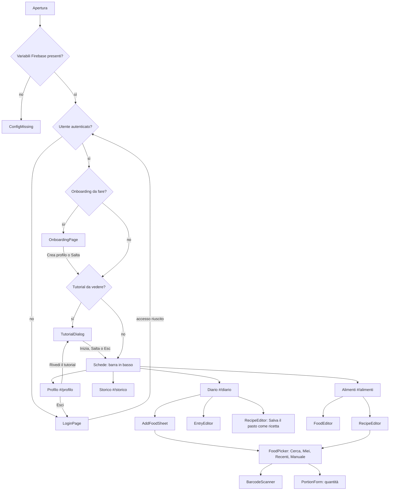

# Schermate e componenti

Interfaccia in italiano, mobile-first (larghezza massima 2xl), tema chiaro e scuro. Le schede principali sono quattro, scelte con la barra in basso (`src/components/layout/BottomNav.tsx`) e salvate nell'hash dell'URL (`useHashTab`).

## Navigazione

## Elementi comuni

| Elemento | File | Cosa mostra |
|---|---|---|
| Header | `src/App.tsx` | titolo della scheda (o "Benvenuto") e `SyncIndicator` |
| Indicatore di sincronizzazione | `src/components/layout/SyncIndicator.tsx` | pallino colorato e testo: Online, Offline (· N modifiche in attesa), Sincronizzazione in corso (N modifiche in attesa), Tutto sincronizzato |
| Barra in basso | `src/components/layout/BottomNav.tsx` | Diario, Alimenti, Storico, Profilo (nascosta durante l'onboarding) |
| Notifiche | `src/contexts/ToastContext.tsx` | in alto, al massimo 3; informative per 4 s, errori per 6 s; azione facoltativa (es. "Annulla") |
| Pannello modale | `src/components/ui/Sheet.tsx` | dal basso su mobile, centrato su schermi larghi; Esc chiude quello in primo piano |
| Segno "non sincronizzato" | `src/components/ui/PendingMark.tsx` | pallino arancione su voci, alimenti, pesi e codici non ancora confermati dal server |
| Errore generale | `src/components/layout/ErrorBoundary.tsx` | "Qualcosa è andato storto" e "Ricarica l'app" |

## Schermate

### Configurazione mancante — `src/features/auth/ConfigMissing.tsx`
- **Mostra**: l'elenco delle variabili Firebase mancanti (`missingFirebaseKeys`) e come impostarle.
- **Dati**: `src/lib/firebase.ts`.
- **Azioni**: nessuna.

### Login — `src/features/auth/LoginPage.tsx`
- **Mostra**: logo, nome dell'app, pulsante "Accedi con Google", nota sulla privacy. Più gli avvisi:
  - offline ("per accedere serve internet");
  - browser in-app ("Per accedere apri questo link in Safari o Chrome" con "Copia link");
  - popup bloccato (istruzioni e "Riprova");
  - errore di accesso.
- **Dati**: `useAuth` (`error`, `popupUnavailable`), `currentInAppBrowser`, `useOnlineStatus`.
- **Azioni**: accedere (popup), copiare il link. Il pulsante è disattivato se si è offline o in un browser in-app.

### Onboarding — `src/features/account/OnboardingPage.tsx`
- **Mostra**: benvenuto con il nome e il modulo del profilo (`ProfileForm` con `isNew`).
- **Dati**: profilo base appena creato (`createUserDoc`).
- **Azioni**: "Crea profilo" (salva con `onboarded: true`), "Salta per ora" (salva i valori predefiniti con `onboarded: true`).

### Tutorial di benvenuto — `src/features/tutorial/TutorialDialog.tsx`
- **Quando**: una sola volta, dopo il login e dopo l'onboarding del profilo (vedi `docs/FLOWS.md`, "Tutorial di benvenuto"); a richiesta da Account → "Rivedi il tutorial".
- **Mostra**: dialogo modale (dal basso su mobile, centrato su schermi larghi) con avanzamento "2 di 7", pallini, illustrazione SVG, titolo, 1–3 frasi e, dove serve, l'icona della scheda della barra in basso ("Lo trovi in Diario"). Contenuti in `src/features/tutorial/steps.ts`: benvenuto e privacy, profilo e obiettivi, diario, ricerca, scanner e alimenti salvati, riepilogo e storico, offline e account.
- **Azioni**: "Avanti", "Indietro", "Salta tutorial", "Inizia" all'ultimo passo, Esc (= salta). Il focus va sul titolo a ogni passo, resta dentro il dialogo (Tab) e torna dov'era alla chiusura.
- **Dopo "Salta"**: avviso una sola volta "Puoi rivederlo da Account".

### Diario — `src/features/diary/DiaryPage.tsx`
- **Mostra**:
  - `DayNavigator`: giorno precedente o successivo, "Oggi"/"Ieri"/"Domani" o la data, calendario nativo, "Torna a oggi";
  - invito a completare il profilo, se manca;
  - `DaySummary`: anello delle kcal rimanenti o oltre l'obiettivo, consumate/obiettivo, barre di proteine, carboidrati e grassi;
  - quattro `MealSection` (Colazione, Pranzo, Cena, Spuntini) con totali, voci (nome, grammi, marca, kcal, pallino se non sincronizzata), pulsante **+** e "Salva il pasto come ricetta" (con almeno 2 voci).
- **Dati**: `useDayEntries(uid, date)`, profilo da `App`.
- **Azioni**: cambiare giorno; aggiungere un alimento (`AddFoodSheet`); toccare una voce (`EntryEditor`); salvare il pasto come ricetta (`RecipeEditor` con gli ingredienti del pasto).

### Aggiungi alimento — `src/features/diary/AddFoodSheet.tsx` + `src/features/picker/*`
- **Mostra**: scelta del pasto (`MealSelect`) e `FoodPicker` con quattro schede:
  - **Cerca** (`SearchTab`): campo di ricerca, "Cerca", scanner. Sezioni "I miei alimenti", "Alimenti generici", "Mostra anche prodotti trasformati (N)", "Prodotti confezionati", con stella e messaggi d'errore per fonte.
  - **Miei**: tutti i miei alimenti (preferiti prima) con stella e **+**.
  - **Recenti**: ultimi 20 alimenti distinti dalle voci di diario, con **+**.
  - **Manuale** (`ManualFoodForm`): nome, marca, quantità, valori per 100 g o per la quantità, "Aggiungi ai preferiti".
- Dopo la scelta: `PortionForm`, cioè grammi, porzioni indicative (generici), scorciatoie 50/100/150/200 g e porzione del prodotto, anteprima di kcal e macro, pasto, "Aggiungi ai preferiti".
- **Dati**: `useFoods`, `useRecentFoods`, fonti di ricerca (vedi `docs/SEARCH_PIPELINE.md`).
- **Azioni**: cercare, scansionare, aggiungere (il pannello resta aperto per aggiunte successive), mettere tra i preferiti, "Salva per dopo" (codice offline), "Inserisci a mano".

### Scanner — `src/features/picker/BarcodeScanner.tsx`
- **Mostra**: anteprima della fotocamera posteriore con linea di mira, errori sul permesso o sulla fotocamera assente, campo "Oppure inserisci il codice".
- **Dati**: `@zxing/browser`, caricato al momento.
- **Azioni**: leggere il codice (con vibrazione) o digitarlo (almeno 6 cifre).

### Modifica voce — `src/features/diary/EntryEditor.tsx`
- **Mostra**: `PortionForm` con i valori della voce, pasto, giorno, "⭐ Salva tra i miei alimenti" (solo per voci senza `foodId`).
- **Azioni**: salvare (`updateEntry`); eliminare con "Annulla" nella notifica (`deleteEntry`, `restoreEntry`).

### Alimenti — `src/features/foods/FoodsPage.tsx`
- **Mostra**:
  - "+ Alimento", "+ Ricetta";
  - sezione **Da completare** con i codici scansionati offline (in attesa o non trovati, "Rimuovi");
  - filtro testuale (nome, marca, codice) e filtro Tutti / Preferiti / Ricette;
  - elenco come "Nome - Marca", con valori per 100 g, pallino se non sincronizzato, stella.
- **Dati**: `useFoods`, `usePendingScans`, `useOnlineStatus`.
- **Azioni**: creare o modificare alimenti (`FoodEditor`) e ricette (`RecipeEditor`), preferito, rimuovere codici dalla coda.

### Editor alimento — `src/features/foods/FoodEditor.tsx`
- **Mostra**: nome, marca, codice a barre, porzione, preferito, kcal e macro per 100 g.
- **Azioni**: salvare (`saveFood`), eliminare (le voci di diario già registrate non cambiano).

### Editor ricetta — `src/features/foods/RecipeEditor.tsx`
- **Mostra**: nome, ingredienti (scelti con `FoodPicker`), peso finale da cotto, numero di porzioni, totali e valori per 100 g, preferito.
- **Azioni**: aggiungere o rimuovere ingredienti, salvare (`saveFood` con `kind: 'recipe'`), eliminare.

### Storico — `src/features/history/HistoryPage.tsx` (caricata in modo lazy)
- **Mostra**:
  - periodo di 7 o 30 giorni;
  - media giornaliera, giorni registrati, giorni entro l'obiettivo;
  - `CaloriesChart`: barre per giorno e linea dell'obiettivo, giorni oltre in ambra;
  - macro medi, tabella della media settimanale con differenza dall'obiettivo, dati giornalieri espandibili;
  - `WeightSection`.
- **Dati**: `useEntriesRange`, `dailyTotals`, `average`, `weeks` (`src/features/history/stats.ts`).

### Peso — `src/features/history/WeightSection.tsx`
- **Mostra**: data e peso con "Salva", ultimo peso e variazione dal primo, `WeightChart` (linea), elenco espandibile con eliminazione.
- **Dati**: `useWeights`.
- **Azioni**: registrare (`logWeight`), eliminare (`deleteWeight`).

### Profilo — `src/features/profile/ProfilePage.tsx`
- **Account** (`src/features/account/AccountSection.tsx`): foto, nome, email, ultimo accesso, **Rivedi il tutorial** (riapre il tutorial senza modificare lo stato salvato), **Esci** (logout sicuro).
- **I tuoi dati / Fabbisogno / Target macro** (`ProfileForm`):
  - sesso, età, altezza, peso, attività, obiettivo;
  - metabolismo basale, fabbisogno totale e consigliato;
  - obiettivo calorico a mano;
  - target dei macro con "Calcola";
  - "Salva profilo".
- **Aspetto**: tema Sistema / Chiaro / Scuro; "Installa l'app sul dispositivo" quando il browser lo permette (`useInstallPrompt`).
- **Esporta i dati (CSV)** (`ExportSection`): diario e peso, con intervallo di date facoltativo.
- **I miei dati** (`src/features/account/MyDataSection.tsx`): "Esporta i miei dati (JSON + alimenti CSV)", "Elimina il mio account e tutti i miei dati" (conferma, poi pannello in cui scrivere `ELIMINA`; se serve, nuovo accesso).
- Crediti: dati nutrizionali da Open Food Facts (licenza ODbL).

## Componenti dell'interfaccia di base (`src/components/ui/`)

| Componente | Uso |
|---|---|
| `Button` | varianti `primary`, `secondary`, `ghost`, `danger`; dimensioni; stato `loading` con spinner |
| `Card`, `SectionTitle` | contenitori e titoli di sezione con azione facoltativa |
| `TextField`, `NumberField`, `SelectField`, `Segmented`, `Toggle` | campi dei form (`NumberField` accetta virgola o punto) |
| `ErrorNotice`, `EmptyState` | errore leggibile (`errorMessage`) e stato vuoto con icona |
| `ProgressRing`, `MacroBar` | anello delle calorie e barre dei macro |
| `Sheet` | pannello modale |
| `Spinner`, `LoadingBlock` | caricamento |
| `PendingMark` | segno "non sincronizzato" |
| Icone (`Icons.tsx`) | SVG inline: libro, mela, grafico, utente, frecce, più, stella, codice a barre, lente |
